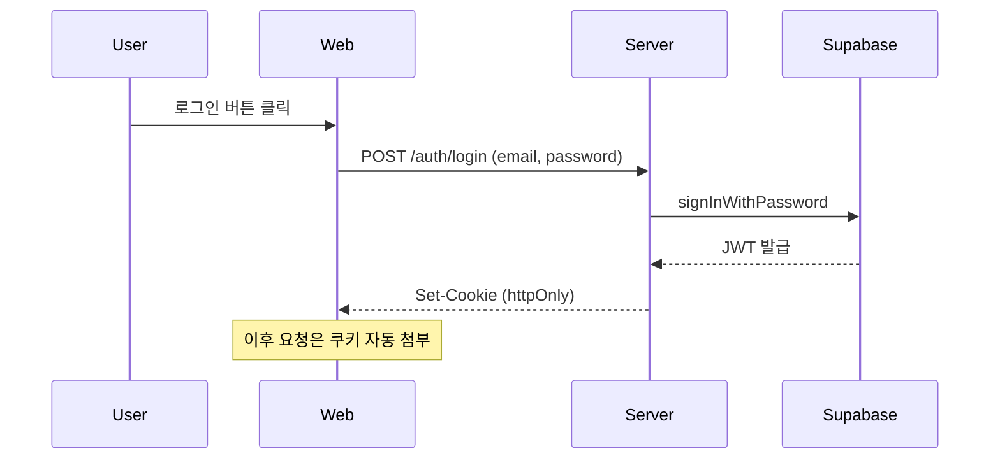

# MVP 학습 스킬 (/study)

> `/study MVP1`, `/study MVP11` 또는 `/study` (인자 없으면 활성 MVP)

## 목적

이미 구현된 MVP를 **흐름 + 개념** 쌍으로 학습한다.
코드 암기가 아니라 "왜 이 기술을 선택했고, 어떻게 동작하는가"를 면접/실무에서 자기 언어로 설명할 수 있게 체화한다.

## 대상 독자

AI 접목 iOS 개발자 취준생. 면접에서 "이 프로젝트에서 JWT 어떻게 쓰셨어요?" 같은 질문에 **흐름 + 개념 + 다른 대안과의 비교**까지 말할 수 있는 수준이 목표.

---

## [0] 호출 처리

### 인자 파싱

- `/study MVP{N}` → 해당 MVP 학습 시작
- `/study` (인자 없음) → `progress/active_mvp.txt` 읽어 활성 MVP 확인 후 안내:
  ```
  현재 활성 MVP는 MVP{N}이에요. 이것으로 진행할까요? (y/n)

  만약 다른 MVP를 학습하고 싶다면 `/study MVP{X}` 형식으로 다시 호출하세요.
  ```

### 기존 학습 기록 확인

`history/study/mvp{N}_concepts.md` 존재 시:

```
MVP{N} 학습 기록이 이미 있어요 (마지막 갱신: {날짜}).
어떻게 진행할까요?

A) 처음부터 다시 학습 (기존 파일은 덮어쓰기 전 백업)
B) 이어서 학습 (중단된 단계부터 재개)
C) 기존 내용 업데이트/보완 (특정 단계만 다시 다루기)

→ 답:
```

---

## [1] 데이터 수집 (필수)

**Phase 진입 전 반드시 수행. 추측 금지.**

### 1-A. 기획 문서 로드

```bash
ls history/mvp{N}/       # 완료된 MVP
ls progress/mvp{N}/      # 진행 중인 MVP
```

- `*_기획.md`, `*_roadmap.md`, `M{X}_*.md` 모두 Read
- 각 문서에서 **기능 흐름 / 결정사항 / 개념** 추출

### 1-B. 실제 코드 위치 매핑 (내부 참조용)

- `server/` — 관련 라우트/서비스 파일 목록화
- `web/` — 관련 route/component 파일 목록화
- `ios/` — 관련 Feature/Service 파일 목록화

**설명에 코드 스니펫을 붙이지 않는다.** "이 흐름이 실제 코드에 존재하는지" 확인용으로만 사용.

### 1-C. 문서 vs 코드 불일치 검사

문서의 주장과 코드가 다르면 **즉시 멈추고 안내**:

```
⚠️ 문서 vs 코드 불일치 발견

- 문서 위치: history/mvp{N}/{파일}.md Line {N}
- 문서 주장: "JWT를 httpOnly 쿠키에 저장"
- 코드 실제: web/src/lib/auth.ts — localStorage 사용

이 부분을 어떻게 처리할까요?
A) 코드 기준으로 설명 (문서는 틀림)
B) 문서 기준으로 설명 (코드가 나중에 변경됨)
C) 둘 다 설명 (변경 이력으로 다루기)
```

---

## [2] 학습 흐름 설계 (내부 작업)

수집한 문서 기반으로 **사용자 관점 흐름**을 단계로 쪼갠다.

### 흐름 분할 원칙

- 사용자 행동 기준: "로그인 → 키워드 등록 → 피드 로딩 → 기사 상세 보기"
- 기술 레이어 기준 아님 (❌ "DB 설계 → API → UI")
- 각 단계는 독립적으로 이해 가능한 단위

### 개념 추출

각 단계에서 **처음 등장하는 핵심 개념**만 뽑는다 (중복 개념은 최초 단계에 귀속).

예시 (MVP1 로그인 단계):
- JWT (JSON Web Token)
- httpOnly 쿠키
- 포트/어댑터 패턴 (서버 측 인증 모듈 구조)

### 출력: 학습 목차 제시

```
📚 MVP{N} 학습 흐름

전체: 로그인 → 키워드 등록 → 뉴스 수집 → 피드 표시 → 기사 상세

각 단계에서 다룰 개념:
  1단계 로그인: JWT, httpOnly 쿠키, 포트/어댑터 패턴
  2단계 키워드 등록: Supabase RLS, 낙관적 업데이트
  3단계 뉴스 수집: 배치 처리, stale-while-revalidate
  4단계 피드 표시: Svelte 5 runes, 가상 스크롤
  5단계 기사 상세: og:image 크롤링, 캐싱 전략

첫 단계부터 시작할까요? (y/n)
```

---

## [3] 단계별 학습 진행 (반복)

각 단계는 아래 순서로 진행. **1문1답 / 다음 단계 확인 필수.**

### 3-A. 개념 선행 설명

이 단계에 필요한 개념들을 **하나씩** 설명. 한 개념이 끝나면 다음 개념으로.

**개념 설명 템플릿** (필수 4요소):

```markdown
### 개념: {이름}

**무엇인지**
한 문장으로 정의. 기술 용어는 풀어서.

**왜 쓰는지**
이 개념이 해결하는 문제 + 대안 대비 장점.
(예: JWT는 세션 방식 대비 서버 확장성이 좋음)

**이 프로젝트에서**
구체적으로 어느 레이어/모듈에서, 왜 그 선택을 했는지.
(구현 디테일이 아니라 **의사결정 근거**)

**다른 이름**
같은 개념이 다른 맥락에서 어떻게 불리는지.
(예: 포트/어댑터 ↔ 헥사고날 아키텍처 ↔ 클린 아키텍처 — 완전히 같진 않지만 철학 공유)
```

**도식화 규칙** — 개념이 구조/관계를 포함하면 Mermaid 다이어그램 필수:
- JWT 발급·검증 흐름
- 포트/어댑터 레이어 구조
- 데이터 흐름 (클라이언트 ↔ 서버 ↔ DB)

**내부 Codex 크로스체크 (경량, 사용자에 노출 X)**

개념 설명 초안이 완성되면 **화면 출력 전에** Codex MCP로 검증:

1. `mcp__codex__codex`에 다음 질문 전달:
   ```
   아래 기술 개념 설명이 정확한가? 틀린 부분·오해 소지·누락된 핵심이 있으면 지적해줘.

   [개념 이름]
   [무엇인지 / 왜 쓰는지 / 다른 이름 섹션 원문]
   ```
2. Codex 응답을 내부적으로만 파싱:
   - **치명적 오류** 있으면 설명 수정 후 출력
   - **경미한 보완** 있으면 반영 후 출력
   - **이상 없음** 이면 그대로 출력
3. 사용자에게는 **수정된 최종 설명만** 보여준다. 크로스체크 과정 자체는 노출하지 않음 (흐름 방해).

단, Codex가 **"이 프로젝트에서"** 섹션은 검증 못함 (외부 정보 없음). 그 섹션은 문서 기반으로 제가 검증.

### 3-B. 흐름 엮기 (개념 다 끝난 후)

해당 단계의 **사용자 행동 → 시스템 응답**을 개념들과 함께 시퀀스로 설명.

Mermaid sequenceDiagram 사용 권장:



### 3-C. 자가 확인 (필수, 객관식)

단계 마지막에 **객관식 확인 문제**를 제시한다. 주관식 서술형 금지 — 선택지 기반으로 진행.

**문제 유형**
- 개념 정의 확인
- 왜 이 기술을 선택했는지
- 올바른/틀린 설명 고르기
- 상황에 맞는 대응 선택

**문제 구성 규칙**
- 선택지 4개 (A/B/C/D) 권장, 최소 3개
- **오답지도 그럴듯하게** — 흔한 오해/착각을 반영 (학습자가 헷갈릴 만한 선택지)
- 한 문제당 정답 1개
- 단계당 2~3문제 출제

```
💡 자가 확인 (1/2)

Q. JWT를 httpOnly 쿠키에 저장하는 **주된** 이유는?

  A) CSRF 공격을 완벽히 방어하기 위해
  B) JavaScript에서 토큰 접근을 차단해 XSS 공격 피해를 줄이기 위해
  C) 서버 세션 저장소를 없애 수평 확장을 가능하게 하기 위해
  D) 토큰 크기를 줄여 네트워크 비용을 절감하기 위해

→ 답:
```

**사용자 답변 후**
- 정답 + 오답 해설 제공
- 오답 고른 경우 왜 틀렸는지 + 올바른 개념 재설명
- 예:
  ```
  정답: B

  - A ❌: httpOnly는 CSRF를 막지 못해요. CSRF는 SameSite 쿠키/CSRF 토큰으로 별도 대응.
  - B ✅: 정답. XSS로 탈취 시도해도 document.cookie에서 접근 불가.
  - C ❌: 이건 JWT 자체의 장점이지, httpOnly 저장 이유가 아니에요.
  - D ❌: 토큰 크기와 무관해요.
  ```

**자가 확인 기록은 저장 시 포함**
- 질문·선택지·사용자 답변·정답·해설을 `mvp{N}_concepts.md`에 함께 저장 → 복습 시 같은 실수 확인 가능

### 3-D. 증분 저장

단계 완료 시마다 `history/study/mvp{N}_concepts.md`에 해당 단계 내용을 **즉시 append**.
중간에 세션이 끊겨도 진행 상태가 남게.

저장 포맷 (단계별):

```markdown
## {N}단계: {단계명}

> 학습 일시: {YYYY-MM-DD HH:MM}
> 상태: ✅ 완료

### 이 단계 핵심 개념
- {개념1} — 한 줄 요약
- {개념2} — 한 줄 요약

### 개념 상세
{3-A 내용}

### 흐름
{3-B 다이어그램 + 설명}

### 자가 확인 기록
Q: {질문}
A: {사용자 답변 요약}
포인트: {보완된 내용}
```

### 3-E. 다음 단계 확인

```
{N}단계 학습 완료. 저장했어요 ({파일 경로}).

다음 단계 "{N+1}단계: {이름}"로 넘어갈까요? (y/n)

잠시 멈추고 다음에 이어서 하려면 "중단"이라고 답해주세요.
```

---

## [4-Pre] 자동 critical-review (최종 검증)

모든 단계 학습이 끝나면 **전체 완료 처리 전에 반드시** critical-review를 호출한다.

### 실행 절차

1. `history/study/mvp{N}_concepts.md`의 모든 단계 내용을 critical-review에 전달:
   ```
   다음 학습 문서를 적대적 관점에서 검토해줘. 사용자가 이 내용을 그대로 체화하면 면접에서 틀린 답을 확신 있게 말하게 될 수 있음. 다음을 중점 점검:

   1. 개념 설명의 기술적 정확성 (용어·인과관계·전제)
   2. 이 프로젝트에서 설명이 실제 코드/기획 문서와 부합하는지
   3. 누락된 중요 개념 (이 흐름에 등장해야 하는데 빠진 것)
   4. 틀린 비교·대안 설명 (예: "A는 B보다 빠르다" 주장의 근거)
   5. 과도한 일반화·단순화로 오해 소지가 생기는 부분
   ```

2. 리뷰 결과를 사용자에게 제시:
   ```
   🔍 학습 내용 리뷰 결과

   ✅ 정확: {항목 요약}
   ⚠️  보완 필요: {항목 + 제안 수정}
   ❌ 오류: {항목 + 올바른 설명}

   어떻게 처리할까요?
   A) 지적된 부분 모두 반영해서 문서 수정
   B) 특정 항목만 선택해서 수정 (번호 지정)
   C) 해당 단계를 아예 다시 학습 (단계 번호 지정)
   D) 무시하고 진행 (리뷰 지적도 부록으로 남김)
   ```

3. 사용자 선택에 따라 문서 수정 또는 재학습 후 [4]로 진입.

### 금지

- 리뷰 없이 바로 HTML 생성하지 않는다
- 리뷰 결과를 "문제 없음"으로 축약하지 않는다 (원문 그대로 전달)

---

## [4] 전체 완료 처리

모든 단계 완료 + 리뷰 반영 후:

### 4-A. 최상단 요약 추가

`mvp{N}_concepts.md` 파일 맨 위에 **플래시카드형 핵심 요약** 삽입 (복습용).

```markdown
# MVP{N} 학습 기록

> 학습 완료: {날짜}
> 커버한 단계: {N}개

## 🎴 핵심 요약 (복습용)

| # | 질문 | 핵심 답변 |
|---|------|----------|
| 1 | JWT를 왜 썼나? | 서버 세션 저장 불필요, 수평 확장 용이 |
| 2 | httpOnly 쿠키? | JS 접근 차단 → XSS 방어 |
| 3 | 포트/어댑터? | 도메인 ↔ 외부 분리, 테스트 용이 |
| ... | ... | ... |

(아래는 단계별 상세 내용)
```

### 4-B. HTML 생성

`history/study/mvp{N}_concepts.html` 생성.

**Claude Sunset 테마 사용** (`daily-retro` 스킬 테마 재사용):
```css
--bg: #FDF6F0; --text: #2D2926; --accent: #D97706;
--accent-light: #FEF3C7; --heading: #92400E;
--border: #E5D5C5; --code-bg: #FFF7ED; --card-bg: #FFFFFF;
```

- 모바일 최적화 (max-width: 480px)
- Mermaid CDN 임베드로 다이어그램 렌더링
- 플래시카드는 접기/펼치기 가능하게 (details/summary)

### 4-C. INDEX 업데이트

`history/INDEX.md`에 학습 기록 섹션 있으면 항목 추가. 없으면 새 섹션 생성 제안.

---

## [5] 특수 케이스

### 이어서 학습 (B 선택 시)

기존 `mvp{N}_concepts.md` 파싱:
- `상태: ✅ 완료`인 마지막 단계 찾기
- 그 다음 단계부터 [3]으로 재진입

### 업데이트 모드 (C 선택 시)

```
어느 단계를 업데이트할까요?
1. 1단계 로그인
2. 2단계 키워드 등록
...

→ 번호 선택:
```

선택한 단계만 재실행 후 파일 내 해당 섹션 교체.

---

## 절대 금지

- **추측 설명 금지** — Phase 1에서 문서 읽기 전에 설명 시작 금지
- **코드 스니펫 붙여넣기 금지** — 내부 확인용으로만 코드 읽기
- **한 번에 여러 개념 동시 설명 금지** — 한 개념씩 1문1답
- **자가 확인 생략 금지** — 단계마다 필수
- **증분 저장 생략 금지** — 매 단계 완료 시 파일 갱신

## 출력 체크리스트

- [ ] 각 단계마다 개념 선행 → 흐름 엮기 → 자가 확인 순서
- [ ] 구조/관계 포함 개념은 Mermaid 다이어그램 포함
- [ ] 사용자 답변 없이 다음 단계로 넘어가지 않음
- [ ] 매 단계 완료 시 파일 저장 완료
- [ ] 완료 시 플래시카드 요약 + HTML 생성 + INDEX 반영
