# 흐름으로 이해하는 Frank 프로젝트 (2026-04-08)

> 깊은 개념보다 **"아 이런 흐름이구나"** 를 먼저 잡는 것이 목표.
> iOS 개발자 관점에서 비유 + Mermaid 다이어그램으로 흐름 정리.

---

## MVP별 흐름 변경 이력

| MVP | 추가된 것 | 변경된 것 | 스냅샷 |
|-----|---------|---------|--------|
| MVP1 | Rust API 서버, 웹 SvelteKit, Supabase, Tavily, OpenRouter, 기사 수집 흐름 | — | — |
| MVP1.5 | API Contract, Mock-First 병렬 개발 패턴, fixture 공유 | — | — |
| MVP2 | iOS SwiftUI 앱, Supabase SDK 직접 호출 (웹/iOS 각자) | — | — |
| MVP3 | Apple 로그인 (웹+iOS), scripts/deploy.sh, httpOnly 쿠키 세션, worktree 병렬 개발 | 웹/iOS → Rust API 통합 (Supabase 직통 폐기), 웹 인증 localStorage → httpOnly 쿠키 | [MVP3 흐름도](mvp3/260408_흐름도.md) |

---

## 1. 전체 그림 — 서버·웹·앱이 어떻게 연결되나

### 현재 (MVP3 이후)

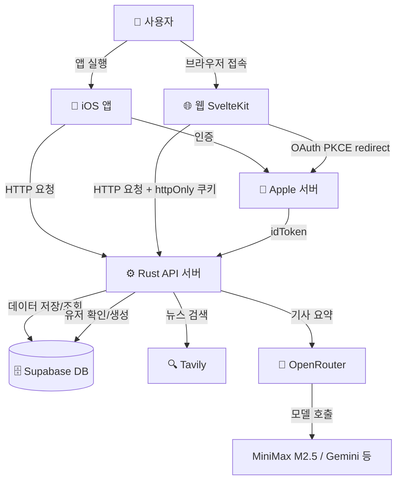

**한 줄 정리:**
앱과 웹은 화면만 그린다. 실제 데이터 처리는 전부 Rust 서버가 한다.
서버는 필요할 때 Supabase(저장), Tavily(검색), OpenRouter(요약)를 호출한다.

**로그인 방식별 흐름 비교:**

```
Apple 로그인:
  앱/웹 → Apple 서버(본인 확인) → Supabase → JWT → Rust API
  이유: Apple이 직접 "이 사람 맞아요"를 확인해줘야 하기 때문

이메일 로그인:
  앱/웹 → Supabase(직접 인증) → JWT → Rust API
  이유: Supabase가 이메일/비밀번호를 직접 관리하므로 Apple 서버 불필요
```

**MVP3에서 달라진 핵심:**
- 웹과 iOS가 각자 Supabase를 직접 부르던 구조 → Rust API 서버로 단일화
- Apple 로그인 추가 (웹: OAuth PKCE redirect / iOS: ASAuthorizationController ID Token)
- 동일 Supabase 프로젝트 → 웹에서 가입 → iOS 로그인 시 계정 자동 연동

### 변경 전 (MVP2)

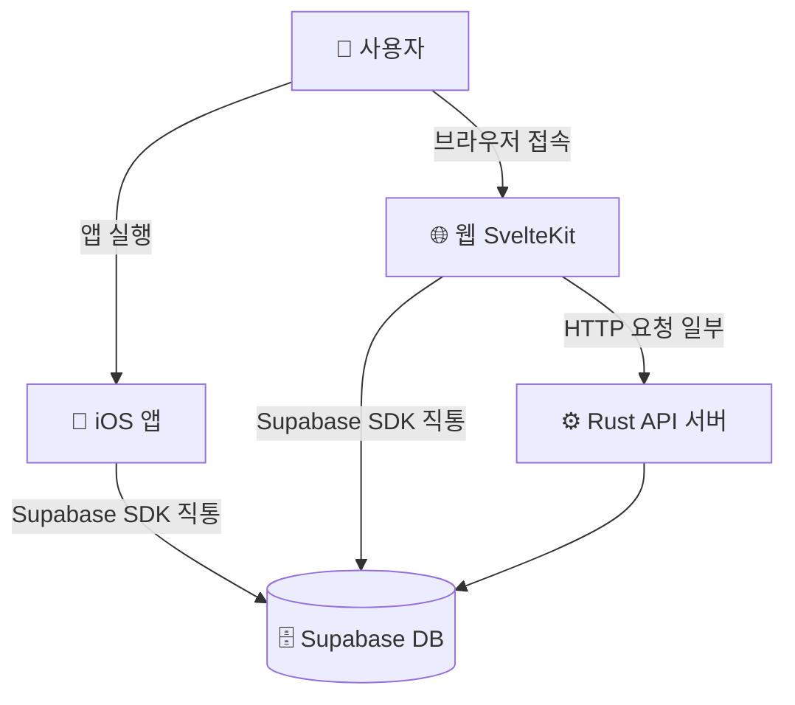

---

## 2. 배포 흐름 — "로컬에서 돌아가는 것"을 "어디서든 접근 가능"하게

### 개발 중 (지금 이 상태)

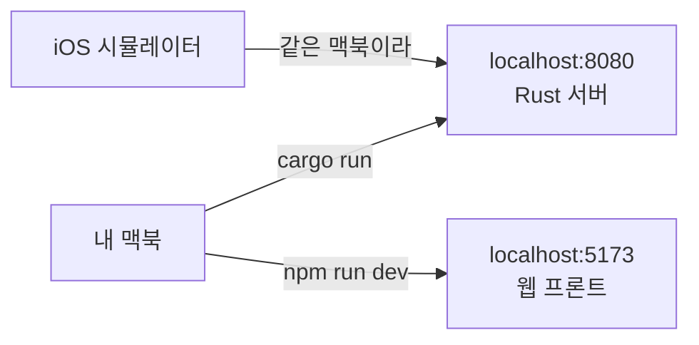

**두 개가 다른 포트를 쓰는 이유:**
Rust 서버와 SvelteKit은 완전히 다른 프로그램이야. 같은 맥북에서 동시에 실행되지만 역할이 달라.

```
localhost:8080  →  Rust API 서버 (데이터 처리, 비즈니스 로직)
localhost:5173  →  SvelteKit 웹 (브라우저에서 보이는 화면)
```

iOS로 비유하면:
- Rust 서버 = URLSession으로 호출하는 그 API 서버
- SvelteKit = 브라우저용 "앱" 화면 (웹브라우저가 5173 열고 → 8080으로 API 호출)

**cargo run / npm run dev 가 뭔가:**
```
cargo run    =  Rust 서버 실행  →  iOS Xcode에서 ▶ Run 버튼 누르는 것과 동일
npm run dev  =  웹 개발 서버 실행  →  코드 바꾸면 브라우저에서 실시간 반영됨
```

지금은 내 맥북 안에서만 돌아감. 외부에서 접근 불가.

---

### Cloudflare Tunnel — 실제 기기 테스트할 때

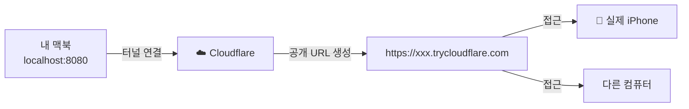

**Cloudflare Tunnel이 하는 일:**
localhost:8080은 이미 HTTP야. 문제는 "내 맥북 안에서만" 접근 가능하다는 것.
Cloudflare Tunnel은 그 로컬 주소에 **인터넷 어디서든 접근 가능한 공개 URL**을 붙여줘.

```
내 맥북만 접근 가능:   localhost:8080
인터넷 어디서든 접근:  https://xxx.trycloudflare.com
                              ↓ 내부적으로 localhost:8080으로 전달
```

iOS로 비유하면: TestFlight 없이 내 맥에서 빌드한 앱을 친구 폰에서 바로 실행할 수 있게 해주는 것.

---

### 통합 배포 스크립트 (MVP3 추가)

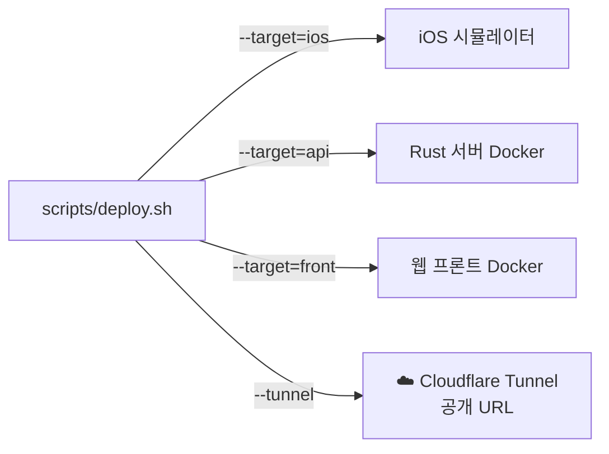

**`scripts/deploy.sh`가 하는 일:**
iOS 시뮬레이터 + Rust API(Docker) + 웹 프론트(Docker)를 단일 명령으로 배포.
`--target` 옵션으로 필요한 것만 선택 가능.

### 실제 배포 (서비스 오픈할 때)

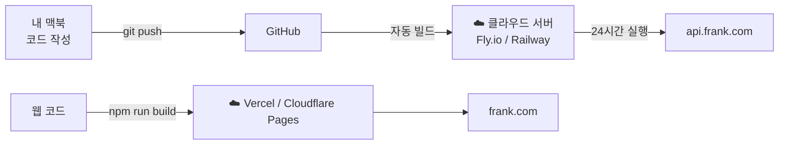

**배포 = 내 맥북이 꺼져도 서버가 돌아가게 만드는 것.**

| 대상 | 로컬 (개발 중) | 배포 후 |
|------|--------------|--------|
| API 서버 | localhost:8080 | api.frank.com |
| 웹 | localhost:5173 | frank.com |
| 접근 가능 범위 | 내 맥북만 | 전 세계 |

---

### Docker가 하는 역할

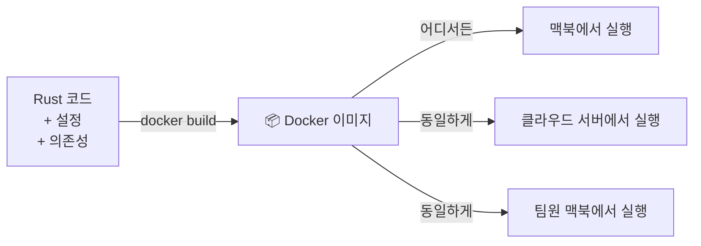

**Docker = Rust 코드를 서버에서 실행할 수 있게 준비하는 도구.**

Rust 서버 자체는 그냥 Rust 코드야.
문제는 내 맥북이랑 클라우드 서버의 환경(OS, 설치된 프로그램 등)이 달라서 "내 맥에서는 되는데 서버에서는 안 돼"가 생길 수 있어.

Docker는 코드 + 실행에 필요한 모든 환경을 하나로 묶어서, 어디서든 동일하게 실행되도록 해줌.

```
Rust 코드 작성
    ↓
Docker로 빌드 (코드 + 실행환경 묶기)
    ↓
클라우드 서버에 올리면 내 맥과 동일하게 실행됨
```

지금 단계에서 Docker 내부를 깊게 알 필요는 없어. "서버 배포할 때 쓰는 도구" 정도로만 이해하면 충분해.

---

## 3. 기사 수집 흐름 — 뉴스가 앱에 뜨기까지

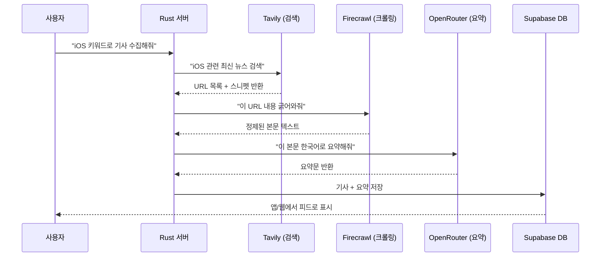

### 각 외부 서비스 역할 (이 프로젝트 기준)

**Tavily — AI 특화 검색엔진**
```
일반 검색: 광고, 관련없는 결과 섞임
Tavily:   AI가 쓰기 좋은 깔끔한 결과만 반환

사용처: "iOS 뉴스 검색" → URL + 간단한 설명 목록
```

**Firecrawl — 웹페이지 → 텍스트 변환**
```
URL 주면 → HTML/CSS/광고/메뉴 다 걷어내고 → 본문 텍스트만 반환
```
맞아, URL을 주면 웹페이지를 텍스트로 파싱해주는 API야.
AI 모델한테 기사 내용을 넘길 때 HTML 태그가 섞여있으면 안 되니까 이걸 사용.

사용처: Tavily가 찾은 URL → Firecrawl로 본문 추출 → OpenRouter로 요약

**OpenRouter — AI 모델 연결 창구**
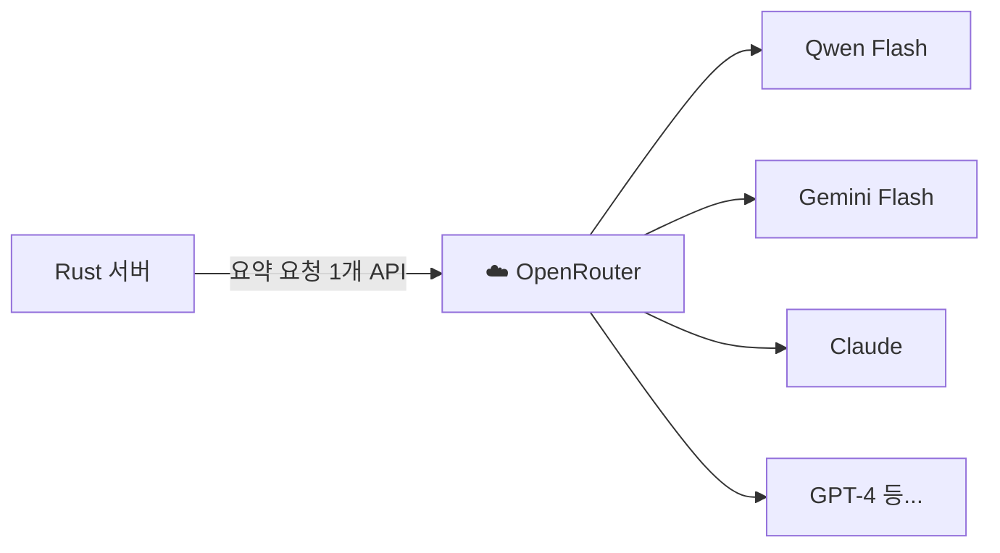

OpenRouter가 하는 일: 여러 AI 회사 모델을 **하나의 API 주소**로 쓸 수 있게 해줌.
맞아, 여러 모델을 한 곳에서 관리하고, 내가 지정한 모델로 연결해주는 것.
서버 코드에서 OpenRouter 하나만 연결해두면 모델을 바꿔도 코드 수정 없이 설정값만 바꾸면 됨.

```
코드:  openrouter.ai/api → model: "qwen/qwen-2.5"  (Qwen 쓸 때)
코드:  openrouter.ai/api → model: "google/gemini-flash"  (Gemini 쓸 때)
주소는 그대로, 모델 이름만 바꾸면 됨
```

---

## 4. 로그인 흐름 — Apple 로그인부터 API 호출까지

### iOS Apple 로그인 흐름 (MVP3 추가)

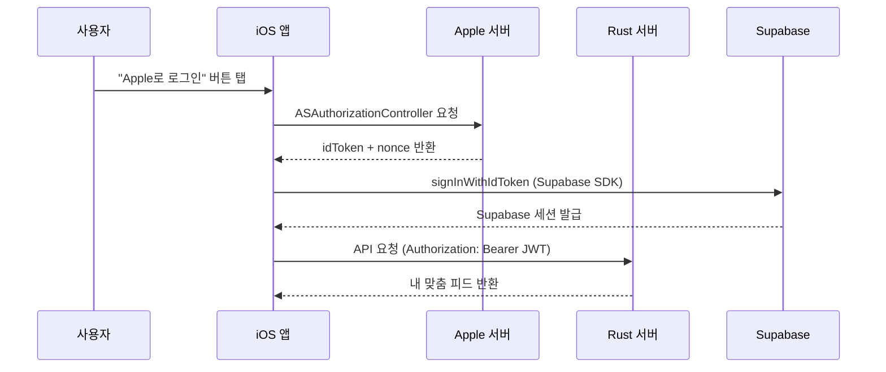

### 웹 Apple 로그인 흐름 (MVP3 추가)

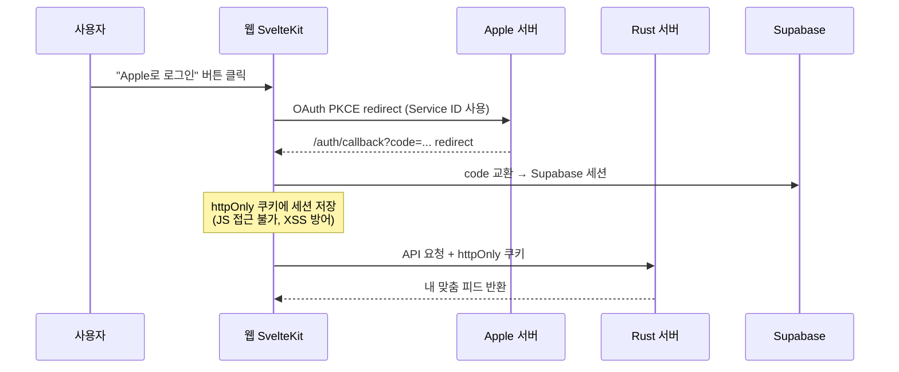

**iOS와 웹 방식이 다른 건 어쩔 수 없나?**
어쩔 수 없어. Apple이 플랫폼별로 다른 방식을 제공하거든.
- iOS: 네이티브 시트(ASAuthorizationController) → ID Token 직접 받음
- 웹: 브라우저 리다이렉트(OAuth PKCE) → 코드 받고 → 토큰 교환

방식은 달라도 **결국 목적은 동일** — "Apple이 인증한 토큰을 가져와서 Supabase → JWT → Rust API로 전달"

**크로스 플랫폼 계정 연동이 "공짜"인 이유:**
웹과 iOS가 동일 Supabase 프로젝트를 쓰면, 동일 Apple ID로 로그인한 계정은 동일한 user_id를 가진다. 별도 연동 로직 없이 자동.

웹에서 온보딩(태그 선택) → iOS 로그인 → 태그 그대로 유지.

**두 방식의 차이:**

| 항목 | 웹 | iOS |
|------|-----|-----|
| 방식 | OAuth PKCE redirect | ID Token 직접 |
| 핵심 | Service ID, 브라우저 리다이렉트 | Bundle ID, 네이티브 시트 |
| 주의 | `use:enhance`가 redirect를 가로챔 | canceled 분기 반드시 처리 |

**Apple Service ID vs Bundle ID:**
Supabase Apple Provider 설정의 `Client IDs` 첫 번째 값이 OAuth `client_id`로 사용된다.
```
❌ dev.frank.app,com.frank.web   → Bundle ID가 OAuth client_id로 사용, invalid_client 오류
✅ com.frank.web,dev.frank.app   → Service ID가 OAuth client_id로 사용, 정상 동작
```

**JWT / httpOnly 쿠키가 하는 역할:**
로그인 성공 후 "이 사람 맞아요" 증명서.
- iOS: JWT를 Authorization 헤더로 첨부
- 웹: httpOnly 쿠키 (JS 접근 불가 → XSS 방어), 서버 사이드에서 검증

iOS 비유: Keychain에 저장하는 인증 토큰과 동일한 역할. 웹의 httpOnly 쿠키는 "Keychain에 저장하되 앱이 직접 못 읽게 막은 것"에 해당.

---

## 5. 병렬 개발 흐름 — 서버·웹·앱을 동시에 만드는 방법

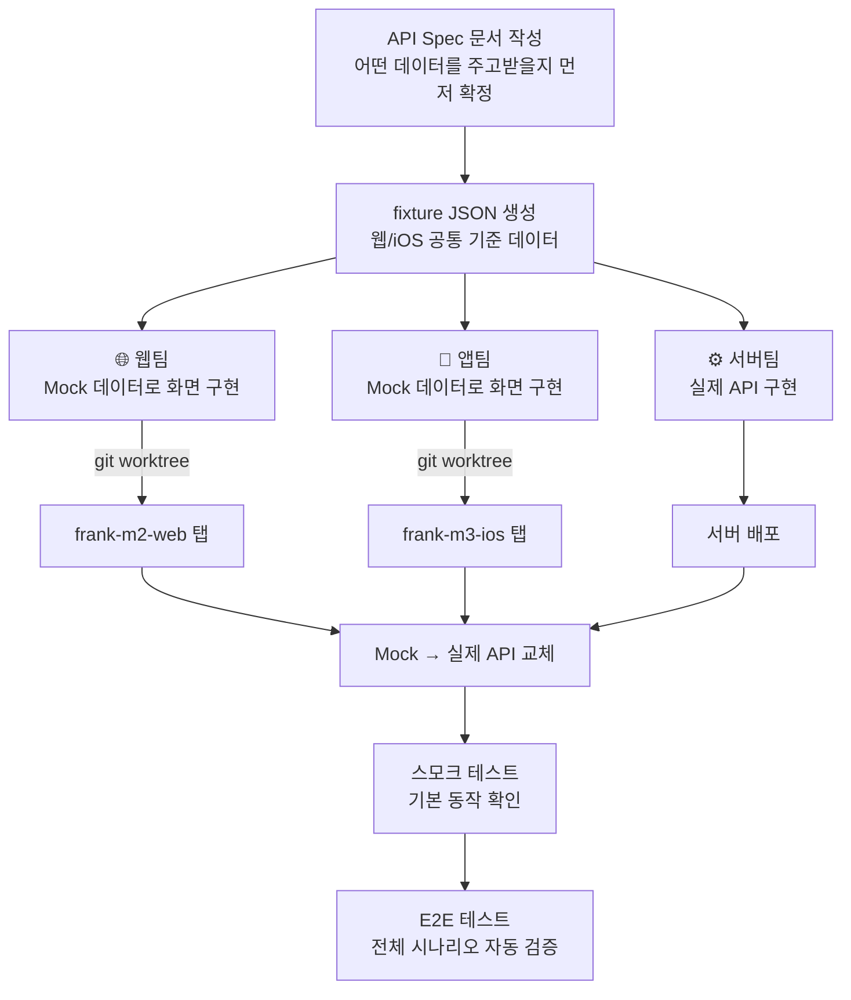

**핵심:**
계약(API Spec)만 먼저 정하면 서버·웹·앱이 기다리지 않고 동시에 작업 가능.
Mock 데이터 = 가짜 데이터. 실제 서버 없이 화면을 먼저 만들 때 사용.

**git worktree (MVP3 실전 검증):**
동일 git 저장소를 두 디렉토리(`frank-m2-web`, `frank-m3-ios`)에 체크아웃해서 탭별 독립 작업.
- web/ vs ios/ 완전 분리 → 코드 충돌 0건
- fixture JSON 공유 → 스키마 불일치 0건
- 병렬 진행 시간 약 40% 단축 추정

iOS로 비유하면: 동일 Xcode 프로젝트의 브랜치를 두 개의 시뮬레이터에서 동시 실행하는 것.

---

## 6. Port/Adapter 패턴 — 이 프로젝트 전체에 적용된 핵심 구조

### 왜 필요한가

테스트할 때 실제 DB나 외부 API를 호출하면:
- 느리고, 비용 나가고, 인터넷 없으면 테스트 불가
- 외부 서비스가 죽으면 내 테스트도 실패

해결책: **중간에 인터페이스(Port)를 끼워서 실제 구현체를 교체 가능하게**

### iOS Clean Architecture와 매핑

iOS Clean Architecture를 알면 바로 이해돼. 레이어 구조가 동일해.

```
iOS Clean Architecture       이 프로젝트 (서버/웹)
─────────────────────────────────────────────────
View / ViewModel        ↔   api/ (HTTP 핸들러)
UseCase                 ↔   services/ (유스케이스)
Repository Protocol     ↔   domain/port (trait)   ← Port
Repository 구현체        ↔   infra/adapter          ← Adapter
```

**Infra(Adapter)는 iOS의 Repository 구현체에 해당해.** UseCase가 아니야.
- Port = "어떻게 가져올지 약속" (Repository Protocol)
- Adapter = "실제로 Supabase HTTP 호출하는 코드" (Repository 구현체)
- Services = "비즈니스 로직" (UseCase)

```swift
// iOS 비유
// ❌ 나쁜 방식 — 구체 타입에 직접 의존
class FeedViewModel {
    let db = SupabaseClient()  // 테스트할 때 실제 DB 호출됨
}

// ✅ Port/Adapter 방식 — Protocol로 추상화
protocol ArticlePort {           // ← Port (Repository Protocol)
    func fetchArticles() async -> [Article]
}
class SupabaseAdapter: ArticlePort {  // ← Adapter (Repository 구현체)
    func fetchArticles() async -> [Article] { /* 실제 HTTP 호출 */ }
}
class FeedViewModel {
    let port: ArticlePort  // 테스트엔 MockAdapter, 실제론 SupabaseAdapter
}
```

### 이 프로젝트에서의 흐름

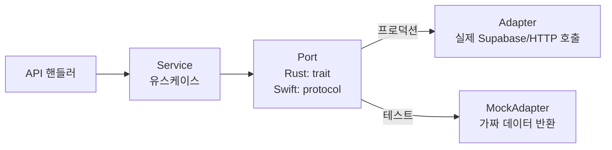

**의존 방향 규칙:**
```
api → services → domain(port) ← infra(adapter)
```
화살표가 항상 안쪽(domain)을 향함. infra가 domain을 바라봄. 반대 금지.

### 각 언어에서의 표현

| 언어 | Port (인터페이스) | Adapter (구현체) |
|------|-----------------|-----------------|
| Swift | `protocol ArticlePort` | `class SupabaseAdapter: ArticlePort` |
| Rust | `trait ArticlePort` | `impl ArticlePort for SupabaseAdapter` |
| TypeScript | `interface ArticlePort` | `class SupabaseAdapter implements ArticlePort` |

이름만 다르고 개념은 완전히 동일.

---

## 7. Supabase — 이 프로젝트의 DB + 인증 담당

### 한 줄 정의

**Supabase = Firebase의 오픈소스 대안.**
PostgreSQL DB + 인증(Auth) + 스토리지를 하나의 서비스로 제공.

### iOS 비유

```
Firebase   ≈ Supabase
Firestore  ≈ Supabase DB (PostgreSQL)
Firebase Auth ≈ Supabase Auth
```

### 이 프로젝트에서 하는 일

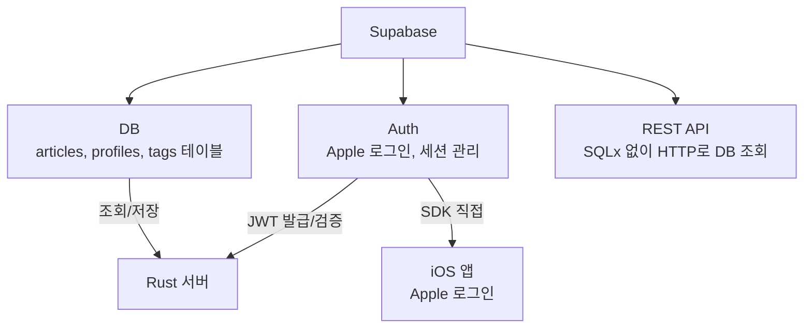

**MVP3 이후 구조:**
- 웹/iOS는 Supabase에 직접 붙지 않음
- Rust 서버만 Supabase와 통신
- iOS는 로그인(인증)만 Supabase SDK 직접 사용

### 마이그레이션이란

DB 테이블 구조를 바꿀 때 쓰는 변경 스크립트.
```
supabase/migrations/0001_create_articles.sql  ← 테이블 생성
supabase/migrations/0002_add_tags.sql         ← 컬럼 추가
```
iOS로 비유하면: CoreData 마이그레이션과 동일한 개념.

---

## 9. 환경변수 흐름 — 민감한 값을 안전하게 쓰는 방법

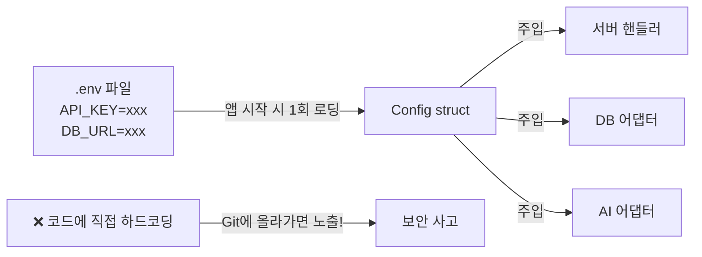

iOS 비유: `.xcconfig` 또는 `Info.plist`에 API 키 분리하는 것과 동일.

---

## 10. 이 프로젝트 개발 사이클

```mermaid
graph LR
    A[/milestone\n큰 그림 설계] --> B[/workflow\n태스크 실행]
    B --> C[step-1~9\n단계별 구현]
    C --> D[MVP 완료]
    D --> E[/daily-retro\n회고]
    E --> F[history/ 아카이빙]
    F --> A
```

---

## 11. Claude Code 스킬 한눈에

| 스킬 | 언제 쓰나 | 한 줄 설명 |
|------|----------|-----------|
| `/init` | 세션 시작 | 현재 상태 파악 |
| `/milestone` | MVP 시작 전 | 큰 그림·로드맵 설계 |
| `/workflow` | 기능 구현 시작 | 9단계 태스크 실행 |
| `/step-{N}` | 중간 재개 | 특정 단계만 실행 |
| `/next` | 다음 단계 진행 | 자동으로 다음 step |
| `/status` | 진행 중 확인 | 현재 단계·진행률 |
| `/daily-retro` | 하루 끝 | 회고 문서 생성 |
| `/notes` | 메모 정리 | 쌓인 메모 분류+설명 |
| `/deep-analysis` | 코드 분석 필요 | 내 파일 심층 분석 |

---

## 12. 외부 서비스 계정 정리

| 서비스 | 연결 계정 | 역할 |
|--------|---------|------|
| Supabase | GitHub | DB + 인증 |
| Tavily | Google | 뉴스 검색 |
| Cloudflare | Google | 터널 + DNS |
| OpenRouter | — | AI 모델 연결 |

---

---

## 13. MVP4 이월 부채 (체크리스트)

- [ ] LLM 모델 MiniMax → Qwen 복귀 — commit 634f4f6 원복 (M1 선행 조건)
- [ ] iOS 요약 60s timeout — 클라이언트 타임아웃 + 재시도 버튼 (High)
- [ ] Apple Client Secret 갱신 알림 — 6개월 만료 2026-10-08경 (High)
- [ ] Supabase Manual Linking — 이메일+Apple 계정 병합, Beta 졸업 후 (Medium)
- [ ] alert → 인라인 에러 UX 개선, iOS 로그인 에러 표시 (Low)
- [ ] iOS UITest/E2E 보강 (MVP2 이월)
- [ ] iOS 커버리지 측정 파이프라인 (MVP2 이월)
- [ ] 태그 stale article 이슈 (MVP3 M2 이월)
- [ ] 웹 UX 개선 — 에러 표시, 로딩 상태 등

---

*최종 업데이트: 2026-04-08 (MVP3 흐름도 스냅샷 링크 추가)*
