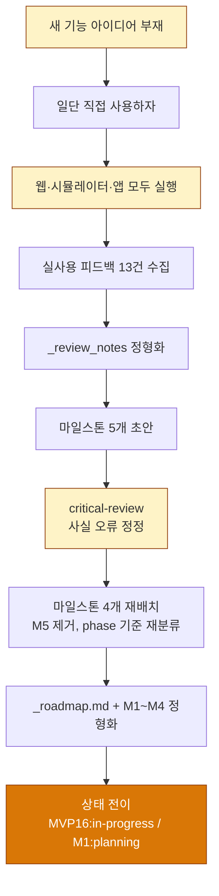
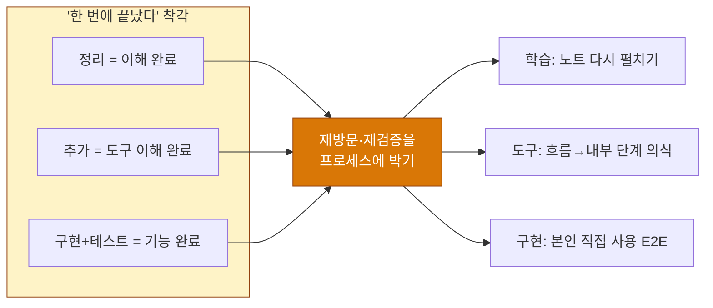

# 🗓️ 2026-05-05 개발 회고

> MVP16 기획 사이클 + MVP1 스터디 보강의 날.
> "한 번 정리하면 끝난다"는 가정이 학습·도구 이해·구현 모든 영역에서 깨진 날이기도 하다.

---

## 오늘 뭘 했나

크게 세 갈래로 흘러갔다.

**오전~오후 중반: MVP1 로그인 스터디 보강.** 어제 정리해둔 Apple/iOS 이메일 로그인 흐름을 오늘 처음부터 다시 따라가 봤다. 그런데 어제 "이해했다"고 적어둔 흐름이 오늘 다시 따라가니 곳곳에서 막혔다. 한 단계씩 짚어가다 보니 "맞긴 맞는데 다시 보면 헷갈리는" 부분이 여러 군데 — 특히 nonce가 어디서 생성되어 어디로 흘러가는지, Keychain이 실제로 무엇을 저장하는지, Session 타입이 SDK·서버·Keychain 사이에서 어떻게 변형되는지가 흐릿했다. 결국 흐름도와 노트를 거의 처음부터 다시 정리했다(`login_flow/`, `mvp1_stage1_notes.md`). 핵심은 특정 키워드 보강이 아니라, **어제 정리해둔 전체 흐름을 다시 따라가니 안 잡히는 부분이 있어 흐름 자체를 다시 정리했다**는 점.

**오후 후반: PPT 작성하면서 훅 시스템 흐름 처음 파악.** `260505_presentation.html`을 만드느라 훅 관련 파일들을 들여다봤는데, 그동안 "추가만" 해온 훅 3~4개가 실제 워크플로우에서 어떤 순서로 어떻게 호출되는지를 처음으로 그려봤다. 장치1/2/3 구조가 비로소 머리에 들어왔다 — 여전히 내부 동작 디테일까지 다 안 건 아니지만, "어떻게 흘러가는지"는 처음으로 윤곽이 잡혔다. "필요해서 추가했다"로 끝낸 도구가 사실 흐름조차 모른 채 쓰이고 있었다는 자각. 이 과정의 부산물로 step-2/3/5/6/7/8가 `active_step.txt`를 갱신 안 하고 있다는 사실(DEBT-HOOK-01)도 발견 — 기능 영향 없는 부채라 등록만 해두었다.

**저녁: MVP16 마일스톤 기획 사이클.** 오늘의 본 작업. `_seed` → 실사용 피드백 13개 정리 → `_review_notes` 정형화 → 마일스톤 5개 → 4개로 재배치 → `_roadmap.md` + `M1~M4` 정형화 → critical-review로 사실 오류 정정 → 상태 파일을 `MVP16:in-progress / M1:planning`으로 전이. 이 사이클이 가능했던 건, 이번 MVP의 시작이 "기능 추가 아이디어 부재"여서 일단 본인이 웹·시뮬레이터·앱을 다 돌려본 뒤였기 때문이다.

마지막으로 MVP1 온보딩 스터디(stage 2)도 시작해뒀다 — `flow_onboarding.svg` + `mvp1_stage2_notes.md`.

---

## 핵심 의사결정과 그 이유

### 결정 1 — MVP16 정체성을 "실사용 피드백 기반 오류·회귀 수정 사이클"로 확정

- **상황**: MVP16에 무엇을 넣을지 한참 고민했지만 추가하고 싶은 새 기능이 떠오르지 않았다. 그래서 "일단 만든 거 직접 써보자"고 결정하고 웹·시뮬레이터·앱을 모두 돌려봤다.
- **선택지들**:
  - (a) 새 기능 한두 개를 짜내서 MVP16을 채우기
  - (b) 실사용에서 발견된 항목으로만 사이클 한 번 돌리기
  - (c) (a)+(b) 절충 — 일부 새 기능 + 일부 수정
- **결정**: (b). 새 기능 확장은 다음 MVP 후보로 분리(`_review_notes.md` §5), 이번 사이클은 "오류·회귀 수정"으로 정체성 박제.
- **왜**: 직접 써보니 인터뷰·기획·구현으로 닫힌 줄 알았던 항목들이 실제로는 안 닫혀 있었다. 웹-앱 싱크 미스, 시뮬레이터-앱 차이(아직 진짜로 다른지 추가 확인 필요), 태그-기사 매칭 부정합, LLM 출력에 한자 섞임, 오답 노트 원문 URL 누락. 13건 발견. 이게 안 정리된 채로 새 기능을 또 얹는 건, 흙바닥에 벽돌 더 쌓는 일이라고 느꼈다.
- **인사이트**: "기능을 추가하는 것보다, 내가 만든 것이 내 생각과 맞는지 확인하는 게 더 중요한 시점이 있다"는 자각. 이게 MVP16 KPI에 "본인 직접 사용 E2E" 3건이 들어간 배경이고, 앞으로 모든 MVP에 비슷한 항목이 들어가게 만들 압력이 됐다.

### 결정 2 — step-1과 step-4에만 인터뷰를 두는 이유 정형화

- **상황**: 9단계 워크플로우에서 step-1과 step-4 둘 다 "인터뷰" 단계인데, 둘이 어떻게 다른지가 그동안 모호했다. PPT 준비하면서 다시 들여다봤다.
- **선택지들**:
  - (a) step-1만 인터뷰, step-4는 자동 분해
  - (b) step-1/step-4 둘 다 인터뷰 유지, 역할 명확화
  - (c) 인터뷰 단계를 하나로 통합
- **결정**: (b). step-1은 "메인태스크 범위 확정용 인터뷰", step-4는 "각 서브태스크의 상세 요구사항 확정용 인터뷰"로 역할 박제.
- **왜**: step-1에서 메인태스크 단위로 한 번에 모든 디테일을 결정해버리면, 분해 후 각 서브태스크에서 발견되는 작은 결정사항이 전부 추측·생략된다. 반대로 step-4만 두면 메인태스크 범위 자체가 흔들린다. 두 층의 결정 단위가 다르다는 게 인터뷰가 두 번 필요한 이유.
- **인사이트**: 워크플로우 단계는 비슷해 보여도 "결정의 단위"가 다르면 분리해야 한다. 인터뷰 위치가 두 곳인 건 비효율이 아니라 의도된 안전장치였다.

### 결정 3 — MVP1 로그인 흐름을 다시 따라가며 노트 재정리

- **상황**: 어제 정리한 Apple/iOS 이메일 로그인 흐름을 오늘 처음부터 다시 따라가 봤는데, 어제 "이해했다"고 적어둔 흐름이 오늘 따라가니 곳곳에서 막혔다. 특정 키워드 한두 개가 아니라 **흐름 자체가 다시 보면 안 잡히는** 형태. 막힌 곳을 짚어보니 nonce·Keychain·Session 같은 부분이 특히 흐릿했지만, 더 큰 문제는 "어제 적은 흐름을 오늘 다시 따라갈 수가 없다"는 사실 자체였다.
- **선택지들**:
  - (a) "이미 정리했으니 됐다"로 두기
  - (b) 어제 노트를 base로 두고 흐름을 다시 따라가며 빈틈 채우기
  - (c) 노트를 폐기하고 처음부터 다시 쓰기
- **결정**: (b). 어제 노트를 base로 두되, 흐름을 처음부터 다시 따라가며 막힌 곳을 고치고 보강.
- **왜**: 어제의 이해와 오늘의 이해가 달라 보인다는 사실 자체가 정보였다. 폐기(c)하면 그 차이를 못 본다. 그대로 두기(a)는 가장 위험 — "정리했다"는 착각이 박힌다.
- **인사이트**: **정리는 학습의 시작이지 끝이 아니다.** 한 번 정리해서 끝났다고 느끼는 순간이 가장 위험. 다시 따라가 보면 흐릿한 부분이 드러나고, 그 차이를 마주할 때 비로소 한 단계 깊어진다.

---

## 기획/설계 과정 — MVP16이 닫히는 데 걸린 단계

이 흐름에서 가장 인상 깊은 분기는 두 곳.

**A → C** — "기능이 안 떠오른다"가 막다른 길이 아니라, "그럼 직접 써보자"로 이어진 분기. 만약 여기서 억지로 새 기능을 짜냈다면 MVP16의 정체성이 어정쩡해졌을 것이다.

**F → G** — critical-review가 사실 오류를 잡아낸 분기. D2(오답 노트 원문 URL)는 서버가 이미 정합이라 M3 → M4로 이동했고, C2-bug는 "캐시 키 확장"이 아니라 favorites 데이터 모델 변경(JSONB 또는 별도 테이블)으로 정확화됐고, occupation 의미 매트릭스가 박제됐다. 이걸 step-1 워크플로우에서 발견했다면 더 늦었을 것이다.

---

## 인사이트 & 피드백

오늘 가장 무겁게 와닿은 것 셋이 모두 같은 패턴을 공유한다는 것을 깨달았다.

**1. 학습 — 한 번 정리해서 끝낸 줄 알았는데 다시 따라가니 막힌다.**
어제 로그인 흐름을 정리했을 때는 "이해했다"고 느꼈지만, 오늘 흐름을 처음부터 다시 따라가니 여러 군데서 막혔다. 한 번 적은 글이 다시 읽힐 때 그대로 읽히지 않는다는 자각. 다시 따라가 보지 않으면 어디가 흐릿한지조차 알 수 없다.

**2. 도구 이해 — 사용 → 흐름 → 내부 동작 단계가 따로 있다.**
훅을 그동안 "필요해서 추가했다"로 끝냈다. 오늘 PPT 준비하느라 훅 3~4개 파일을 들여다보면서 비로소 워크플로우에서 어떤 순서로 어떻게 호출되는지를 처음으로 그렸다. 사용은 했지만 흐름조차 모르고 있었다는 자각. 내부 동작은 여전히 모른다. 단계가 있다는 사실 자체를 의식하지 않으면 첫 층에서 멈춘다.

**3. 구현 — 인터뷰·테스트 통과로 닫힌 게 실사용에서 안 닫혀 있다.**
13건의 피드백이 그 증거다. 단위 테스트와 인터뷰는 "내가 의도한 대로 동작하는가"는 검증해도, "내 의도가 실제 사용 맥락과 맞는가"는 검증하지 못한다.

이 셋의 공통 패턴은 **"한 번에 끝났다고 생각하는 것이 함정"**이다. 학습이든 도구든 구현이든 첫 사이클은 출발점에 가깝고, 재방문·재검증이 진짜 작업이다. 셋 다 따로따로의 이슈 같지만 "한 번 닫았다"는 착각이 공통 원인.

**실용 액션 측면**에서는 이 깨달음이 두 곳에 박혔다.
- MVP16 KPI의 "본인 직접 사용 E2E" 3건 (M1)
- MVP16 정체성 자체가 "실사용 검증 사이클"

다음 MVP 사이클에서도 이 항목이 자연스럽게 들어가게 만드는 게 다음 과제. 즉 "이번에 운 좋게 박힌 게 아니라 구조적으로 항상 박히게" 만들어야 한다.

---

## 배운 것

- **나의 사고 패턴 한 가지를 자각함**: "한 번 정리하면 끝났다"고 가정하는 패턴이 학습·도구·구현 세 영역에 동일하게 작동하고 있었다. 각 영역의 어려움을 따로 보지 않고 같은 패턴으로 묶는 것이 회고의 가치였다.
- **워크플로우 단계의 결정 단위**: step-1과 step-4가 둘 다 인터뷰인 이유는 "메인태스크 범위"와 "서브태스크 디테일"의 결정 단위가 다르기 때문. 비슷해 보이는 단계는 결정 단위를 보면 분리 이유가 보인다.
- **critical-review의 자리**: 마일스톤 정의 후, 워크플로우 진입 전에 critical-review를 한 번 거치면 step-1에서의 발견 비용을 크게 줄일 수 있다. 오늘 D2 재배치·C2-bug 정확화·occupation 매트릭스가 모두 이 위치에서 잡혔다.
- **DEBT-HOOK-01**: step-2/3/5/6/7/8가 `active_step.txt`를 갱신 안 하고 있다. 기능 영향은 없지만 `/init`의 컨텍스트 복원 정확도를 떨어뜨린다.

---

## 느낀 점

기능을 추가하지 않는 MVP를 만든다는 게 처음엔 어색했다. "MVP인데 새 기능 없이 닫아도 되나?"라는 의심. 그런데 직접 써보고 13건이 줄줄이 나오는 걸 보니, 이번 사이클은 오히려 가장 "필요했던" MVP라는 확신이 들었다. 기능을 더 얹는 것보다, 내가 만든 게 내 생각과 맞는지 맞춰보는 시간이 부족했던 것이다.

어제 정리한 로그인 흐름을 오늘 처음부터 다시 따라가 봤는데, 어제 "이해했다"고 적어둔 흐름이 오늘은 곳곳에서 막혔다. 부끄럽기보다는 신기했다 — 정리는 한 번이면 충분하다는 가정이 이렇게까지 틀릴 수 있구나.

PPT를 만들면서 훅 3~4개 파일의 흐름을 처음으로 그려본 것도 같은 결의 경험이었다. 그동안 "필요해서 추가했다"로 끝낸 도구가 이렇게나 많구나, 흐름조차 모르고 쓰고 있었구나. 이걸 자각한 건 부담이 아니라 안도감에 가까웠다 — 모르는 게 있다는 걸 아는 것 자체가 출발점이니까.

MVP가 늘어날수록 이전 MVP에 대한 이해도 같이 깊어져야 한다는 생각이 점점 커진다. 새로 만드는 속도와 기존을 다시 보는 속도가 너무 벌어지면, 어느 순간 내가 만든 것이 내가 모르는 것이 된다.

---

## 내일 할 일

**A. MVP16 M1 워크플로우 진입** (메인)
- `/workflow "M1-search-tag-alignment"` 호출
- step-1에서 미결정 2건 매듭짓기
  - A3 운영 정의: (i) 같은 검색 = 같은 결과 vs (ii) N태그 carry (모델 변경 동반)
  - A3 매칭 전략 진단: 통합 캐시 vs 사후 분류 (step-6 진단 후)
- 6개 아이템 분해(step-3) → step-4 인터뷰 → step-6 구현 → step-8 E2E

**B. MVP1 온보딩 스터디 마무리** (병행)
- 오늘 시작한 `flow_onboarding.svg` + `mvp1_stage2_notes.md` 정리 마무리
- 어제 로그인 스터디에서 나온 "한 번 정리는 출발점" 교훈을 의식하면서, 어제 노트와 모순되는 부분이 있는지 재검증까지 포함

> MVP가 늘어날수록 이전 MVP 이해를 따라가야 한다는 자각을 행동으로 — A로 새 사이클을 시작하면서, B로 기존 이해를 깊이는 패턴을 같은 날에 같이 돌려보는 것이 내일의 실험.

---

*— 회고 작성: 2026-05-05*
