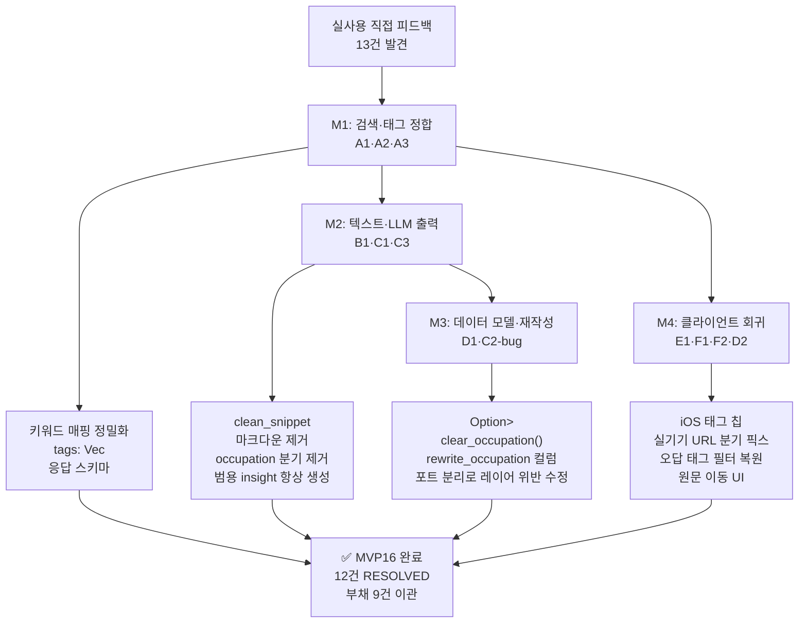

# 🗓️ 2026-05-07 개발 회고

> MVP16 완전 종료 + 훅 시스템 Phase 1 구현의 날.
> "지시가 있어도 Claude가 빠뜨린다"는 사실을 인정하고, 기계로 막은 날.

---

## 오늘 뭘 했나

오늘은 크게 두 단계로 흘렀다.

**오전: MVP16 아카이빙.** 어제(05-06) M4를 완전히 닫았다. E1(iOS 피드 카드 태그 칩), F2(오답노트 태그 필터 회귀 복원), D2(오답 원문 이동 UI)가 전부 구현·테스트 완료됐고, 오늘 아침에 `progress/mvp16/` 전체를 `history/mvp16/`으로 이동했다. 커밋 `536b48d`. 로드맵·시드·마일스톤 파일 14개 + 서브태스크 폴더 5개 + 분석 2건을 한 번에 아카이빙. `history/INDEX.md`에 MVP16 섹션도 추가했다.

M4에서 마지막으로 처리한 F1(실기기 오답 저장 회귀)은 흥미로운 케이스였다. 시뮬레이터에서는 멀쩡한데 실기기에서만 오답이 저장 안 되는 문제. `F1_diagnosis.md`를 써가며 진단하다 보니 ATS/Keychain이 아니라 API base URL 분기 문제로 이어졌다. 진단 → 문서화 → 픽스 순서를 지킨 덕에 원인을 추측으로 때우지 않았다.

**오후~저녁: 훅 시스템 Phase 1.** MVP16 아카이빙 후 자연스럽게 "다음은?"을 생각했는데, 평소부터 거슬렸던 훅 시스템 문제가 먼저 올라왔다. step-2/3/5/6/7/8 SKILL들이 `active_step.txt`를 갱신하지 않는다는 게 DEBT-HOOK-01로 등록된 지 이미 이틀이 지난 상태였다.

문제를 파고드니 부채가 4개로 늘었다 — DEBT-HOOK-01(각 step SKILL 갱신 누락), DEBT-HOOK-02(PostToolUse 훅 미구현), DEBT-HOOK-03(/next 자동 흐름 미구현), DEBT-HOOK-04(step-8 테스트 사용자 위임 문제). 이걸 `plan_hook_phase1.md`로 정리하고 ST-1~ST-4로 나눠 Phase 1 범위를 확정한 뒤 구현에 들어갔다.

핵심은 B안 — `.claude/hooks/update-active-step.sh` 신규 구현과 `settings.json` PostToolUse 훅 등록. E2E 검증: `/step-2` 호출 → `active_step.txt = "step-2"` 자동 갱신 확인, `/status` 호출 → 필터 동작, 변화 없음 확인.

---

## 핵심 의사결정과 그 이유

### 결정 1 — MVP16 M1~M4 전체: 어제 포함 요약

어제(05-06)가 MVP16의 마지막 날이었고, 오늘 아카이빙까지 했으니 이 회고에서 MVP16 전체를 되돌아볼 필요가 있다.

- **상황**: 실사용 피드백 13건 발견 → M1~M4로 구조화
- **M1(검색·태그 정합)**: `tag_search_keyword()` 매핑 정밀화 + Tavily `country` 파라미터 제거. 핵심 결정은 A3 운영 정의를 "(i) 같은 검색 = 같은 결과"로 잡고 다중 태그 carry는 `tags: Vec<Uuid>` 응답 스키마로 처리. 한국어 기사 노출 이슈(A2)는 영어 키워드 병행으로만 해소하고 Naver News 어댑터는 DEBT-MVP16-05로 이관.
- **M2(텍스트·LLM 출력 정제)**: `clean_snippet` 파이프라인 정비(마크다운 패턴 5개 제거) + `SYSTEM_PROMPT_SUMMARY` 통합(occupation 분기 제거 → 항상 범용 insight 생성). 한국어 한자 혼입은 프롬프트 제약으로 어느 정도 억제했으나 모델 교체 평가는 DEBT-MVP16-06으로 남겼다.
- **M3(데이터 모델·재작성 정합)**: occupation 삭제 불가 버그(D1) 수정 — `Option<Option<String>>` 커스텀 deserializer + `clear_occupation()` + `clear_rewrites_for_user()` 포트 분리. C2-bug는 `rewrite_occupation` 컬럼 추가로 단순하게 해결. step-7에서 `infra → services` 레이어 위반이 발견되었고, 그 자리에서 즉시 포트 분리로 수정했다(`feedback_architecture_violation_fix`).
- **M4(클라이언트 표시·회귀)**: E1(iOS 태그 칩), F1(실기기 회귀), F2(오답 태그 필터), D2(원문 이동 UI) 4건 전부 복원. F1 진단 보고서 문서화 포함.

**인사이트**: MVP16은 "직접 써보니 닫힌 줄 알았던 게 열려있었다"는 사이클이다. 내가 만든 걸 내가 직접 써보는 시간이 없으면, 기획·구현·테스트를 다 통과해도 사용자 경험은 전혀 다른 상태일 수 있다.

---

### 결정 2 — B안(PostToolUse 훅) 선택, A안과 병행

- **상황**: DEBT-HOOK-01 처리 방향을 결정해야 했다. "각 SKILL.md에 지시를 추가한다(A안)"와 "훅으로 자동화한다(B안)" 중 선택.
- **선택지들**:
  - A안: 각 step SKILL.md 진입부에 `echo "step-N" > progress/active_step.txt` 추가 (단순, 즉시 적용 가능)
  - B안: PostToolUse 훅으로 Skill 도구 호출 시 자동 갱신 (Claude 의존 제거, 구현 복잡도 있음)
  - C안: A안만으로 마무리 (빠르지만 step-9에서 이미 실패한 방식의 반복)
- **결정**: B안을 근본으로, A안을 백업으로 병행.
- **왜**: step-9 SKILL.md에는 이미 `echo "none" > active_step.txt` 지시가 있었는데 실행이 안 됐다. "지시가 있어도 Claude가 빠뜨린다"는 사실이 이미 확인된 상태에서 A안만 하는 건 같은 실패를 반복하는 것. B안은 Claude가 Skill 도구를 호출하는 PostToolUse 이벤트를 훅에서 잡아서 `tool_input.skill` 값을 직접 파싱한다. Claude가 명시적으로 갱신하지 않아도 훅이 강제 갱신한다.
- **인사이트**: "지시를 더 명확하게 쓰면 되지 않나?"가 첫 반응이었는데, step-9 케이스를 보면 그 전략이 이미 실패했다는 게 데이터다. 규칙을 문서에 더 추가하는 것과 기계가 강제하는 것은 완전히 다른 신뢰성을 준다. 이건 Claude Code 워크플로우에서 반복적으로 확인되는 패턴 — "같은 문제가 두 번이면 기계로 막는다"는 원칙이 여기서도 적용됐다.

---

### 결정 3 — DEBT-HOOK-03(/next 자동 흐름)을 Phase 2로 분리

- **상황**: Phase 1을 구현하다 보니 DEBT-HOOK-03(/next 자동 흐름 재설계)도 같이 처리하고 싶었다. "active_step.txt 갱신이 됐으니 /next가 이걸 읽어서 자동 진행하면 되겠다"는 생각이 들었다.
- **선택지들**:
  - (a) Phase 1에 DEBT-HOOK-03도 포함해서 한 번에 처리
  - (b) Phase 2로 분리, 선행 조건(실전 검증) 명시 후 착수
- **결정**: (b). Phase 2로 분리.
- **왜**: DEBT-HOOK-03의 핵심 설계 리스크가 아직 해소되지 않았다. "step-6(구현)이 완료됐다"는 시그널을 어떻게 정의할 것인가 — 구현이 수십 turn에 걸칠 수 있고, 모델이 자의적으로 "완료"라 판단하고 다음 step으로 넘어갈 위험이 있다. 이 부분을 해결하지 않은 채 /next 자동 진행을 구현하면, 오히려 워크플로우가 더 불안정해질 수 있다. Phase 1이 실전에서 얼마나 잘 작동하는지 먼저 확인한 후에 설계해야 한다.
- **인사이트**: "할 수 있다"와 "지금 해야 한다"는 다르다. Phase 1 결과가 실전 검증을 통과해야 Phase 2 설계의 전제가 단단해진다.

---

### 결정 4 — step-8 SKILL.md 자동 실행 원칙 blockquote 추가 (DEBT-HOOK-04)

- **상황**: step-8에서 자동화 가능한 항목(린트, 빌드, 단위 테스트, E2E)을 Claude가 사용자에게 위임하는 문제. SKILL.md에 이미 "Claude가 직접 실행"이라고 적혀 있었는데 실제로는 안 됐다.
- **결정**: 자동 실행 원칙을 blockquote 형식으로 강조해서 재명시. "Bash 도구로 직접 실행, 시각 확인만 사용자 요청"을 명시적으로 구분.
- **왜**: 지시가 일반 산문 속에 묻혀 있으면 놓치기 쉽다. blockquote로 시각적으로 분리하면 해당 단계에서 읽을 때 주목도가 높아진다. 완전한 해결책은 아니지만 B안 훅과 병행하면 충분한 안전망이 된다.

---

### 결정 5 — Phase 2 착수 조건을 구체적으로 명시

- **상황**: DEBT-HOOK-03에 "Phase 2 착수 가능"이라는 문구만 있으면 기준이 모호해서 언제든 일찍 착수할 유혹이 생긴다.
- **결정**: "Phase 1 완료 후 실제 워크플로우 실행으로 step 추적 정확성 검증, 그 결과를 기반으로 설계·착수한다"는 조건을 `debts.md`와 `plan_hook_phase1.md`에 명시.
- **왜**: 검증 없는 Phase 2는 "훅이 잘 작동하고 있다는 가정" 위에 더 복잡한 로직을 얹는 것이다. Phase 1이 틀어지면 Phase 2 전체가 흔들린다. 조건을 명시해두면 다음 세션에서도 "Phase 1이 충분히 검증됐는가?"를 먼저 확인하게 된다.

---

## 기획/설계 과정

훅 시스템 Phase 1의 설계 과정은 흥미로웠다. 처음에는 "SKILL.md에 지시를 추가하면 된다"는 단순한 A안만 생각했는데, step-9에서 이미 같은 방식이 실패했다는 걸 확인하는 순간 방향이 바뀌었다.

PostToolUse 훅 구현에서 첫 번째 난관은 "훅에서 `tool_input.skill` 값을 실제로 읽을 수 있는가"였다. 이걸 먼저 임시 훅으로 검증했다 — `echo "$HOOK_INPUT" >> /tmp/hook_debug.log`. stdin JSON 구조가 실제로 `tool_name`, `tool_input.skill` 필드를 포함한다는 걸 확인한 후에야 실제 스크립트를 작성했다. 검증 없이 "될 것 같다"고 구현에 들어갔으면 디버깅에 더 많은 시간이 걸렸을 것이다.

필터 로직도 중요한 결정이었다. `/next`, `/workflow`, `/init`, `/status` 등 다른 Skill 호출이 step-N 패턴과 겹치지 않도록 `grep -qE '^step-[1-9]$'` 정규식으로 좁혔다. 정수 [1-9]를 명시한 이유는 step-10 이상이 생겼을 때 의도치 않게 갱신되는 것을 방지하기 위해서다.

---

## MVP16 구현 회고 (M1~M4 요약 다이어그램)

---

## 훅 시스템 Phase 1 설계 흐름

```mermaid
graph LR
    PROBLEM["step-2~8\nactive_step.txt\n갱신 안 함"] --> ANALYSIS

    ANALYSIS["원인 분석:\nstep-9에도 지시 있었음\n→ 실행 안 됨"] --> OPTIONS

    OPTIONS["A안: SKILL.md 지시 추가\nB안: PostToolUse 훅 자동갱신\nC안: A안만"]

    OPTIONS --> DECISION["B안 근본\nA안 백업\n병행 채택"]

    DECISION --> ST1["ST-1: 훅 stdin\ntool_input.skill\n읽기 검증"]
    ST1 --> ST2["ST-2: update-active-step.sh\n구현 + settings.json 등록"]
    ST2 --> ST3["ST-3: step-2~8 SKILL.md\n갱신 지시 추가"]
    ST3 --> ST4["ST-4: step-8 자동실행\n원칙 blockquote 강조"]

    ST4 --> E2E["E2E:\n/step-2 → active_step.txt=step-2\n/status → 변화 없음"]
    E2E --> RESOLVED["DEBT-HOOK-01/02/04\nRESOLVED"]

    RESOLVED --> PHASE2["DEBT-HOOK-03\nPhase 2 대기\n선행: 실전 검증"]
```

---

## 인사이트 & 피드백

**"지시를 더 명확하게"는 이미 실패한 전략이다.** SKILL.md에 명시된 지시가 실행 안 된다는 게 step-9 케이스에서 이미 증명됐다. 이런 상황에서 같은 방식으로 지시를 더 추가하는 것은 "이번엔 다를 거야"라는 낙관 편향이다. 훅 레벨로 올려서 Claude 의존을 끊는 것이 맞는 대응이었다.

**진단 → 문서화 → 픽스 순서는 실제로 효과가 있다.** F1 케이스에서 잘 드러났다. 실기기에서만 재현되는 버그를 "아마 ATS 문제겠지"로 추측하고 바로 코드를 뜯었다면 전혀 다른 곳을 건드렸을 것이다. 진단 보고서를 먼저 써가면서 원인 후보를 좁히는 과정이 있었기 때문에 실제 원인(API base URL 분기)까지 도달할 수 있었다.

**레이어 위반을 그 자리에서 고친 것은 옳은 결정이었다.** M3 step-7에서 `infra → services` 의존 위반이 발견됐을 때, "다음 MVP에서 처리하자"는 유혹이 있었다. 하지만 `feedback_architecture_violation_fix` 원칙대로 그 마일스톤 안에서 즉시 수정했다. `AlertDispatcherPort` trait 신설로 infra→services 의존을 끊은 것처럼, 이번에도 포트 분리로 해결했다. 부채를 쌓는 것과 즉시 고치는 것의 차이는 "지금은 작은 불편"과 "나중에는 큰 리팩토링" 사이의 차이다.

**"같은 문제가 두 번이면 기계로 막는다."** 이번 회고에서 가장 중요한 원칙으로 꼽고 싶다. 문서·SKILL.md·CLAUDE.md에 규칙을 추가하는 것과 hook·deny·pre-commit으로 강제하는 것은 신뢰성이 완전히 다르다. 앞으로 같은 문제가 반복되는 걸 발견하면 문서 수정이 아니라 기계 강제로 바로 올려야 한다.

---

## 배운 것

**PostToolUse 훅의 stdin JSON 구조.** `tool_name`, `tool_input.skill` 필드가 직접 넘어온다. `jq -r '.tool_name'`으로 파싱 가능하고, 필터 정규식으로 특정 Skill만 골라낼 수 있다. `CLAUDE_PROJECT_DIR` 환경변수로 레포 루트를 안전하게 참조할 수 있다.

**Rust `Option<Option<String>>` serde 처리.** JSON에서 "키 없음(변경 안 함)"과 "키=null(삭제)"을 구분하려면 `#[serde(default)]` + 커스텀 deserializer 조합이 필요하다. `serde_with` 크레이트 없이 직접 구현하는 방식도 충분히 가능하다.

**포트 경계를 지키면서 cascade 처리하는 방법.** 단일 DB 메서드로 두 테이블을 건드리면 포트 경계 위반이 된다. 대신 핸들러에서 두 포트를 순서대로 호출(best-effort)하는 방식이 있다. 완전한 트랜잭션 보장은 안 되지만, 포트 분리를 지키면서 idempotent 연산을 순서대로 처리하는 실용적 타협이다.

---

## 느낀 점

MVP16이 끝났다. "오류·회귀 수정 사이클"이라는 정체성으로 시작했는데, 막상 끝내고 나니 단순히 버그 고치는 것 이상이었다. 내가 만든 걸 내가 쓰면서 "이게 내 생각과 맞는가?"를 확인하는 시간이 이 프로젝트에서 처음 있었다.

훅 시스템 Phase 1은 하루 만에 설계·구현·검증까지 마쳤다. 예상보다 빨리 끝났고, E2E 검증도 깔끔하게 통과했다. 뿌듯했다. 더 중요한 건, Phase 2 설계 리스크를 명확히 인식하고 "지금은 아니다"를 결정한 것이다. 할 수 있다고 해서 지금 해야 하는 건 아니라는 걸, 이번에 조금 더 실감했다.

---

## 내일 할 일

- DEBT-HOOK-03(/next 자동 흐름) Phase 2 착수 조건 확인 — Phase 1이 실전 워크플로우에서 제대로 작동하는지 먼저 검증
- MVP17 기획 사이클 시작 — `_seed.md` 작성 (피드 품질 고도화 2라운드 또는 새 기능 방향?)
- MVP1 스터디 stage 2 마무리 — `flow_onboarding.svg` 기반 개념 정리

---
