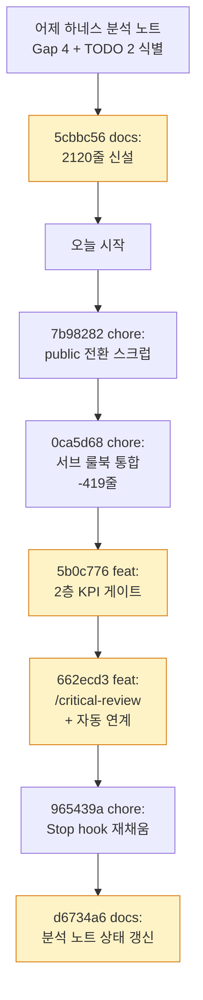

# 🗓️ 2026-04-18 (토) 개발 회고

> **오늘의 한 줄**: 하네스 분석 → 갭 식별 → "문서 원칙"을 "기계 강제"로 격상한 날.
>
> **활성 상태**: MVP11 planning / 활성 마일스톤 none
>
> **커밋 7개, 총 +3,647 / −614 라인** (주로 문서 + 인프라)

---

## 🌅 오늘 뭘 했나

오늘은 코드를 만지기보다 **AI와 내가 일하는 환경 자체를 손본 날**이었다. 어제 올린 "하네스 엔지니어링 비교 분석 노트"가 발단이었는데, 이 문서가 갭 4개(G1/G3/G4/G6)와 TODO 2개를 정리하자마자 "이걸 문서로만 남기면 어차피 안 지켜진다"는 생각이 들었다. 그래서 하루를 4개 묶음으로 끊어 진행했다.

**첫 묶음 (낮, ~15:44)** — 저장소를 public으로 열 가능성을 열어두기 위한 정리 작업이었다. history 문서들에 흩어져 있던 네이버 이메일, Supabase project ref, `/Users/seungchan/` 로컬 경로를 스크럽하고, `.mcp.json`은 사용자별 절대 경로가 섞여 있어서 `.gitignore`에 넣고 `.mcp.json.example`로 분리했다. 분석 문서를 공유할 수 있게 만드는 준비였다.

**두 번째 묶음 (16:03, 룰 슬림화)** — 서브 룰북 재정비. `rules/sub/mcp_integration.md`와 `mcp_tool_design.md`를 `agents.md` 하나로 통합(419줄 삭제)하고, `workflow.md`는 별도 단계 시스템이 아니라 사고 가이드로 재정의해서 `0_CODEX_RULES.md §3`의 5단계와 충돌하던 부분을 없앴다. 스코프가 중복되던 게 여러 군데 있었는데, "같은 주제를 두 문서가 다루면 둘 다 안 지킨다"는 감각이 강해진 상태에서 한 번에 쳐냈다.

**세 번째 묶음 (16:04, 메인 작업 — feat 2개)** — 오늘의 핵심.

1. **2층 KPI 게이트 시스템**: `scripts/kpi-lib.sh`(250줄) + `kpi-check.sh`(131줄) + `kpi-report.sh`(128줄)을 새로 짜고, `progress/active_mvp.txt`·`active_milestone.txt` 2층 상태 파일, `TEMPLATE_mvp_kpi.md`를 갖췄다. 파서가 각 MVP 기획 문서에서 `## KPI` 섹션을 읽고, 상태(`planning/in-progress/completing/done`)에 따라 Hard 게이트를 자동 강등한다. pre-commit이 Hard 미달이면 커밋을 막는 구조. `CLAUDE.md`도 215줄 → 95줄로 대거 줄이고 KPI 섹션을 신설했다.

2. **`/critical-review` 스킬 신설**: 적대적 시각으로 기획·분리안의 숨은 구멍을 선제로 발굴하는 스킬. 치명/중대/경미 분류 + 각 구멍에 대안 동반. `/milestone` [6.5]단계에 자동 호출을 걸고, step-5에도 [3.5]에 연계했다. `/milestone-review`는 역할을 축소해서 MVP 사이클 경계에만 호출되도록 바꾸고, 각 마일스톤 단위 전이는 `/workflow`에 자동으로 넘겼다.

**네 번째 묶음 (16:03~21:00, 하네스 hook + 문서 재반영)** — Stop hook을 단순 echo에서 `scripts/kpi-report.sh --quick`으로 바꿔서 턴 종료 시 KPI 상태를 1줄로 표시하도록 하고, PostToolUse(Edit|Write) 신설 — active MVP에 Hard KPI가 있으면 편집 직후 `/kpi 실행 권장` 리마인더가 나온다. 마지막 21:00 커밋은 하네스 분석 문서에 오늘 반영한 것들(G1/G3/G4/G6, 8.1/8.2)의 현재 상태를 표로 정리해서 "언제 어디까지 왔는지" 추적 가능하도록 박았다.

---

## 🎯 핵심 의사결정과 그 이유

### 결정 1: 하네스 2문서를 frank 실측과 대조하는 노트 작성

**상황**. Anthropic의 "긴 작업 실패 4유형" 가이드와 OpenAI의 "5개월·100만줄 프로젝트 Harness Engineering" 블로그를 각각 읽고 나서, 둘을 따로 요약만 할지 / 내 프로젝트 현황과 맞대놓고 볼지 고민했다.

**선택지들**.
- **A. 각 문서 요약만** — 시간 적게 들지만 "내 프로젝트에 뭐가 부족한지"가 안 드러남.
- **B. 한 문서만 깊게** — 한쪽에만 편향됨. 두 문서의 시각이 꽤 다름.
- **C. 두 문서 교차 + frank 실측 인벤토리** — 시간 많이 들지만 **갭 식별이 객관적**. 양 문서가 같이 언급하는 게 진짜 중요한 원칙이라는 가설.

**결정**. C. Strong Fit 9개 + Gap 4개(G1/G3/G4/G6) + 스코어카드를 2120줄짜리 MD/HTML 쌍으로 작성.

**왜**. 하네스의 핵심은 "일반론"이 아니라 "이 프로젝트는 지금 어디쯤이냐"다. 실측 없이 읽으면 "맞는 말이네" 하고 끝난다. 실측을 인벤토리로 박아두면 **나중에 다시 봤을 때 "그때 대비 얼마나 성숙했나"를 숫자로 추적** 가능하다. 오늘 오후에 한 작업 대부분이 이 인벤토리에서 직접 도출된 것만 봐도 원본 투자 대비 회수는 컸다.

**인사이트**. 학습 문서는 "남이 한 말을 받아적는 형태"가 아니라 **"내 상황에 얹어보는 형태"**로 써야 쓸모가 생긴다. 대조가 없으면 그냥 지식이다.

---

### 결정 2: KPI 게이트를 단일 계층이 아닌 "2층"으로 설계

**상황**. 지금까지 MVP 단위로 KPI를 선언하고 pre-commit이 검증해 왔는데, MVP가 여러 마일스톤(M1/M2/M3)으로 쪼개져 있다 보니 "어느 마일스톤의 어떤 지표가 활성인지" 불분명했다. 특히 M1이 끝났는데 M2에서 M1 지표를 계속 검증하는 이상한 상황이 반복됐다.

**선택지들**.
- **A. 단일 MVP 기준 유지** — 기존 방식. MVP 전체 기준 고정. 단순하지만 마일스톤 전환 시 정확도 떨어짐.
- **B. 마일스톤별 KPI만** — 각 M 단위 지표만 검증. 단순하지만 **MVP 최종 품질 게이트가 사라짐**.
- **C. 2층 구조: 마일스톤 KPI + MVP 최종 KPI 분리** — 복잡도 올라가지만 각 층의 책임이 명확해짐.

**결정**. C. 각 `M{X}_*.md`에 마일스톤용 ## KPI, `_roadmap.md`에 MVP 최종 ## KPI 두 개를 두고, `active_mvp.txt` + `active_milestone.txt` 두 상태 파일로 "지금 누가 활성이냐"를 관리.

**왜**. 마일스톤과 MVP 최종은 **질적으로 다른 게이트**다. 마일스톤은 "이 단계 기능이 회귀 없이 통과했나", MVP 최종은 "사용자 가치 지표 달성했나". 한 층에 섞으면 커버리지 같은 점진 지표와 기능 완성도 같은 회귀 지표가 뒤엉킨다. 2층으로 분리하면 **상태별 자동 강등 로직**(`planning/in-progress/completing/done`)을 각 층에 독립적으로 걸 수 있다. 예를 들어 MVP:completing이 될 때만 MVP 최종 KPI를 엄격하게 보고, 그 전에는 현재 활성 마일스톤 KPI만 검증한다.

**인사이트**. "하나로 통일하면 깔끔하다"는 관성은 **서로 성격이 다른 게이트를 섞었을 때 치명적**이다. 2층이 구조적으로 필요했는지는 앞으로 마일스톤 두세 개를 굴려봐야 알겠지만, 설계 단계에서 "이건 같은 게이트가 아니다"라고 분리한 판단 자체는 맞는 방향이라고 본다.

---

### 결정 3: `/critical-review`를 별도 스킬로 분리 (vs /debate 확장)

**상황**. 기획·분리안의 허점을 선제로 잡는 장치가 필요했다. 이미 `/debate`(Claude+Codex+Serena 3자 토론)와 `/deep-analysis`(심층 코드 분석)가 있었다.

**선택지들**.
- **A. `/debate`에 "적대적 모드" 플래그 추가** — 기존 스킬 재사용, 간결. 하지만 토론은 경쟁 가설 비교가 본질이고 적대적 구멍 발굴은 다른 목적.
- **B. `/deep-analysis`로 흡수** — 스킬 수 억제. 하지만 deep-analysis는 "코드/아키텍처 이해"가 목적이고 적대적 리뷰와 결이 다름.
- **C. `/critical-review` 신설** — 스킬 수 증가(22→23), 단 **자동 호출 지점 2군데 명확**(milestone [6.5] + step-5 [3.5]).

**결정**. C. 독립 스킬 + 치명/중대/경미 3단계 분류 + 각 구멍에 대안 동반 제공.

**왜**. `/debate`의 목적은 "어느 안이 더 나은가 선택"이고 `/critical-review`의 목적은 "선택된 안을 **부수는** 시나리오를 적극적으로 만드는 것"이다. 둘을 섞으면 토론은 경쟁이 약해지고 리뷰는 편들게 된다. 자동 호출 지점이 명확하다는 게 결정적이었다 — milestone 기획 직후와 서브태스크 분리 직후, 이 두 구멍이 닫히면 "구현 후 재작업" 비용이 크게 준다.

**인사이트**. 스킬 수를 아끼는 것보다 **역할이 다르면 이름도 다르게 주는 것**이 결국 유지보수가 편하다. OpenAI 하네스 글에서도 "에이전트 역할 분리"를 강조했다 — 한 에이전트에 두 역할을 주면 둘 다 약해진다.

---

### 결정 4: Stop hook — "제거" 대신 "재채움"으로 방향 전환

**상황**. 어제 분석에서 "Stop hook이 이모지 출력만 하는 placeholder다. 실질 검증은 Git hook이 다 맡으니 제거 권고"가 있었다.

**선택지들**.
- **A. 원래 권고대로 제거** — 깔끔함. 실질 공백 없음.
- **B. 그대로 유지** — 의미 없음. 노이즈.
- **C. 실질 로직으로 재채움** — 2층 KPI 게이트 시스템이 새로 생겼으니 `kpi-report.sh --quick`을 걸어 턴 종료 시 KPI 상태 1줄 표시.

**결정**. C. echo → `scripts/kpi-report.sh --quick` 호출로 전환.

**왜**. 어제 기준으로는 "껍데기만 있음"이 맞았지만 **오늘 아침 2층 KPI가 생기면서 채울 알맹이가 생겼다**. 제거했다가 다시 추가하는 것보다 기존 훅에 실제 쓸모를 채우는 게 자연스러웠다. 분석 노트에도 "실질 로직 생기면 다시 추가" 케이스에 부합한다고 박았다.

**인사이트**. 원본 권고를 그대로 따르지 않고 **현재 시점의 맥락에 맞춰 재판단**하는 게 맞다. 분석 문서가 하루 만에 일부 권고가 "해결 (대체 방식)"으로 바뀔 만큼 움직이는 대상이라는 걸 오늘 체감했다. 그래서 마지막 21:00 커밋에서 분석 문서에 **"2026-04-18 갱신 요약" 표**를 따로 박아둔 것도 이 감각의 연장이다.

---

### 결정 5: G1 Feature List 수치를 원안 30~50개 → frank 15~25개로 축소

**상황**. Anthropic이 제안한 "Feature List(체크리스트) 자동 생성" 원칙을 도입할 예정인데, 원본 문서의 기준 수치(서브태스크당 30~50개 체크 항목)가 너무 커 보였다. 실측으로 MVP10 M2 버그수정 7개, MVP7 M4 퀴즈 7개, MVP6 M1 썸네일 8개 — 대체로 7~8개였다.

**선택지들**.
- **A. 원안 그대로 30~50개** — 문서 충실. 하지만 1인 프로젝트에서 한 서브태스크에 30~50개 체크 항목은 실행 불가.
- **B. 현 수준 유지(7~8개)** — 증가 없이는 Anthropic ① "대충 끝내려 함" 방어가 약함.
- **C. 3배 증가(15~25개)** — 실측의 약 3배. 소형 서브태스크(1~2파일 수정)는 생성 스킵 옵션, 중형 이상만 강제.

**결정**. C. 15~25개 + 소형 스킵 옵션.

**왜**. 30~50개는 팀·대규모 제품 기준이다. 1인이 한 세션에 소화 가능한 인지 부하를 넘는다. **약으로 치면 성인 용량을 아이한테 그대로 먹이는 셈**이다. 3배 증가(7~8 → 15~25)만 해도 방어 효과는 충분히 올라가고, 체크 자체가 과부하가 되지 않는다.

**인사이트**. 하네스 기법을 "그대로 가져오면 원전 그대로 가치가 나올 것"이라는 인식은 위험하다. **프로젝트 규모·운영 인력 수에 따라 스케일링 계수**가 다르고, 이 계수를 정하는 게 실전 감각이다. 오늘 이 수치를 분석 문서에 박아둔 건, 나중에 규모가 커졌을 때 "그때는 왜 15~25로 했지?"를 추적 가능하게 하기 위함이다.

---

## 📐 기획/설계 과정

오늘 작업은 **하향식**이었다. 어제의 분석 노트가 "해야 할 일 목록"을 만들어주고, 오늘은 그중 기계 강제 격상 가능한 것부터 순서대로 찍어 내려갔다.

```
어제 분석 노트 (5cbbc56)
      ↓
Gap 4개 + TODO 2개 식별
      ↓
┌─────────────┬──────────────┬─────────────┐
│ public 전환 │ 룰 슬림화    │ 핵심 feat   │
│ 준비        │ (중복 제거)  │ (2층 KPI +  │
│ (스크럽)    │              │ critical-r) │
└─────────────┴──────────────┴─────────────┘
      ↓
hook 재채움 (Stop → kpi-report --quick)
      ↓
분석 노트에 오늘 반영 결과 표로 박제 (d6734a6)
```

**커밋 단위 분리 원칙**을 의식적으로 지켰다. chore/feat/docs를 7개 커밋으로 쪼갠 건 "나중에 revert 범위를 좁히기 위해서"이기도 하지만, 더 큰 이유는 **각 커밋 메시지가 의사결정의 근거를 박제**할 수 있게 하기 위해서다. 특히 feat 커밋 본문이 `신규 자산 / 룰·문서 반영 / 핵심 변화` 3문단 구조로 쓰여 있는 건 2주 뒤 다시 봐도 "왜 이런 구조를 골랐나"가 복원 가능하도록 짠 것이다.

---

## 🗺️ 오늘의 흐름도



---

## 🎓 인사이트 & 피드백

### 1. "문서 원칙"과 "기계 강제"는 가치가 다르다

오늘 한 작업의 본질은 "이미 있던 원칙을 기계가 집행하게 만든 것"이다. pre-commit에 `kpi-check.sh`를 붙이는 순간, "KPI 달성해야 한다"는 룰이 더 이상 내 의지에 의존하지 않는다. OpenAI 하네스 글이 강조한 "6-layer 린터"의 축소판이다. **"해야 한다"는 "어기면 막는다"보다 몇 배 약하다**는 것을 오늘 체감했다.

### 2. 원본 권고를 맥락에 맞춰 재판단하는 힘

Stop hook을 원안대로 "제거"했다면 오늘 아침까진 맞는 선택이었겠지만, 2층 KPI가 도입된 오후부터는 틀린 선택이 된다. 분석 문서가 **"고정된 결론"이 아니라 "움직이는 대상"**이라는 감각을 가지고, 원본 권고를 읽을 때마다 "지금 이 프로젝트 시점에 이게 여전히 맞나"를 되묻는 습관이 필요하다.

### 3. 스케일링 계수 — 원전 수치를 그대로 가져오지 않는다

G1 Feature List 30~50개 → 15~25개 조정은 작은 결정이지만, 앞으로 다른 하네스 기법을 도입할 때마다 같은 질문을 해야 한다. "이 숫자는 어느 규모의 프로젝트 기준인가?" Frank는 1인 프로젝트고, Anthropic/OpenAI 글의 기준은 100만줄·수개월 프로젝트다. 같은 원리라도 수치는 달라야 한다.

### 4. 커밋 단위 분리 = 미래 가독성에 대한 투자

7개 커밋으로 쪼갠 건 번거로운 일이지만, 2주 뒤 "왜 Stop hook을 바꿨지?"를 찾아보려고 할 때 `965439a`만 열면 의도·변경범위·근거가 한 눈에 들어온다. 몰아서 커밋했다면 git blame에서 다 섞인다. **과거의 나를 위한 투자가 아니라 미래의 나를 위한 투자**다.

### 5. 인터뷰 — 멘토가 봐주면 인상 깊을 만한 포인트

- "왜 2층 KPI인가"에 대해 "단일 계층으로 통일하는 게 깔끔하다는 관성은 서로 성격이 다른 게이트를 섞을 때 치명적이다"라고 대답할 수 있게 된 것.
- "왜 /critical-review를 별도 스킬로 뺐나"에 대해 "역할 분리의 가치가 스킬 수를 아끼는 비용보다 크다"고 설명할 수 있게 된 것.
- "왜 원본 수치를 그대로 쓰지 않았나"에 대해 "프로젝트 규모별 스케일링 계수"로 설명할 수 있게 된 것.

이 세 가지는 **"레거시 따라하기"가 아니라 "현재 맥락에서 재판단하기"**를 보여준다.

---

## 📚 배운 것

### 기술적으로
- `progress/active_*.txt` 2층 상태 파일 설계 패턴 — 상태 전이 주체(스킬/커밋 훅/수동)를 명확히 하면 버그가 덜 남.
- pre-commit hook에서 외부 스크립트를 호출하는 방식 — `scripts/kpi-check.sh`가 exit 1 하면 커밋이 막힘. BYPASS 플래그를 환경변수로 받고 log에 기록시키는 패턴이 합리적.
- hook 환경변수화 — `${CLAUDE_BACKUP_DIR:-~/.claude/backups}`처럼 기본값을 주고 오버라이드 가능하게 하면 테스트하기 쉽다.

### 프로세스에서
- 대규모 리팩토링을 한 번에 하지 않고 **"어제 분석 → 오늘 실행" 2단 분리**가 작동했다. 분석할 때는 구현 부담이 없고, 실행할 때는 탐색 부담이 없다.
- 커밋 본문을 "신규/변경/근거" 3문단 구조로 쓰는 게 체득되기 시작했다. 한 달 전에는 제목만 썼다.
- `docs:` / `chore:` 커밋은 KPI 검증을 자동 스킵시키는 로직을 넣어둬서, 오늘처럼 인프라 변경 위주 세션에서 pre-commit hook이 방해가 안 됐다. 이건 scripts/kpi-check.sh를 짤 때 선견지명.

---

## 💭 느낀 점

오늘은 **코드 한 줄도 프로덕션에 안 가는 날**이었다. MVP11 기획도 아직 안 시작했고, 사용자가 볼 기능이 늘지도 않았다. 그럼에도 체감상 어제보다 환경이 한 단계 올라간 느낌은 분명히 있다.

처음에는 "하루 종일 룰만 만졌는데 이게 의미가 있나"라는 불안이 있었다. 그런데 마지막 커밋(`d6734a6`)에서 분석 문서의 Gap 표가 "미구현" → "해결 (대체 방식)" / "부분 구현"으로 바뀌는 걸 보고, **이게 바로 "환경 설계자" 일이구나**라는 감각이 잡혔다. OpenAI 하네스 글이 말한 "요리사 → 주방 설계자" 비유가 오늘 실제 체감으로 들어왔다.

힘들었던 건 `/critical-review`와 `/debate`의 경계를 판단하는 일이었다. 둘 다 "다른 관점 제공"이라 한참 고민했다. 결국 "목적의 비대칭성"(한쪽은 선택, 한쪽은 부수기)으로 갈라냈는데, 이 판단이 옳았는지는 며칠 써봐야 알 것 같다.

뿌듯한 건 커밋 7개를 단위별로 잘 쪼갰다는 점. 4월 초에는 "feat + chore + docs" 한 커밋에 다 몰아넣던 버릇이 있었는데, 오늘은 의식하지 않아도 자연스럽게 분리됐다. **습관이 붙었다는 체감**이 있다.

---

## 🚀 내일 할 일

### Top 1 (최우선)
- **G1 Feature List 자동 생성 스킬 구현** — 남은 하네스 갭 중 "★ 최우선"으로 박혀 있던 것. 오늘 수치 기준(15~25개, 소형 스킵)까지 확정했으니 이제 스킬만 짜면 됨.
  - step-3 (서브태스크 분리) 또는 step-4 (인터뷰) 단계에 자동 호출 연계 후보
  - 생성된 체크리스트는 `progress/checklists/{YYMMDD}_{task}.md`에 저장 + commit hook으로 진행률 추적

### 그 다음
- **MVP11 기획 착수** — 현재 `active_mvp.txt`가 `11:planning`이지만 아직 `history/mvp11/_discovery.md`가 없음. `/milestone` 스킬로 Discovery → 로드맵 순으로 진행
- **G6 MCP 과다 로드 조정** — 선언 없는 3개(`/deep-analysis`·`/presentation`·`/progress-cleanup`) + 과다 3개(`/milestone`·`/debate`·`/milestone-review`)의 MCP 목록 정비. 토큰 비용 체감 시작하면 우선순위 올림

### 대기 (필요 시)
- G3 UI 자율 피드백 루프 (Chrome DevTools MCP 이미 연결됨 — 웹 화면 변경 작업이 생길 때 도입)
- G4 MVP 완료 아카이빙 알림 — 현재 부분 구현, 실제 MVP 완료가 한 번 돌아가야 재평가 가능

---

*회고 작성 시각: 2026-04-18 · 작성 도구: `/daily-retro` 스킬 (Claude Opus 4.7)*
