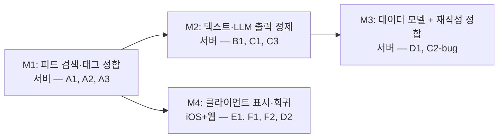

# 로드맵: Frank MVP16

> 기획일: 260505
> 최종 갱신: 260507
> 테마: 피드 품질 고도화 — 실사용 피드백 기반 오류·회귀 수정 사이클
> 상태: ✅ 완료 (M1~M4 전체 done)

## 정체성

**MVP16 = 실사용 피드백 기반 오류·회귀 수정 사이클.**

이번 사이클의 모든 항목은 "발견된 오류·회귀·기능 누락" 성격. 새로운 기능 확장은 다음 MVP 후보로 분리 (`_review_notes.md` §5).

## 목표

12개 실사용 발견 항목을 4개 마일스톤으로 묶어 처리한다.

- M1: 피드 검색·태그 정합 (서버) — A1, A2, A3
- M2: 텍스트·LLM 출력 정제 (서버) — B1, C1, C3
- M3: 데이터 모델 + 재작성 정합 (서버) — D1, C2-bug
- M4: 클라이언트 표시·회귀 (iOS+웹) — E1, F1, F2, **D2**

> **D2 재배치**: 오답 노트 원문 URL 미저장은 서버 측이 이미 정합(`quiz_wrong_answers.article_url` 컬럼·페이로드 보유)이므로 클라이언트 UI 작업만 남는다. 따라서 M3 → M4로 이동.

## 타임라인

| 마일스톤 | 목표 | 기간 | 의존성 | 상태 |
|----------|------|------|--------|------|
| M1 | 피드 검색·태그 정합 (서버) | 3~5일 | 없음 | 완료 |
| M2 | 텍스트·LLM 출력 정제 (서버) | 2~3일 | M1 | 완료 |
| M3 | 데이터 모델 + 재작성 정합 (서버) | 4~6일 | M2 | 완료 |
| M4 | 클라이언트 표시·회귀 (iOS+웹) | 3~5일 | M1 | 완료 |

총 예상: 2~3주

> **M3 기간 상향**: C2-bug가 "캐시 키 확장"이 아니라 favorites 데이터 모델 변경(JSONB 또는 별도 테이블) + 마이그레이션이라 사이즈가 더 큼 (`services/rewrite_service.rs:69-77` 단일 컬럼 덮어쓰기 구조 확인).
>
> **M4 의존성 단순화**: D2 서버 작업이 없어 M3 응답 의존이 사라짐. M1 응답 스키마(article.tags) 박제 후 진입.

## 마일스톤 상세 링크

- [M1 — 피드 검색·태그 정합](M1_search_tag_alignment.md)
- [M2 — 텍스트·LLM 출력 정제](M2_text_llm_output.md)
- [M3 — 데이터 모델 + 재작성 정합](M3_data_model_rewrite.md)
- [M4 — 클라이언트 표시·회귀](M4_client_display_regression.md)

## 의존성 그래프

- **M1 → M2**: M1 응답 스키마 박제 후 M2 sanitize 파이프라인 진입 (응답 형태 의존)
- **M2 → M3**: occupation 의미 변경 충돌 회피 — M2 C3(범용 insight) 확정 + favorites.insight 백필 정책 결정 후 M3 D1(occupation 삭제)·C2-bug(다중 시점 보존) 진입
- **M1 → M4**: M1의 `article.tags` 응답 스키마 박제 후 M4 E1(iOS 카드 태그 칩) 진입. D2(원문 이동 UI)는 서버 응답 의존 없음 — M3 종료 대기 불요

## 개발 순서 원칙 (`feedback_dev_order`)

서버 마일스톤(M1~M3) 확정 후 클라이언트(M4) 진행. iOS 회귀(F1, F2)는 서버 변경과 무관하지만 표시 변경(E1)은 서버 응답 의존이라 M4에 묶어 한 사이클로 처리.

## 폐기 / 미흡수 (`_review_notes.md` §4)

- 시드 "소스 다양성 제한" — 실사용에서 안 아픔
- DEBT-MVP15-03 (`effective_max` 동적 감지) — 우선순위 낮음
- DEBT-MVP15-05 (`notification_service` task leak) — 우선순위 낮음

## 다음 MVP 후보 (이번 사이클에서 분리)

| 항목 | 내용 | 분리 이유 |
|------|------|----------|
| **C2-feature** 다중 시점 UI | 기사 화면에서 시점 칩으로 즉석 전환 + 새 시점 추가 | 새 기능 확장. 이번 MVP는 오류 수정 집중. M3에서 데이터 모델은 이미 깔아두므로 다음 MVP에서 UI만 얹으면 됨 |
| 시드 "소스 다양성 제한" | 동일 도메인 기사 편중 감지 + 상한 적용 | 실사용 미발견, 우선순위 낮음 |

## 비용 정책 정합 (`project_api_cost_policy`)

비용 증가 금지 원칙. 각 마일스톤의 비용 영향:

- **M1 검색 정밀화**: 쿼리 보강 정도 → 영향 낮음. KR/EN 멀티패스 적용 시 호출 수 2배 가능성 → 통합 캐시로 흡수
- **M2 LLM 프롬프트 수정**: 출력 변경만 → 비용 영향 없음. 한자 후처리 재요청은 변환 우선, 재요청은 fallback
- **M3 재작성 누적 저장**: 직업 바꾸면 새로 호출 가능 → 본인 사용·Groq 저렴·드문 빈도라 통제 가능
- **M4**: 클라이언트 변경만 → 비용 영향 없음

## 아이템 라우팅 요약

| 유형 | 아이템 | 마일스톤 |
|------|--------|---------|
| decision | A3 운영 정의 (carry vs 같은 검색 동일 결과) | M1 |
| research | A3 매칭 전략 진단 | M1 |
| feature | A1, A2, A3 검색 정합 | M1 |
| decision | B1 sanitize 정책, C1 후처리 정책, C3 favorites.insight 백필 정책 | M2 |
| feature | B1, C1, C3 텍스트·LLM 출력 | M2 |
| decision | D1 페이로드 패턴, C2-bug 모델(JSONB vs 별도 테이블) + 마이그레이션 정책, C4 NULL rewrite 정책 | M3 |
| feature | D1, C2-bug 데이터 모델·재작성 | M3 |
| decision | D2 원문 이동 UI (새 탭 vs 인앱 웹뷰 vs 디테일 재진입) | M4 |
| research | F1 실기기 회귀 진단, F2 태그 필터 회귀 진단 | M4 |
| feature | E1 iOS 카드 태그 칩 + F1, F2 픽스 + D2 원문 이동 UI | M4 |

## KPI (MVP16 최종)

| 지표 | 측정 방법 | 목표 | 게이트 | 기준선 |
|---|---|---|---|---|
| 12개 항목 RESOLVED | `_review_notes.md` §2 항목별 상태 + `progress/debts.md` `DEBT-MVP16-*` | 전건 RESOLVED | Hard | 12건 OPEN |
| 서버 테스트 통과 | `cargo test` | 전체 통과 | Hard | MVP15 종료 시 통과 |
| 웹 테스트 통과 | `vitest` | 전체 통과 | Hard | MVP15 종료 시 통과 |
| iOS 테스트 통과 | `xcodebuild test -workspace Frank.xcworkspace -scheme Frank` | 전체 통과 | Hard | MVP15 종료 시 통과 |
| 서버 테스트 커버리지 | cargo-tarpaulin | ≥90% | Soft | MVP15 종료 시 값 |
| 웹 테스트 커버리지 | `vitest --coverage` | ≥90% | Soft | MVP15 종료 시 값 |
| iOS 테스트 커버리지 | `scripts/coverage.sh` (Frank 타겟 lineCoverage) | ≥85% | Soft | MVP15 종료 시 값 |
| 무료 한도 위반 발생 0건 | `progress/mvp16/cost_log.md` 검토 | $0 유지 | Hard | — |
| MVP 회고 작성 | `history/mvp16/retro.md` 존재 | exists | Hard | — |
| 기술부채 증감 | `progress/debts.md` OPEN 카운트 | net 감소 | Soft | MVP15 종료 시 카운트 |
| 피드 ephemeral 보존 | `articles` 테이블 row count 변화 | 즐겨찾기/오답 외 변화 없음 | Soft | — |

## 변경 이력

| 날짜 | 변경 내용 | 사유 |
|------|----------|------|
| 260505 | 초안 작성 | `_review_notes.md` §2/§4 합의 구조를 정형화 + KPI 정의 |
| 260505 | C1·C2·C5 정정 (D2를 M3→M4 이동, M3 C2-bug를 favorites 모델 변경으로 정확화, occupation 의미 매트릭스 명시). C3·C4는 step-1 결정 표로 미룸 | critical-review가 발견한 사실 오류·코드 실체 불일치·마일스톤 간 의존성 누락을 마일스톤 단계에서 정정 |
