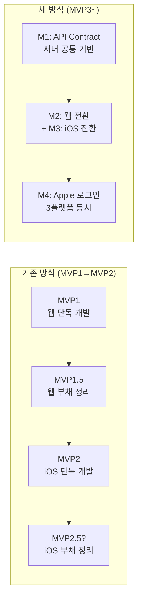
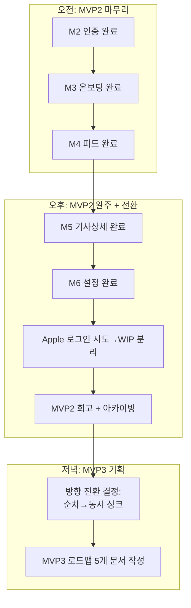

# 🗓️ 260406 개발 회고

## 오늘 뭘 했나

하루에 MVP2 iOS 앱의 M2(인증)~M6(설정)까지 5개 마일스톤을 전부 완주했다. 커밋 21개, 79개 파일, +7,631줄. 인증 → 온보딩 → 피드 → 기사 상세 → 설정까지 iOS 앱의 전체 기능이 돌아가는 상태가 됐다.

오후에 Apple 로그인을 시도했는데 검증이 안 돼서 WIP 브랜치로 분리했고, 그 다음에 MVP2 완료 회고 + 문서 아카이빙을 진행했다.

저녁에는 MVP3 방향을 잡았다. 지금까지 웹 먼저 → iOS 나중에 하는 순차 개발을 해왔는데, 이걸 **웹+iOS 동시 싱크 개발**로 바꾸기로 했다. MVP3 로드맵 문서 5개(통합 로드맵 + M1~M4)를 작성했다.

## 핵심 의사결정과 그 이유

### 결정 1: 플랫폼별 순차 개발 → 웹+iOS 동시 싱크 개발로 전환

- **상황**: MVP1은 웹만, MVP2는 iOS만 개발했다. 결과적으로 웹과 iOS가 완전히 다른 데이터 경로를 사용하게 됨 (웹은 Supabase 직결, iOS는 Supabase+Rust 혼용). 이대로 가면 플랫폼 간 싱크 비용이 계속 누적된다.
- **선택지들**:
  - A) 계속 순차 개발 (MVP3 웹 → MVP4 iOS) — 단순하지만 싱크 격차 확대
  - B) 동시 싱크 개발 (마일스톤마다 3플랫폼 동시) — 초기 설계 비용 있지만 총 비용 절감
  - C) 한 플랫폼에 집중하고 나머지 폐기 — 현실적이지 않음
- **결정**: B. MVP3부터 M1(API Contract) → M2(웹 전환)+M3(iOS 전환) → M4(Apple 로그인) 순으로, 마일스톤마다 서버+웹+iOS를 동시에 건드린다.
- **왜**: 순차 개발은 "나중에 맞추면 되지"라는 착각을 만든다. 실제로는 플랫폼별 기술 부채가 독립적으로 쌓이면서 합치는 비용이 기하급수적으로 늘어난다. MVP2.5를 따로 만들어야 하나 고민한 것 자체가 순차 개발의 한계를 보여줌.
- **인사이트**: 처음부터 동시에 가는 게 총 비용이 낮다. "빨리 하나 끝내고 다음"이 아니라 "느리더라도 같이 가는" 게 맞다.

### 결정 2: MVP3 마일스톤 의존 그래프 설계 (M1→M2+M3→M4)

- **상황**: 웹+iOS 동시 전환을 하려면 공통 기반(API)이 먼저 있어야 한다. 그 위에 웹과 iOS가 병렬로 전환하고, 둘 다 끝나면 Apple 로그인을 3플랫폼 동시에 붙인다.
- **선택지들**:
  - A) M1~M4 순차 진행 — 안전하지만 느림
  - B) M1 후 M2+M3 병렬, 합류 후 M4 — 의존성 존중하면서 속도 확보
  - C) 전부 병렬 — 의존성 충돌 위험
- **결정**: B. API Contract(M1)이 웹(M2)과 iOS(M3)의 선행 조건이므로 M1 완료 후 M2+M3 병렬, 둘 다 완료 후 M4.
- **왜**: 동시 싱크 개발이라고 해서 모든 걸 동시에 시작하는 게 아니다. 의존 관계를 존중하면서 병렬 가능한 부분만 병렬화해야 한다.
- **인사이트**: "동시 개발"의 핵심은 의존 그래프를 그리고, 크리티컬 패스를 최적화하는 것.

## 기획/설계 과정

MVP2 iOS 앱을 하루에 완주하고 나서, "다음은 뭐지?"를 고민하는 시간이 있었다. MVP2.5로 iOS 부채를 정리할지, 바로 MVP3로 넘어갈지.

결론은 **MVP2.5를 없애고 부채를 MVP3에 흡수**하는 것. 이유는:
- .5 버전은 문서/브랜치 관리가 번거로움
- 부채 정리만 하는 버전은 동기부여가 떨어짐
- MVP3에서 웹+iOS 전환하면서 자연스럽게 정리되는 부분이 많음

MVP3 로드맵 5개 문서를 작성하면서, 각 마일스톤의 서브태스크와 완료 기준을 구체적으로 정의했다. 이전 MVP에서는 기획이 느슨했는데, 이번에는 엔드포인트 스펙, 변경 대상 파일, 테스트 기준까지 문서에 명시했다.

## 인사이트 & 피드백

### 🔑 기획한 단위를 빠르게 넘기는 습관

기획을 짜고 나면 "이것도 넣으면 좋겠는데", "저것도 같이 하면 효율적인데" 하는 유혹이 온다. 하지만 이걸 받아들이면:
- 정한 단위에 필요 없는 기능이 들어감
- 중간에 스코프가 새면서 시간/토큰 낭비
- 완료 시점이 불명확해짐

**원칙**: 메인 태스크 기획이 끝나면 빠르게 개발로 넘기고, "나중에 생각할 것"은 진짜 나중으로 미룬다. 부가 아이디어는 TODO로만 기록하고 현재 단위에 끼워넣지 않는다.

### 🔑 순차 개발의 숨은 비용

플랫폼별 순차 개발은 눈앞의 속도는 빠르지만, 합치는 시점에 폭발한다. MVP1(웹) → MVP2(iOS)를 거치면서 웹과 iOS의 데이터 경로가 완전히 갈라졌다. 이걸 하나로 합치려면 양쪽 다 뜯어고쳐야 한다.

**교훈**: "나중에 맞추면 되지"는 기술 부채의 시작. 처음부터 같이 가는 게 총 비용이 낮다.

## 배운 것

- **Port/Adapter 패턴의 위력**: 동일 구조로 Feature를 찍어낼 수 있어서 M2~M6 5개를 하루에 완주 가능했음. 패턴이 확립되면 속도가 선형이 아니라 가속됨.
- **의존 그래프 기반 병렬화**: 동시 개발 ≠ 전부 동시 시작. 크리티컬 패스(M1)를 먼저 해결하고 독립 작업(M2, M3)을 병렬로 돌리는 게 핵심.
- **WIP 브랜치 전략**: 검증 안 된 기능은 미련 없이 WIP로 분리. "거의 다 됐는데"의 함정에 빠지지 않기.

## 느낀 점

솔직히 MVP2를 하루에 끝낼 줄은 몰랐다. Port/Adapter 패턴 덕분에 Feature마다 같은 리듬으로 작업할 수 있었던 게 컸다. "패턴이 속도를 만든다"를 체감한 하루.

Apple 로그인에서 막혔을 때 WIP로 넘긴 건 좋은 판단이었다. 거기서 붙잡혔으면 MVP3 기획까지 못 갔을 것.

저녁에 MVP3 방향을 잡으면서, 이 프로젝트가 "학습용 토이"에서 "진짜 크로스 플랫폼 앱"으로 넘어가는 느낌이 들었다. 웹+iOS 동시 싱크 개발은 도전적이지만, 이게 실무에서 하는 방식이니까 좋은 경험이 될 것 같다.

## 내일 할 일

1. MVP3 M1 API Contract 착수 — 마일스톤 순서대로 진행
2. M1 진행하면서 웹(api.ts) 현황 파악 — M2+M3 병렬 전환 준비
3. 서버 엔드포인트 3개 추가: GET /api/me/articles/:id, PUT /api/me/profile, 기존 확장

