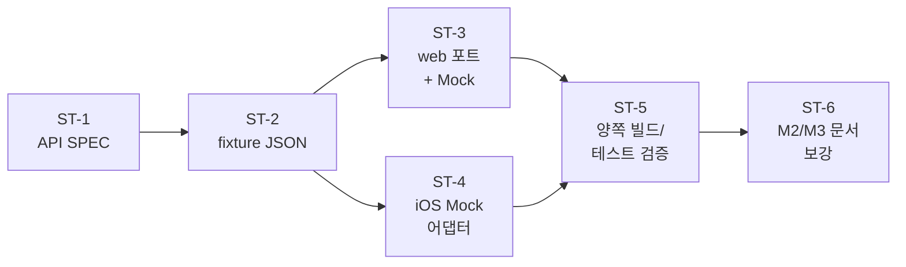
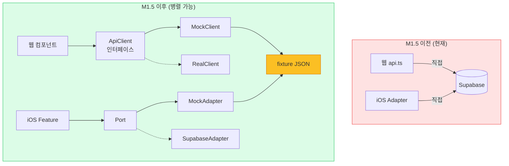

# M1.5: 병렬 개발 준비

> 생성일: 260407
> 상태: ✅ 완료 (260407)
> 범위: 웹 + iOS (서버는 read-only)
> 의존: M1 ✅
> 후속: M2 / M3 병렬 시작

## 목표

M2(웹)와 M3(iOS)를 두 개의 worktree에서 **충돌 없이 병렬 진행**할 수 있도록 외부 의존을 끊어둔다. 양쪽이 같은 API SPEC을 보고 같은 fixture로 작업하면 통합 단계에서도 변경량이 최소가 된다.

## 왜 (Why)

병렬 작업 시 두 탭이 모두 실 서버/Supabase를 두드리면 다음 충돌이 발생한다:
- 8080 포트 충돌
- 같은 Supabase 테이블 동시 read/write → 테스트 시드 race
- E2E 사용자 세션 충돌
- 디버깅 시 원인 추적 불가

→ Mock-First로 격리하면 두 탭이 in-memory만 사용, 외부 의존 0.

## 현재 상태 점검 (스캔 결과)

| 영역 | 포트 추상화 | Mock/Fake 어댑터 | M1.5 작업량 |
|------|-----------|-----------------|------------|
| **web/** | ❌ 없음 (`api.ts`가 supabase client 직접 호출) | ❌ 없음 | 큼 — 인터페이스 신설 |
| **ios/** | ✅ 있음 (`Core/Ports/*Port.swift` 4개) | ❌ 없음 (Supabase 어댑터만) | 중간 — Mock 어댑터만 추가 |

### web 현재 구조
```
web/src/lib/
├── supabase.ts        # Supabase client 인스턴스
├── utils/api.ts       # supabase.from(...).select(...) 직접 호출 8개 함수
└── types/             # Article, Tag 타입
```

### ios 현재 구조
```
ios/Frank/Frank/Sources/Core/
├── Ports/             # ArticlePort, TagPort, AuthPort, CollectPort
└── Adapters/          # SupabaseTagAdapter, SupabaseArticleAdapter,
                       # SupabaseAuthAdapter, APICollectAdapter
```

## 서브태스크

### ST-1: API SPEC 문서 작성
- **유형**: docs
- **상태**: [x]
- **목표**: 양쪽이 같은 그림을 보도록 단일 진실 문서 작성
- **위치**: `progress/260407_API_SPEC.md`
- **내용**:
  - 엔드포인트 표 (method, path, query, body, response, 에러)
  - 데이터 모델 (TypeScript + Swift 타입 한 번에 명시)
  - M1에서 확정한 ArticleResponse, Profile, Tag 등
- **의존**: 없음

### ST-2: 샘플 fixture JSON 작성
- **유형**: docs/data
- **상태**: [x]
- **목표**: 양쪽이 import할 공통 가짜 데이터
- **위치**: `progress/fixtures/articles.json`, `tags.json`, `profile.json`
- **내용**:
  - articles 5~8건 (요약 있음/없음/태그 있음/없음 섞어서)
  - tags 4~5건
  - profile 1건 (onboarding 완료/미완료 시나리오)
- **의존**: ST-1

### ST-3: web 포트 추상화 + Mock 어댑터
- **유형**: feature (web)
- **상태**: [x]
- **목표**: `api.ts` 함수 8개를 인터페이스로 추상화하고 Mock 구현체 추가
- **수정 파일**:
  - `web/src/lib/api/client.ts` (신설) — `ApiClient` 인터페이스
  - `web/src/lib/api/mockClient.ts` (신설) — fixture import해서 반환
  - `web/src/lib/api/realClient.ts` (신설) — 기존 `api.ts` 로직 이관
  - `web/src/lib/api/index.ts` (신설) — 환경변수 스위치 (`VITE_USE_MOCK=true`)
  - `web/src/lib/utils/api.ts` (제거 또는 re-export)
- **의존**: ST-1, ST-2
- **테스트**: 기존 vitest가 깨지지 않을 것

### ST-4: iOS Mock 어댑터 추가
- **유형**: feature (ios)
- **상태**: [x]
- **목표**: 기존 4개 포트에 대해 Mock 어댑터 작성
- **수정 파일**:
  - `ios/Frank/Frank/Sources/Core/Adapters/MockArticleAdapter.swift` (신설)
  - `ios/Frank/Frank/Sources/Core/Adapters/MockTagAdapter.swift` (신설)
  - `ios/Frank/Frank/Sources/Core/Adapters/MockAuthAdapter.swift` (신설)
  - `ios/Frank/Frank/Sources/Core/Adapters/MockCollectAdapter.swift` (신설)
  - `ios/Frank/Frank/Sources/App/AppDependencies.swift` 또는 동등 위치 — DEBUG 빌드 스위치
- **fixture**: ST-2의 JSON을 Bundle resource로 import (또는 Swift 리터럴)
- **의존**: ST-1, ST-2
- **테스트**: 기존 Swift Testing 케이스 통과

### ST-5: 양쪽 빌드 + 테스트 검증
- **유형**: test
- **상태**: [x]
- **검증**:
  - `cd web && npm run lint && npm run check && npm run test`
  - `cd ios/Frank && tuist generate --no-open && xcodebuild build/test`
- **의존**: ST-3, ST-4

### ST-6: M2 / M3 메인태스크 문서 보강
- **유형**: docs
- **상태**: [x]
- **목표**: 각 문서 상단에 "Mock-First → swap" 작업 방식 명시
- **수정 파일**:
  - `progress/260406_MVP3_M2_웹전환.md`
  - `progress/260406_MVP3_M3_iOS전환.md`
- **의존**: ST-3, ST-4

## 의존 그래프



ST-3와 ST-4는 논리적으로 독립이지만 M1.5는 단일 탭으로 진행하므로 순차 실행.

## M1.5가 만들어내는 격리 구조



**M1.5의 본질**: 점선(`-.->`)으로 표시된 Real 어댑터는 환경변수/빌드 플래그로 비활성화. Mock만 활성. 양쪽이 같은 fixture를 공유하므로 데이터 일관성도 보장됨.

## 완료 기준

- [x] API SPEC 문서 존재 + 양쪽 타입 일치 (`progress/260407_API_SPEC.md`)
- [x] fixture JSON 존재 + 양쪽에서 import 가능 (`progress/fixtures/`)
- [x] web `VITE_USE_MOCK_API=true` 모드에서 supabase 호출 0 (`web/src/lib/api/`)
- [x] iOS `FRANK_USE_MOCK=1` 환경변수로 Mock 모드 활성화 (`AppDependencies.mock()`)
- [x] 양쪽 lint/check/test 모두 통과 (web 392 files / 77 tests, iOS BUILD + TEST SUCCEEDED)
- [x] M2/M3 문서에 작업 방식 명시
- [ ] 커밋 + 푸쉬 후 worktree 분기 (사용자 허락 대기)

## 다음 단계

M1.5 머지 후:
```bash
git worktree add ../frank-m2-web -b feature/260408_m2_web_api
git worktree add ../frank-m3-ios -b feature/260408_m3_ios_api
```
두 탭에서 각자 `/workflow` 실행.
