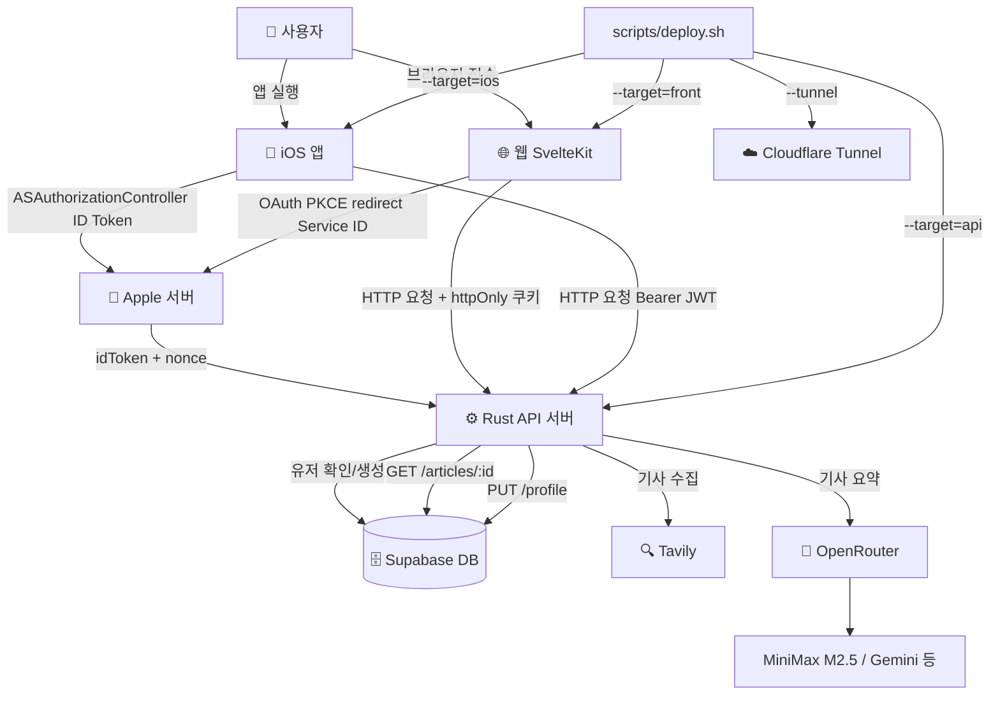
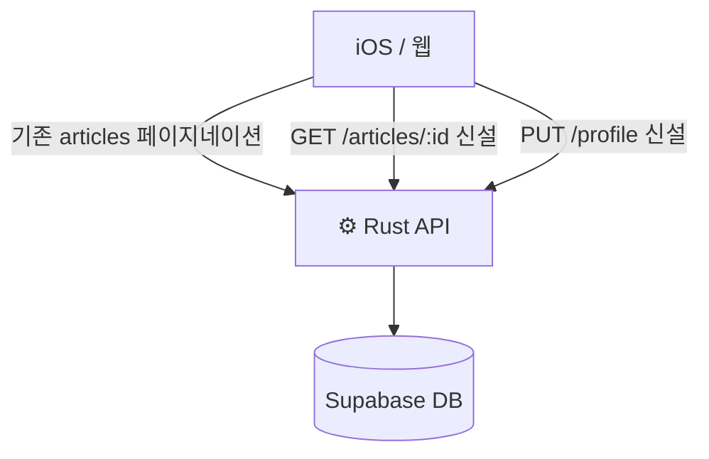
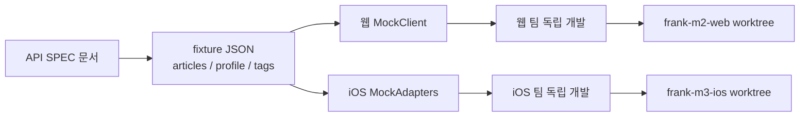
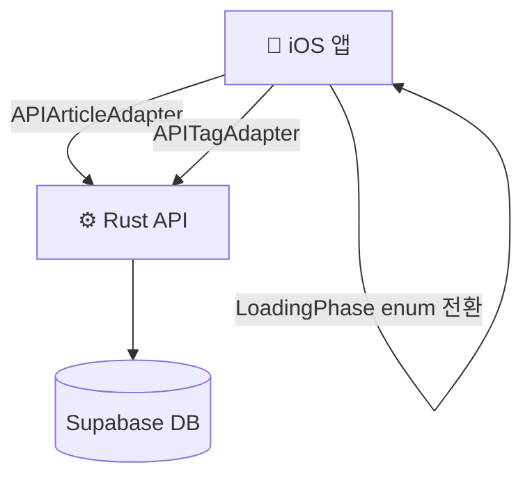
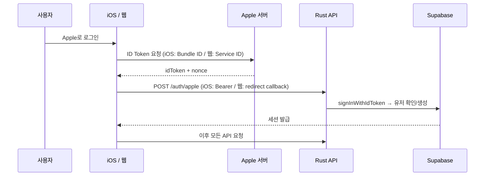

# MVP3 흐름도 스냅샷

> 작성일: 2026-04-08
> MVP3 기간: 2026-04-06 ~ 2026-04-08
> 마일스톤: M1, M1.5, M2, M3, hotfix, M4

---

## 마일스톤별 변경 내역

| 마일스톤 | 추가된 것 | 변경된 것 |
|---------|---------|---------|
| M1 | `GET /articles/:id`, `PUT /profile` 엔드포인트, DTO 분리 | 기존 articles 페이지네이션 API 재활용 |
| M1.5 | API SPEC 문서, fixture JSON (articles/profile/tags), 웹 MockClient, iOS MockAdapters | — |
| M2 | `@supabase/ssr` 도입, httpOnly 쿠키 세션, 웹 → Rust API 직통 호출 | 웹 인증: localStorage → httpOnly 쿠키, 웹: Supabase SDK 직통 → Rust API |
| M3 | `APIArticleAdapter`, `APITagAdapter` (iOS), MVP2 부채 흡수 (LoadingPhase enum) | iOS: Supabase SDK 직통 → Rust API |
| hotfix | OpenRouter reasoning mandatory 파라미터 400 fix | MiniMax M2.5 호환 수정 |
| M4 | 웹 Apple 로그인 (OAuth PKCE redirect + `/auth/callback`), iOS Apple 로그인 (ASAuthorizationController), `generate_apple_secret.js`, `scripts/deploy.sh` | — |

---

## 전체 흐름도 (MVP3 완료 시점)



**MVP2 대비 핵심 변경:**
- 웹/iOS가 각자 Supabase를 직접 부르던 구조 → Rust API 서버로 단일화
- 웹 인증: localStorage → httpOnly 쿠키 (XSS 방어)
- Apple 로그인: 웹(OAuth PKCE) + iOS(ID Token) 크로스 플랫폼 계정 자동 연동

---

## 마일스톤별 흐름 변화

### M1 이후



엔드포인트 보완. 웹/iOS 각자 여전히 Supabase SDK 직통 사용.

### M1.5 이후



병렬 개발 기반 확립. 외부 의존 0, Mock으로 격리.

### M2 이후

```mermaid
graph TD
    C[🌐 웹 SvelteKit] -->|@supabase/ssr hooks.server.ts| SS[서버사이드 세션 검증]
    SS -->|httpOnly 쿠키| C
    C -->|HTTP 요청 + 쿠키| D[⚙️ Rust API]
    D --> E[(Supabase DB)]
```

웹 인증이 서버사이드로 이동. JS에서 토큰 접근 불가 (XSS 방어).

### M3 이후



iOS도 Rust API 직통. 웹+iOS 모두 Rust API 단일 진실의 원천.

### M4 이후 (최종)



크로스 플랫폼 계정 자동 연동. 동일 Apple ID → 동일 Supabase user_id.

---

## 주요 발견 / 트러블슈팅

| 이슈 | 원인 | 해결 |
|------|------|------|
| Apple `invalid_client` | Supabase Client IDs에서 Bundle ID가 첫 번째 → OAuth client_id로 사용됨 | Service ID를 첫 번째로 이동 (`com.frank.web,dev.frank.app`) |
| `use:enhance`가 redirect 가로챔 | SvelteKit enhance가 redirect를 fetch로 처리 | Apple 로그인 form에서 `use:enhance` 제거 |
| iOS Apple 로그인 canceled 처리 누락 | `canceled` 케이스 분기 없음 | `ASAuthorizationError.canceled` 분기 추가 |
| OpenRouter reasoning 400 | MiniMax M2.5에서 reasoning 파라미터 mandatory | reasoning param 조건부 전송으로 수정 |
| httpOnly 쿠키 Playwright 삭제 불가 | `document.cookie`로 httpOnly 쿠키 삭제 불가 | form POST `/logout` 방식으로 대응 |

---

## 규모 (MVP3 완료 시점)

| 영역 | 소스 코드 | 테스트 코드 | 테스트 수 |
|------|----------|-----------|---------|
| 서버 (Rust) | 6,075줄 | 포함 | 139개 |
| 웹 (Svelte/TS) | 2,489줄 | 1,297줄 | 89개 |
| iOS (Swift) | 3,338줄 | 3,388줄 | 155개 |
| **합계** | **11,902줄** | | **383개** |
