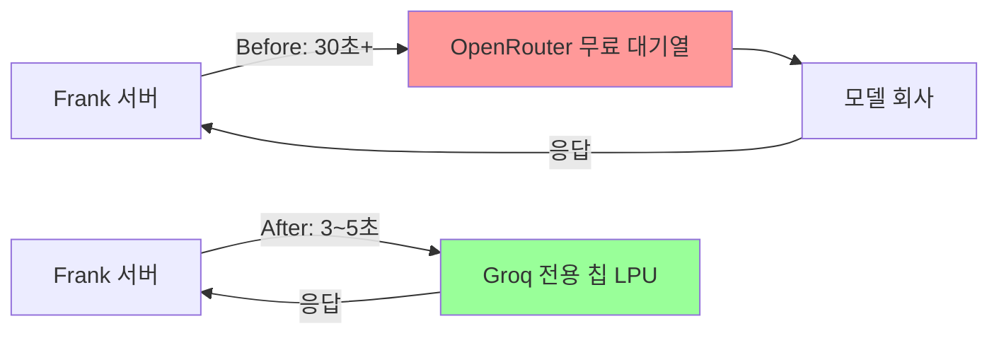
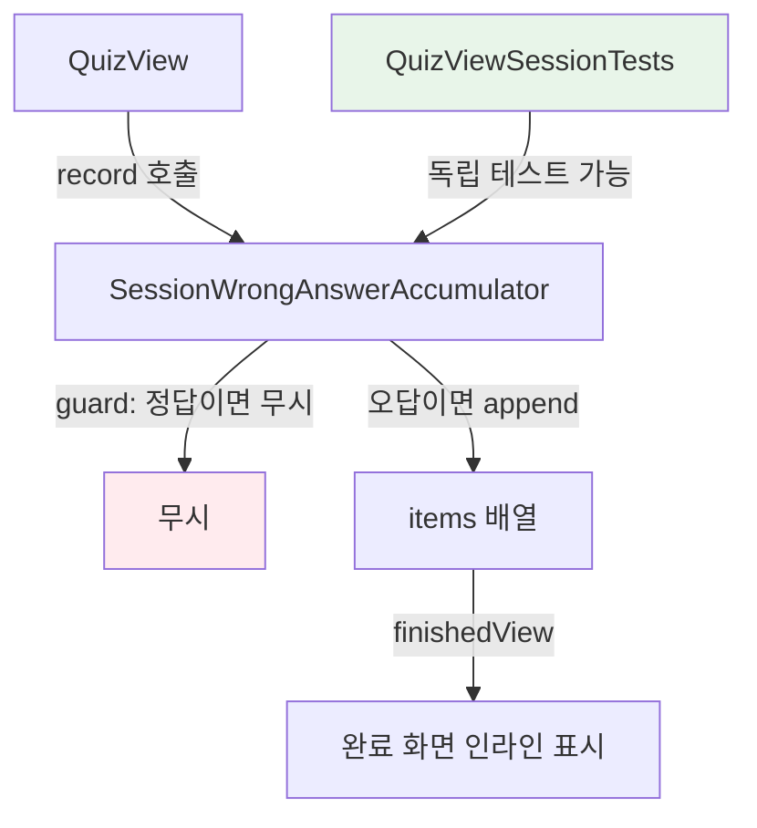
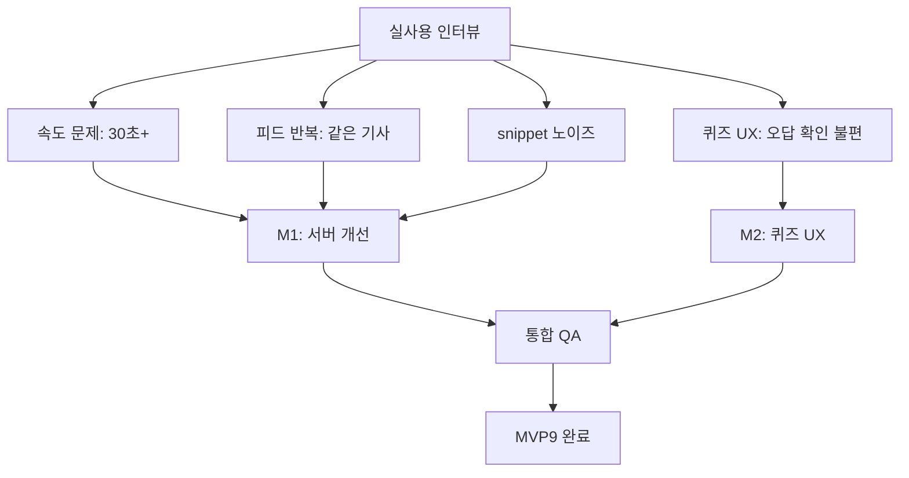

# 🗓️ 2026-04-13 개발 회고 — MVP9 완주의 날

## 오늘 뭘 했나

아침부터 저녁까지 MVP9 전체를 설계하고, 구현하고, QA까지 완료했다. 단 하루 만에 마일스톤 두 개(M1 서버 개선 + M2 퀴즈 UX)가 전부 끝났다는 게 지금도 실감이 잘 안 난다.

시작은 인터뷰였다. 직접 앱을 켜서 사용해보니 문제가 세 가지로 뚜렷하게 보였다: 요약/퀴즈 생성이 30초 넘게 걸리고, 피드에 같은 기사가 계속 나오고, snippet 텍스트에 `arrow_forward - #Android Studio - #Compose` 같은 쓰레기가 섞여 있었다. 거기에 퀴즈 완료 후 오답을 보려면 별도 탭으로 이동해야 하는 UX 불편까지. 이 네 가지를 MVP9으로 묶어서 기획했다.

M1은 서버 레이어 전담: Groq 어댑터 교체, Tavily time_range 추가, clean_snippet 패턴 필터 강화. M2는 클라이언트 전담: 퀴즈 완료 화면 오답 인라인 + 기사 상세 버튼 재설계. M1과 M2가 의존성이 없어서 병렬 진행이 가능했고, 실제로 오늘 하루에 전부 끝냈다.

커밋 순서를 보면: 기획 → M1 서버 → iOS M2 → 웹 M2 → M2 완료 처리 → 아카이빙. 총 6커밋.

---

## 핵심 의사결정과 그 이유

### 결정 1: OpenRouter에서 Groq로 교체

**상황**

요약과 퀴즈 생성이 30초 이상 걸렸다. 실사용 불가 수준이었다. 이전에 `project_api_cost_policy.md`에 Groq 교체를 확정해두고 있었는데, 이번에 실제로 실행했다.

**선택지들**

| 옵션 | 레이턴시 | 비용 | 위험 |
|------|----------|------|------|
| OpenRouter 유료 전환 | 5~10초 예상 | 사용량 무제한, 유료 | 월 청구 시작 |
| 다른 모델로 교체 (OpenRouter 내) | 불명확 | 동일 | 대기열 문제 반복 가능 |
| **Groq 직접 연결** | 3~5초 | 무료 1,000 RPD | API 키 추가, 어댑터 재작성 |

근본 원인이 "모델이 느린 게 아니라 OpenRouter 무료 대기열이 느린 것"임을 파악한 게 핵심이었다. 같은 Llama 3.3 70B 모델인데도 Groq에서는 전용 칩(LPU)으로 실행하니 3~5초가 된다. 비용 청구 없이 하루 1,000회 무료라는 점도 Frank 규모에 딱 맞았다.

**결정**: Groq 직접 연결

**왜**: 비용 0원이면서 30초 → 5초로 6배 빠름. 대기열 없는 전용 인프라. Frank 일일 사용량은 수백 건 수준이라 1,000 RPD 한도도 충분.

**인사이트**: 느린 이유를 "모델 성능" 탓으로 넘기지 않고, 실제 병목(중계 레이어의 대기열)을 파악한 게 결정적이었다. 같은 모델을 어디서 실행하느냐에 따라 UX가 천지 차이가 난다는 것, 그리고 무료 플랜의 구조적 한계는 반드시 직접 확인해봐야 한다는 것.



---

### 결정 2: Tavily `time_range: "week"` 추가 (이 부분 로직이 헷갈렸음)

**상황**

피드 새로 고침을 해도 같은 기사만 계속 나왔다. 원인은 `tavily.rs` 검색 요청에 날짜 필터가 없어서, 같은 키워드로 검색하면 Tavily가 항상 동일한 "최상위 기사"를 반환하는 것이었다.

**헷갈렸던 부분**

`time_range`와 `days` 파라미터가 둘 다 있었는데, 뭘 써야 할지 혼란스러웠다. Tavily 문서를 확인한 결과:

- `days: 7` → `topic: "news"` 설정 시에만 동작. Frank는 topic 없이 일반 검색을 사용 중.
- `time_range: "week"` → 일반 검색에서 최근 7일 필터로 동작.

이 차이를 모르고 `days: 7`을 추가했다면 효과가 없었을 것이다. 실제로 M1_서버개선.md 문서에 "주의" 박스로 이 내용이 적혀 있었다.

**결정**: `"time_range": "week"` 한 줄 추가 + 기존 wiremock 테스트에 body 검증 추가

**왜**: 가장 작은 변경으로 가장 큰 체감 개선. 코드 한 줄, 테스트 한 케이스.

**인사이트**: API 파라미터는 문서를 꼭 확인해야 한다. 비슷해 보이는 파라미터라도 동작 조건이 다를 수 있다. TDD 덕분에 `body_partial_json` 매처로 요청 본문까지 검증하는 테스트가 생겼고, 이게 실제로 파라미터가 들어갔는지 확인해주는 안전망이 됐다.

---

### 결정 3: clean_snippet 방식 변경 — 패턴 필터 → HTML 제거 + 문장 경계 절단

**상황**

snippet에 `TechCrunch –:–:–:– The first StrictlyVC...`, `arrow_forward - #Android Studio`, `00:00 01:00 02:00...` 같은 쓰레기가 섞여 있었다. MVP8의 `clean_snippet`은 HTML 태그, URL, 이메일만 제거했는데, 이 패턴들은 일반 텍스트라 통과했다.

**선택지들**

| 접근 | 장점 | 단점 |
|------|------|------|
| 노이즈 패턴 정규식 추가 | 특정 패턴 정확히 제거 | 오탐 가능, 패턴 추가 필요 |
| **HTML 제거 + 문장 경계 절단** | 단순, 범용 | 정보 손실 가능 |
| LLM 정제 | 가장 정확 | 비용 + 레이턴시 추가 |

결국 두 접근을 조합했다. 5가지 노이즈 패턴(시간표, 해시태그 목록, 구분자, 아이콘이름, 네비게이션 문구)을 정규식으로 제거하고, 그 위에 HTML 제거 + 300자 문장 경계 절단을 적용. Tavily에도 `clean_snippet`을 적용하도록 확장했다.

**결정**: 복합 방식 — 패턴 필터 + HTML 제거 + 문장 경계 절단

**왜**: LLM 정제는 비용 정책(비용 증가 금지)에 걸리고, 패턴 필터 단독으로는 오탐 위험이 있어서 두 방식을 레이어로 쌓았다.

**인사이트**: 텍스트 정제는 "완벽하게 깨끗하게"가 목표가 아니라 "충분히 읽을 수 있게"가 목표다. 비용 없이 regex만으로도 체감 품질이 확 올라간다.

---

### 결정 4: SessionWrongAnswerAccumulator — 독립 struct 분리 (이 부분도 헷갈렸음)

**상황**

퀴즈 완료 화면에 "이번 세션 오답"을 표시하려면 퀴즈 진행 중 오답을 로컬에 누적해야 했다. 기존 코드는 오답 발생 시 서버에 fire-and-forget으로 저장만 하고, 로컬에는 아무것도 남기지 않았다.

**헷갈렸던 부분**

처음엔 `@State private var sessionWrongAnswers: [SessionWrongAnswerItem] = []` 배열을 `QuizView` 안에 바로 추가하면 되지 않을까 생각했다. 근데 `SessionWrongAnswerAccumulator`라는 별도 struct로 분리했는데, 왜 그렇게 했을까?

```swift
// 방법 A: 배열 직접 사용
@State private var sessionWrongAnswers: [SessionWrongAnswerItem] = []
// 오답 시: if selected != question.answerIndex { sessionWrongAnswers.append(...) }

// 방법 B: Accumulator struct 분리 (실제 구현)
@State private var wrongAccumulator = SessionWrongAnswerAccumulator()
// 오답 시: wrongAccumulator.record(question: question, userIndex: selected)
```

**차이점**:

방법 A는 `if selected != question.answerIndex` 조건 체크를 호출하는 쪽(QuizView)이 직접 한다.

방법 B는 `Accumulator.record()` 안에서 `guard userIndex != question.answerIndex else { return }` 가드가 있다. **조건 체크 로직이 Accumulator 안에 캡슐화**된다.

결과적으로 방법 B가 테스트하기 쉽다. `QuizView` 없이 `SessionWrongAnswerAccumulator`만 독립적으로 테스트할 수 있고, "정답이면 누적 안 한다", "오답이면 누적한다"는 로직을 단위 테스트로 명확히 검증할 수 있다. 실제로 `QuizViewSessionTests`가 7개 추가됐다.

**결정**: Accumulator struct 분리

**왜**: TDD 원칙 — 테스트 가능한 단위로 분리. 누적 로직을 View에 섞지 않고 별도 책임으로 만들면 변경에 강하다.

**인사이트**: "이게 View 안에 그냥 넣으면 되는데 왜 struct를 따로 만들지?" 라는 의구심이 들 때, 그 이유가 "테스트 가능성"이라는 걸 이제 체감으로 이해하게 됐다.



---

### 결정 5: M2 웹·iOS 병렬 진행 + 서버 변경 없음

**상황**

M2 기획 시 "서버 변경이 전혀 없다"는 걸 먼저 확인했다. `quiz_completed` 플래그는 MVP8에서 이미 DB에 있었고, 오답 데이터도 이미 API가 있었다. 클라이언트 UI 변경만으로 해결 가능.

**선택지들**

| 접근 | 내용 |
|------|------|
| 서버 + 클라이언트 동시 수정 | 더 많은 기능, 복잡도 높음 |
| **클라이언트만 수정** | 기존 엔드포인트·DB 재사용, M1과 완전 독립 |

"오답 보기" 버튼에서 wrongAnswers를 lazy fetch하는 방식을 선택한 것도 의도적이었다. 스크랩 탭에서 이미 로드된 데이터가 있으면 재사용하고, 없으면 그 시점에 fetch한다. 추가 API 엔드포인트 없이 기존 `GET /api/quiz/wrong-answers`를 재활용.

**결정**: 서버 변경 없이 클라이언트만 수정 + 웹·iOS 병렬 구현

**왜**: 의존성이 없으면 병렬이 맞다. M1 완료를 기다릴 필요 없이 동시에 진행 가능. 실제로 오늘 하루에 M1·M2 모두 완료됐다.

**인사이트**: 새 기능을 만들 때 "서버 변경이 반드시 필요한가?"를 먼저 확인하는 습관. 기존 데이터를 클라이언트에서 다르게 조합하는 것만으로 UX가 크게 달라질 수 있다.

---

### 결정 6: MVP9 종료 + 아카이빙

하루 만에 M1·M2가 모두 완료됐다. QA 통과 후 바로 progress → history/mvp9 이동, INDEX.md 갱신까지 완료했다. 진행 중인 작업이 없으면 즉시 아카이빙하는 게 맞다.

---

## 기획/설계 과정

MVP9의 시작은 "실제로 앱을 쓰면서 찾은 문제"였다. 기능 목록을 먼저 만들고 개발한 게 아니라, 사용 중 불편함을 느낀 것들을 모아서 우선순위를 매겼다.

인터뷰 결과:



우선순위도 명확했다: "한 줄 수정으로 즉각 체감 개선"(Tavily time_range) → "핵심 기능 속도"(Groq 교체) → "앱 첫인상"(snippet) → "학습 루프"(퀴즈 UX) 순서.

---

## 인사이트 & 피드백

1. **병목 진단이 먼저다.** "LLM이 느리다" → "OpenRouter 무료 대기열이 느리다" → "같은 모델을 Groq에서 실행하면 6배 빠르다". 증상이 아니라 원인을 찾는 게 해결책의 품질을 결정한다.

2. **API 파라미터는 반드시 문서 확인.** `days`와 `time_range`처럼 비슷해 보이지만 동작 조건이 다른 파라미터는 직접 문서를 봐야 한다. 어림짐작으로 `days: 7`을 넣었다면 효과가 없었을 것.

3. **테스트 가능성이 설계를 이끈다.** `SessionWrongAnswerAccumulator`를 별도 struct로 분리한 이유가 "QuizView 없이도 단위 테스트 가능"이라는 것. TDD를 따르면 자연스럽게 설계가 좋아진다.

4. **"서버 변경이 필요한가?"를 먼저 확인.** M2 전체가 클라이언트만으로 해결됐다. 이미 있는 데이터를 다르게 조합하는 것만으로 UX가 크게 달라질 수 있다.

5. **하루에 MVP 하나가 가능한 조건:** 문제가 명확하고, 의존성이 없고, 병렬 구조가 잡혀 있을 때. 오늘이 딱 그 조건이었다.

---

## 배운 것

- **Groq vs OpenRouter 구조 차이**: 중계 레이어가 없는 전용 인프라는 레이턴시 차원이 다름. 무료 플랜 = 대기열 = 느림.
- **Tavily `time_range` vs `days`**: topic 설정 여부에 따라 쓰는 파라미터가 다름. 일반 검색 = `time_range: "week"`.
- **`SessionWrongAnswerAccumulator` 패턴**: View에서 로직을 빼서 별도 struct에 캡슐화 → 독립 테스트 가능.
- **wiremock `body_partial_json` 매처**: 요청 본문의 일부만 검증할 수 있는 매처. 파라미터가 실제로 들어갔는지 확인하는 데 유용.
- **lazy fetch 패턴**: "이미 로드됐으면 재사용, 없으면 그때 fetch" — 불필요한 API 호출 없이 기존 데이터를 재활용.

---

## 느낀 점

하루 만에 MVP 하나를 기획부터 아카이빙까지 완주한 게 오늘의 하이라이트다. 사실 처음엔 M1(서버)이 먼저고 M2(클라이언트)는 나중에 해야 하는 줄 알았는데, 의존성을 확인해보니 완전히 독립적이었다. 그래서 병렬로 동시에 진행했고, 하루 안에 전부 끝났다.

`SessionWrongAnswerAccumulator`를 처음 봤을 때 "이걸 왜 따로 struct로 만들었지?"가 솔직한 반응이었다. 배열 하나 추가하면 되지 않나 싶었는데, 막상 이유를 파악하고 나니 "테스트를 먼저 생각하면 설계가 이렇게 된다"는 게 납득됐다. TDD가 단순히 테스트를 먼저 쓰는 게 아니라 설계 방식 자체를 바꾼다는 걸 오늘 실감했다.

Tavily `time_range`는 사실 문서 안 보고 `days: 7`로 바로 했다면 효과가 없었을 텐데, 마일스톤 문서에 주의 사항이 적혀 있어서 잡아냈다. 문서가 제대로 작성되어 있으면 이런 함정을 방지할 수 있다는 걸 다시 확인했다.

---

## 내일 할 일

MVP9이 완전히 끝났다. MVP10 방향을 검토할 차례다. M3 후보에 올라온 항목들:

- 버튼 위치·레이아웃 개선 (기능 완성 후 UI 배치 재검토)
- Groq 스트리밍 퀴즈 생성
- LLM snippet 정제 (비용 검토 후)
- 피드 SWR 강화

또는 완전히 새로운 방향의 기능. `/milestone` 돌리기 전에 앱을 다시 사용해보면서 어디가 가장 아쉬운지 느껴보는 것부터 시작하는 게 좋을 것 같다.
