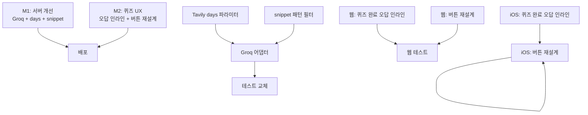

# 로드맵: Frank MVP9

> 생성일: 260413
> 최종 갱신: 260413
> 상태: 계획

---

## 목표 한 문장

실사용 장벽 3가지(속도·노이즈·반복 피드)를 제거하고, 퀴즈 학습 루프를 완성한다.

---

## 타임라인

| 마일스톤 | 목표 | 기간 | 의존성 | 상태 |
|----------|------|------|--------|------|
| M1 | 서버 개선 — Groq 교체 + 피드 다양성 + snippet 정제 | 1주 | 없음 | 완료 |
| M2 | 퀴즈 UX 개선 — 오답 인라인 + 버튼 재설계 (웹+iOS 병렬) | 1주 | M1 없음 (클라이언트 전용) | 완료 |

> **M2는 M1과 독립**: M2는 클라이언트 로컬 상태만 사용 (서버 변경 없음). 병렬 진행 가능.

---

## 의존성 그래프

---

## 구현 원칙

- **M1은 서버 전용**: 클라이언트 변경 없음. Groq는 OpenAI-compatible API — 기존 OpenRouterAdapter 구조 재사용.
- **M2는 클라이언트 전용**: 서버 변경 없음. 퀴즈 세션 중 이미 로컬에 오답 데이터 보유 → 인라인 렌더링만.
- **M1·M2 병렬 진행 가능**: 의존성 없음. 단, 통합 QA는 M1+M2 모두 완료 후 수행.
- **TDD 원칙 유지**: 실패 테스트 → 구현 → 통과. 커버리지 90% 유지.

---

## M3 후보 (M1·M2 완료 후 검토)

| 아이템 | 메모 |
|--------|------|
| 버튼 위치·레이아웃 개선 | 기능 완성 후 UI 배치 재검토. 먼저 기능을 제대로 만들고 수정 예정. |
| Groq 스트리밍 퀴즈 생성 | M1 Groq 교체 완료 후 streaming 확장 |
| LLM snippet 정제 | regex 강화로 우선 대응, 비용 검토 후 도입 |
| 피드 SWR 강화 | MVP6에서 이미 병렬화. 추가 개선 여지 있으나 우선순위 낮음 |

---

## 변경 이력

| 날짜 | 변경 내용 | 사유 |
|------|----------|------|
| 260413 | 최초 작성 — MVP8 완료 후 실사용 인터뷰 기반 확정 | progress/260413_MVP9_인터뷰.md |
| 260413 | M1·M2 상세 구현 가이드 보강 + M3 후보 목록 추가 | Groq 리서치 + 코드 확인 결과 반영 |
| 260413 | M1·M2 완료 처리 — 실사용 QA 통과 | M1: 서버 Groq+snippet+days / M2: 퀴즈 UX 웹·iOS |
