# 흐름으로 이해하는 Frank 프로젝트

> 깊은 개념보다 **"아 이런 흐름이구나"** 를 먼저 잡는 것이 목표.
> iOS 개발자 관점에서 비유 + Mermaid 다이어그램으로 흐름 정리.
> 최초 작성: 2026-04-08 | 마지막 갱신: 2026-04-14

---

## MVP별 흐름 변경 이력

| MVP | 추가된 것 | 변경된 것 | 스냅샷 |
|-----|---------|---------|--------|
| MVP1 | Rust API 서버, 웹 SvelteKit, Supabase, Tavily, OpenRouter, 기사 수집 흐름 | — | — |
| MVP1.5 | API Contract, Mock-First 병렬 개발 패턴, fixture 공유 | — | — |
| MVP2 | iOS SwiftUI 앱, Supabase SDK 직접 호출 (웹/iOS 각자) | — | — |
| MVP3 | Apple 로그인 (웹+iOS), scripts/deploy.sh, httpOnly 쿠키 세션, worktree 병렬 개발 | 웹/iOS → Rust API 통합 (Supabase 직통 폐기), 웹 인증 localStorage → httpOnly 쿠키 | [MVP3 흐름도](mvp3/260408_흐름도.md) |

---

## 1. 전체 그림 — 서버·웹·앱이 어떻게 연결되나

### 현재 (MVP3 이후)

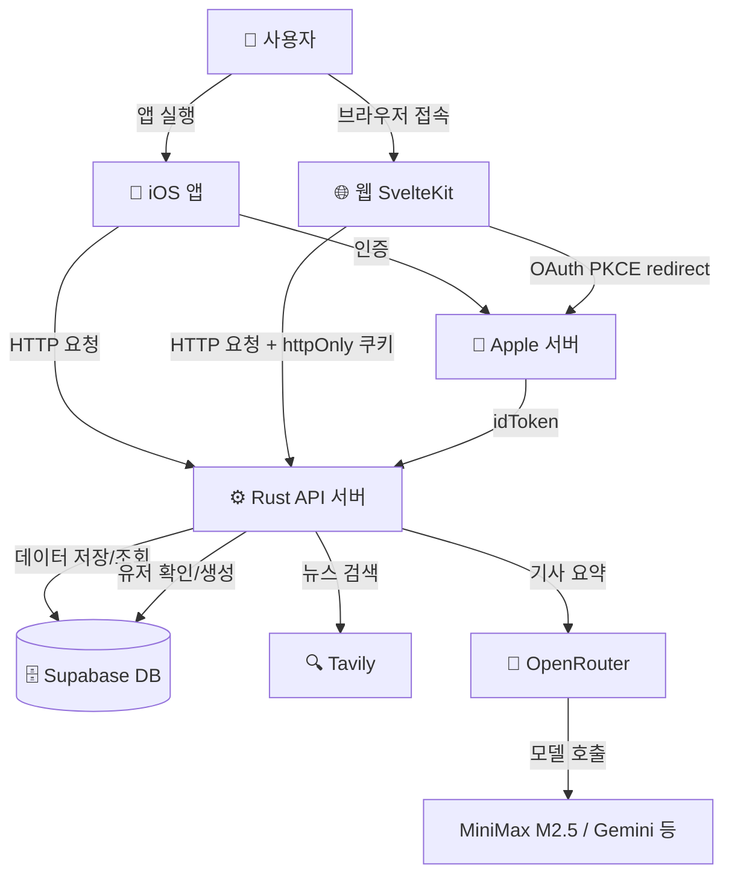

**한 줄 정리:**
앱과 웹은 화면만 그린다. 실제 데이터 처리는 전부 Rust 서버가 한다.
서버는 필요할 때 Supabase(저장), Tavily(검색), OpenRouter(요약)를 호출한다.

**로그인 방식별 흐름 비교:**

```
Apple 로그인:
  앱/웹 → Apple 서버(본인 확인) → Supabase → JWT → Rust API
  이유: Apple이 직접 "이 사람 맞아요"를 확인해줘야 하기 때문

이메일 로그인:
  앱/웹 → Supabase(직접 인증) → JWT → Rust API
  이유: Supabase가 이메일/비밀번호를 직접 관리하므로 Apple 서버 불필요
```

**MVP3에서 달라진 핵심:**
- 웹과 iOS가 각자 Supabase를 직접 부르던 구조 → Rust API 서버로 단일화
- Apple 로그인 추가 (웹: OAuth PKCE redirect / iOS: ASAuthorizationController ID Token)
- 동일 Supabase 프로젝트 → 웹에서 가입 → iOS 로그인 시 계정 자동 연동

### 변경 전 (MVP2)

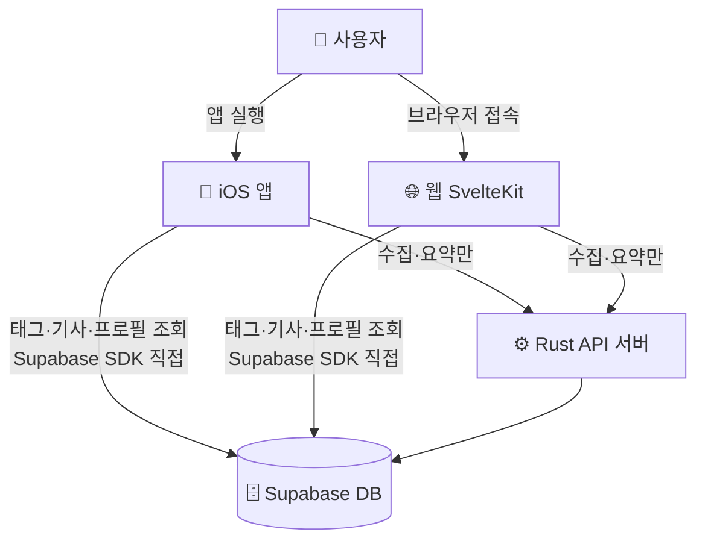

- **Supabase SDK 직접**: 태그 목록, 기사 목록/상세, 프로필 — 단순 CRUD
- **Rust API**: 수집(`POST /me/collect`), 요약(`POST /me/summarize`) — 크롤링·AI 처리가 필요한 것만
- 웹/iOS 양쪽 모두 동일하게 분산 → 비즈니스 로직이 클라이언트에 중복 존재

---

## 2. 배포 흐름 — "로컬에서 돌아가는 것"을 "어디서든 접근 가능"하게

### 개발 중 (지금 이 상태)

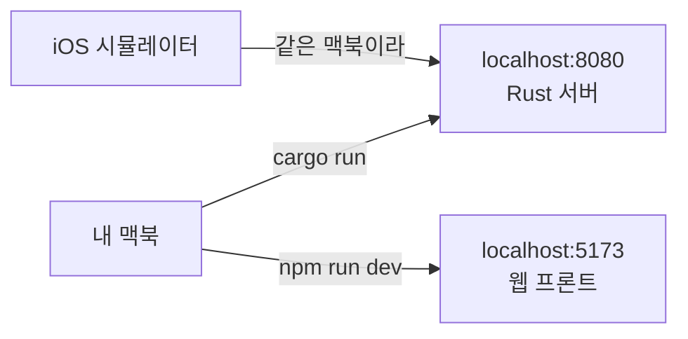

**포트 (Port) — 방 번호 개념:**
같은 컴퓨터에서 여러 프로그램이 동시에 실행될 때 서로 구분하는 방 번호.
컴퓨터 = 건물, localhost = 건물 주소, 포트 = 방 번호.

```
localhost:8080  →  Rust API 서버가 켜진 방
localhost:5173  →  웹 프론트가 켜진 방
```

**두 개가 다른 포트를 쓰는 이유:**
Rust 서버와 SvelteKit은 완전히 다른 프로그램이야. 같은 맥북에서 동시에 실행되지만 역할이 달라.

```
localhost:8080  →  Rust API 서버 (데이터 처리, 비즈니스 로직)
localhost:5173  →  SvelteKit 웹 (브라우저에서 보이는 화면)
```

iOS로 비유하면:
- Rust 서버 = URLSession으로 호출하는 그 API 서버
- SvelteKit = 브라우저용 "앱" 화면 (웹브라우저가 5173 열고 → 8080으로 API 호출)

**cargo run / npm run dev 가 뭔가:**
```
cargo run    =  Rust 서버 실행  →  iOS Xcode에서 ▶ Run 버튼 누르는 것과 동일
npm run dev  =  웹 개발 서버 실행  →  코드 바꾸면 브라우저에서 실시간 반영됨
```

지금은 내 맥북 안에서만 돌아감. 외부에서 접근 불가.

---

### Cloudflare Tunnel — 실제 기기 테스트할 때

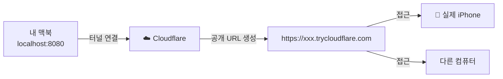

**Cloudflare Tunnel이 하는 일:**
localhost:8080은 이미 HTTP야. 문제는 "내 맥북 안에서만" 접근 가능하다는 것.
Cloudflare Tunnel은 그 로컬 주소에 **인터넷 어디서든 접근 가능한 공개 URL**을 붙여줘.

```
내 맥북만 접근 가능:   localhost:8080
인터넷 어디서든 접근:  https://xxx.trycloudflare.com
                              ↓ 내부적으로 localhost:8080으로 전달
```

iOS로 비유하면: TestFlight 없이 내 맥에서 빌드한 앱을 친구 폰에서 바로 실행할 수 있게 해주는 것.

---

### 통합 배포 스크립트 (MVP3 추가)

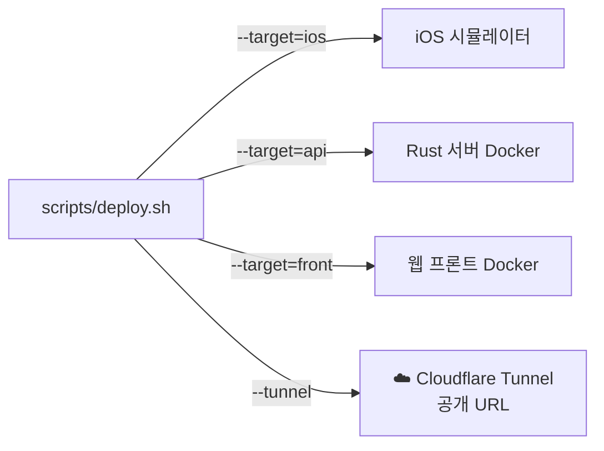

**`scripts/deploy.sh`가 하는 일:**
iOS 시뮬레이터 + Rust API(Docker) + 웹 프론트(Docker)를 단일 명령으로 배포.
`--target` 옵션으로 필요한 것만 선택 가능.

### 실제 배포 (서비스 오픈할 때)

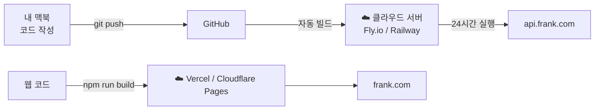

**배포 = 내 맥북이 꺼져도 서버가 돌아가게 만드는 것.**

| 대상 | 로컬 (개발 중) | 배포 후 |
|------|--------------|--------|
| API 서버 | localhost:8080 | api.frank.com |
| 웹 | localhost:5173 | frank.com |
| 접근 가능 범위 | 내 맥북만 | 전 세계 |

---

### Docker가 하는 역할

**클라우드**: 인터넷에 24시간 연결된 남의 서버 컴퓨터. 내 맥북이 꺼져도 계속 실행됨.

**문제 상황:**
```
내 맥 (macOS, ARM 칩)  vs  클라우드 서버 (Linux, x86 칩)
환경이 달라서 내 맥에서 잘 되던 코드가 클라우드에서 실행 안 될 수 있음
```

**Docker = 코드 + 실행에 필요한 환경을 하나의 박스로 묶는 도구.**
iOS로 비유하면: Xcode가 Swift 코드를 .ipa로 묶어주듯, Docker가 Rust 코드를 이미지로 묶어줌.

```
Docker 없이: 내 코드만 → 클라우드에 올림 → 환경 달라서 실행 안 됨
Docker 있으면: 코드 + 환경을 박스로 묶음 → 클라우드에 올림 → 동일하게 동작
```

**Docker는 접근 가능하게 해주는 게 아니다.** 외부 접근은 클라우드에 올리는 행위 자체.
```
Docker 이미지를 내 맥에서 실행   → 여전히 localhost, 외부 접근 불가
Docker 이미지를 클라우드에서 실행 → 공인 주소 생김, 외부 접근 가능
```

**샌드박스 / 컨테이너:**
iOS 앱이 서로 데이터를 건드릴 수 없듯이, Docker 컨테이너도 각자 독립된 공간에서 실행됨.
하나가 죽어도 다른 컨테이너에 영향 없음.

**Frank에서 언제 쓰나:**
```
평소 개발:             cargo run + npm run dev  → Docker 불필요
실제 기기 테스트:       Cloudflare Tunnel         → Docker 불필요
배포 직전 확인 / 배포:  deploy.sh --target=api/front → Docker 필요
                       deploy.sh --target=ios         → Docker 불필요
```

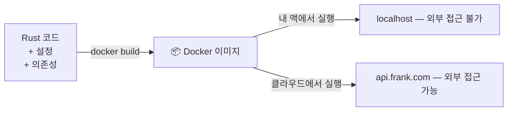

---

## 3. 기사 수집 흐름 — 뉴스가 앱에 뜨기까지

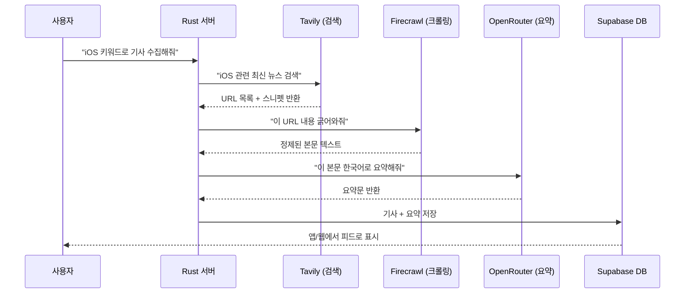

### 각 외부 서비스 역할 (이 프로젝트 기준)

**Tavily — AI 특화 검색엔진**
```
일반 검색: 광고, 관련없는 결과 섞임
Tavily:   AI가 쓰기 좋은 깔끔한 결과만 반환

사용처: "iOS 뉴스 검색" → URL + 간단한 설명 목록
```

**크롤링 (Crawling):**
URL을 주면 웹페이지 HTML 전체를 자동으로 가져오는 것. 광고·태그·메뉴·본문 전부 포함.
크롤링 자체는 HTML 전체를 긁어오는 것이고, 본문만 추출하는 정제는 별도 과정.

**Firecrawl — 크롤링 + 정제를 한 번에:**
```
URL 주면 → 크롤링(HTML 전체 수집) + 정제(광고/태그 제거) → 본문 텍스트만 반환
```
AI 모델한테 기사 내용을 넘길 때 HTML 태그가 섞여있으면 안 되니까 이걸 사용.

사용처: Tavily가 찾은 URL → Firecrawl로 크롤링+정제 → OpenRouter로 요약

**OpenRouter — AI 모델 연결 창구**
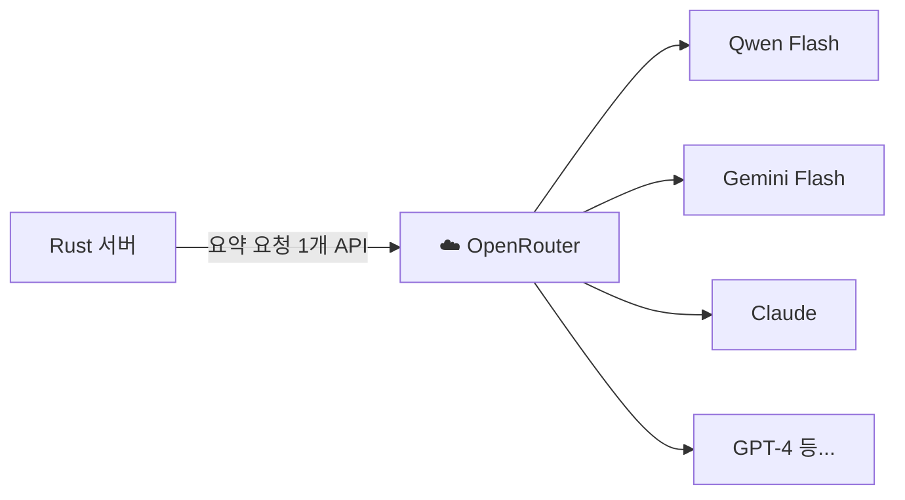

OpenRouter가 하는 일: 여러 AI 회사 모델을 **하나의 API 주소**로 쓸 수 있게 해줌.
맞아, 여러 모델을 한 곳에서 관리하고, 내가 지정한 모델로 연결해주는 것.
서버 코드에서 OpenRouter 하나만 연결해두면 모델을 바꿔도 코드 수정 없이 설정값만 바꾸면 됨.

```
코드:  openrouter.ai/api → model: "qwen/qwen-2.5"  (Qwen 쓸 때)
코드:  openrouter.ai/api → model: "google/gemini-flash"  (Gemini 쓸 때)
주소는 그대로, 모델 이름만 바꾸면 됨
```

---

## 4. 로그인 흐름 — Apple 로그인부터 API 호출까지

### iOS Apple 로그인 흐름 (MVP3 추가)

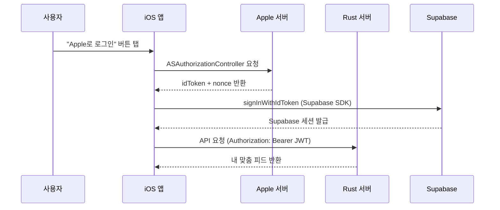

### 웹 Apple 로그인 흐름 (MVP3 추가)

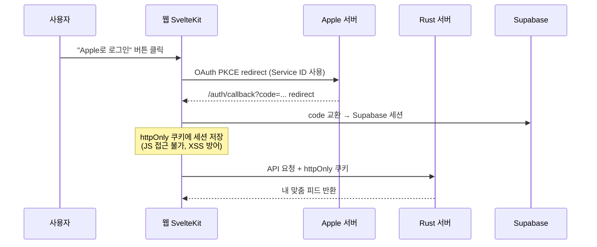

**iOS와 웹 방식이 다른 건 어쩔 수 없나?**
어쩔 수 없어. Apple이 플랫폼별로 다른 방식을 제공하거든.
- iOS: 네이티브 시트(ASAuthorizationController) → ID Token 직접 받음
- 웹: 브라우저 리다이렉트(OAuth PKCE) → 코드 받고 → 토큰 교환

방식은 달라도 **결국 목적은 동일** — "Apple이 인증한 토큰을 가져와서 Supabase → JWT → Rust API로 전달"

**크로스 플랫폼 계정 연동이 "공짜"인 이유:**
웹과 iOS가 동일 Supabase 프로젝트를 쓰면, 동일 Apple ID로 로그인한 계정은 동일한 user_id를 가진다. 별도 연동 로직 없이 자동.

웹에서 온보딩(태그 선택) → iOS 로그인 → 태그 그대로 유지.

**두 방식의 차이:**

| 항목 | 웹 | iOS |
|------|-----|-----|
| 방식 | OAuth PKCE redirect | ID Token 직접 |
| 핵심 | Service ID, 브라우저 리다이렉트 | Bundle ID, 네이티브 시트 |
| 주의 | `use:enhance`가 redirect를 가로챔 | canceled 분기 반드시 처리 |

**Apple Service ID vs Bundle ID:**
Supabase Apple Provider 설정의 `Client IDs` 첫 번째 값이 OAuth `client_id`로 사용된다.
```
❌ dev.frank.app,com.frank.web   → Bundle ID가 OAuth client_id로 사용, invalid_client 오류
✅ com.frank.web,dev.frank.app   → Service ID가 OAuth client_id로 사용, 정상 동작
```

**JWT / httpOnly 쿠키가 하는 역할:**
로그인 성공 후 "이 사람 맞아요" 증명서.
- iOS: JWT를 Authorization 헤더로 첨부
- 웹: httpOnly 쿠키 (JS 접근 불가 → XSS 방어), 서버 사이드에서 검증

iOS 비유: Keychain에 저장하는 인증 토큰과 동일한 역할. 웹의 httpOnly 쿠키는 "Keychain에 저장하되 앱이 직접 못 읽게 막은 것"에 해당.

---

## 4-1. 인증 흐름 vs 서비스 흐름 — 가장 헷갈리기 쉬운 분리

> 멘토 발표에서 두 흐름이 섞여서 설명되었던 부분. 반드시 분리해서 이해할 것.

**핵심 한 줄: 인증은 Supabase SDK가, 데이터 요청은 Rust API가 처리한다.**

### 인증 흐름 — Rust 서버 없음

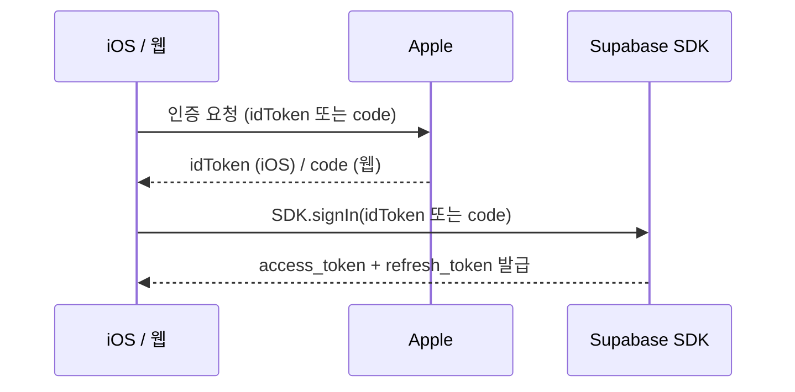

인증은 Supabase SDK가 전담. Rust 서버는 전혀 관여하지 않음.

### 서비스 흐름 — Rust 서버 거침

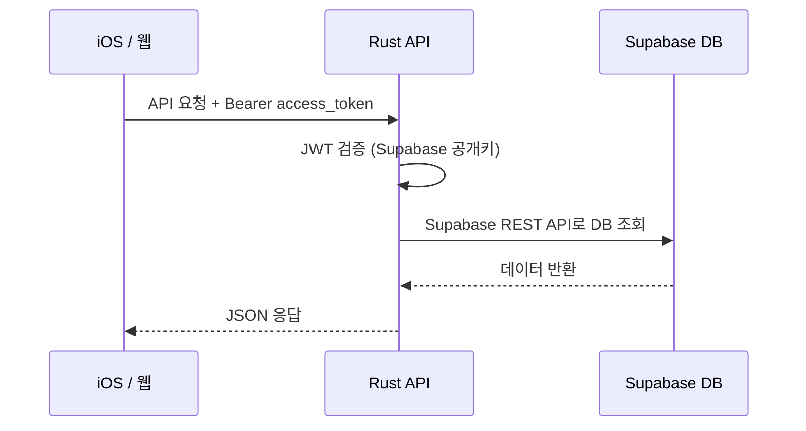

앱은 `Authorization: Bearer {access_token}` 헤더에 토큰을 담아 보냄.
Rust API가 토큰을 검증하고 Supabase DB에 접근. 비즈니스 로직은 전부 Rust 안에 존재.

---

## 4-2. JWT / 토큰 종류 — 발급 주체와 역할 구분

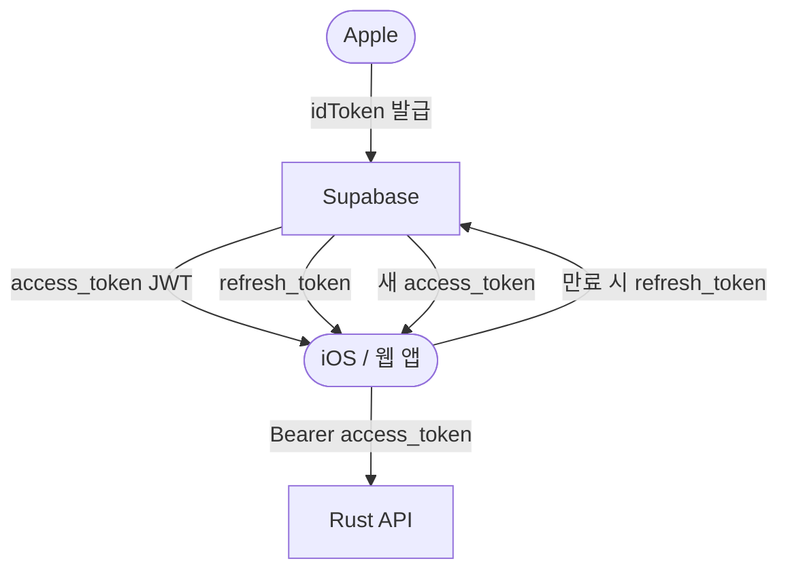

| 토큰 | 발급 주체 | 역할 | 수명 |
|------|---------|------|------|
| idToken | Apple | 신원 증명. Supabase 로그인할 때만 사용 후 폐기 | 1회용 |
| access_token | Supabase | API 호출용 JWT. Bearer 헤더에 담아 Rust에 전달 | 짧음 (1시간) |
| refresh_token | Supabase | access_token 만료 시 새 것 발급받는 열쇠 | 김 (수 주~수 개월) |

**암호화 vs 서명 (JWT):**
- **암호화**: 내용을 숨김. 키 없으면 읽을 수 없음
- **서명(JWT)**: 내용은 읽을 수 있음. 변조하면 서명이 안 맞아서 서버가 거부
- Rust API는 access_token의 내용을 읽고, 변조 여부만 확인

**nonce:**
idToken 안에 포함된 일회용 랜덤 값. 같은 idToken을 탈취해서 다시 쓰려 해도 nonce가 맞지 않아서 Supabase가 거부.

---

## 4-3. 저장소 비교 — httpOnly 쿠키 vs Keychain

### XSS 공격: localStorage의 취약점

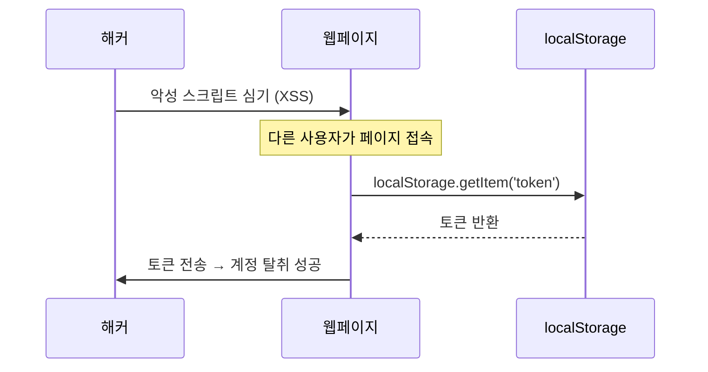

localStorage는 JS로 접근 가능하기 때문에 XSS 공격에 취약. access_token을 localStorage에 저장하면 안 됨.

### 안전한 저장소 선택

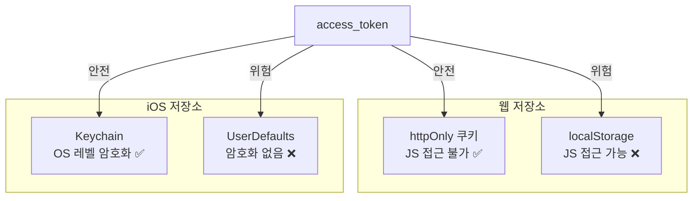

| 저장소 | 플랫폼 | JS 접근 | 특징 |
|--------|--------|---------|------|
| httpOnly 쿠키 | 웹 | 불가 | 서버가 Set-Cookie로 생성. JS 읽기 불가 → XSS 방어 |
| localStorage | 웹 | 가능 | JS로 자유롭게 읽기/쓰기. XSS 취약 |
| Keychain | iOS | 해당없음 | OS 레벨 암호화. 앱 삭제해도 유지. 다른 앱 접근 불가 |
| UserDefaults | iOS | 해당없음 | 단순 키-값 저장. 암호화 없음 → 민감 정보 저장 금지 |

**Frank에서의 결론:**
- 웹 → httpOnly 쿠키에 access_token 저장 (서버가 Set-Cookie로 관리, `@supabase/ssr`)
- iOS → Keychain에 access_token + refresh_token 저장 (Supabase Swift SDK가 자동 관리)

쿠키: 브라우저가 관리. 매 요청마다 자동 첨부. 브라우저마다 독립적.
httpOnly 쿠키: 서버 ↔ 브라우저 사이에서만 오감. JS가 읽을 수 없음.

---

## 5. 병렬 개발 흐름 — 서버·웹·앱을 동시에 만드는 방법

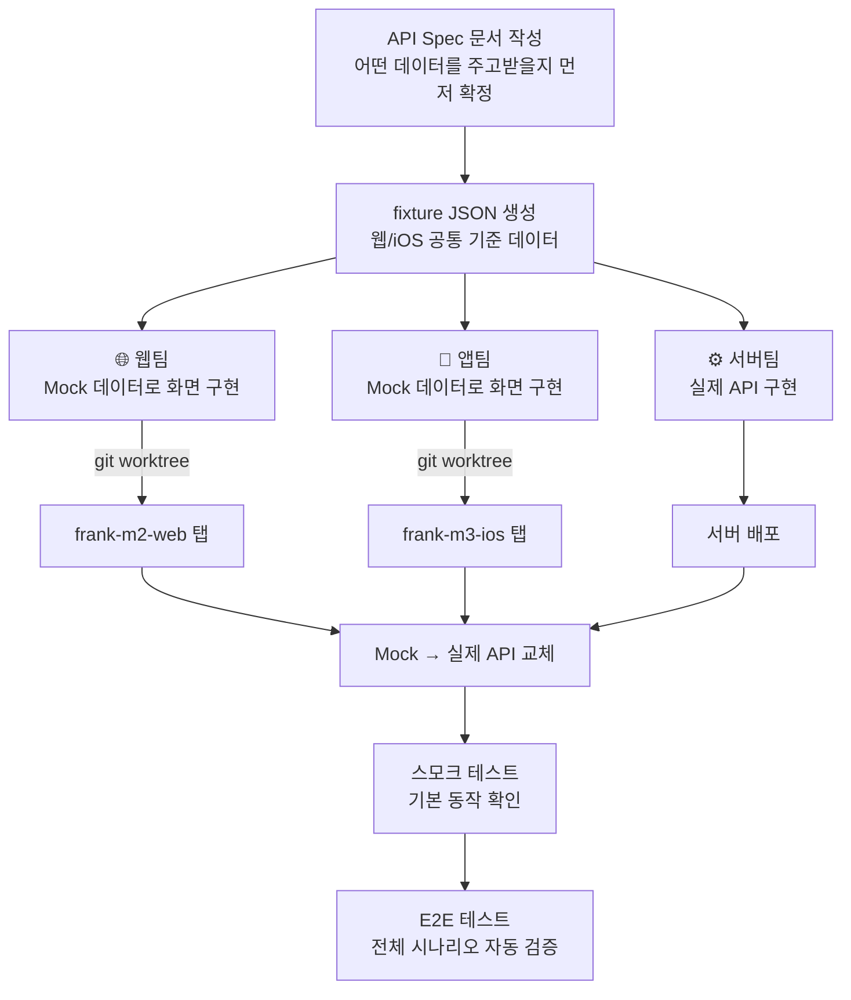

**핵심:**
계약(API Spec)만 먼저 정하면 서버·웹·앱이 기다리지 않고 동시에 작업 가능.
Mock 데이터 = 가짜 데이터. 실제 서버 없이 화면을 먼저 만들 때 사용.

**git worktree (MVP3 실전 검증):**
동일 git 저장소를 두 디렉토리(`frank-m2-web`, `frank-m3-ios`)에 체크아웃해서 탭별 독립 작업.
- web/ vs ios/ 완전 분리 → 코드 충돌 0건
- fixture JSON 공유 → 스키마 불일치 0건
- 병렬 진행 시간 약 40% 단축 추정

iOS로 비유하면: 동일 Xcode 프로젝트의 브랜치를 두 개의 시뮬레이터에서 동시 실행하는 것.

---

## 6. Port/Adapter 패턴 — 이 프로젝트 전체에 적용된 핵심 구조

### 왜 필요한가

테스트할 때 실제 DB나 외부 API를 호출하면:
- 느리고, 비용 나가고, 인터넷 없으면 테스트 불가
- 외부 서비스가 죽으면 내 테스트도 실패

해결책: **중간에 인터페이스(Port)를 끼워서 실제 구현체를 교체 가능하게**

### iOS Clean Architecture와 매핑

iOS Clean Architecture를 알면 바로 이해돼. 레이어 구조가 동일해.

```
iOS Clean Architecture       이 프로젝트 (서버/웹)
─────────────────────────────────────────────────
View / ViewModel        ↔   api/ (HTTP 핸들러)
UseCase                 ↔   services/ (유스케이스)
Repository Protocol     ↔   domain/port (trait)   ← Port
Repository 구현체        ↔   infra/adapter          ← Adapter
```

**Infra(Adapter)는 iOS의 Repository 구현체에 해당해.** UseCase가 아니야.
- Port = "어떻게 가져올지 약속" (Repository Protocol)
- Adapter = "실제로 Supabase HTTP 호출하는 코드" (Repository 구현체)
- Services = "비즈니스 로직" (UseCase)

```swift
// iOS 비유
// ❌ 나쁜 방식 — 구체 타입에 직접 의존
class FeedViewModel {
    let db = SupabaseClient()  // 테스트할 때 실제 DB 호출됨
}

// ✅ Port/Adapter 방식 — Protocol로 추상화
protocol ArticlePort {           // ← Port (Repository Protocol)
    func fetchArticles() async -> [Article]
}
class SupabaseAdapter: ArticlePort {  // ← Adapter (Repository 구현체)
    func fetchArticles() async -> [Article] { /* 실제 HTTP 호출 */ }
}
class FeedViewModel {
    let port: ArticlePort  // 테스트엔 MockAdapter, 실제론 SupabaseAdapter
}
```

### 이 프로젝트에서의 흐름

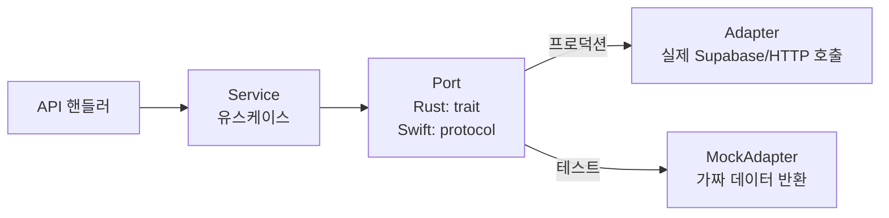

**의존 방향 규칙:**
```
api → services → domain(port) ← infra(adapter)
```
화살표가 항상 안쪽(domain)을 향함. infra가 domain을 바라봄. 반대 금지.

### 각 언어에서의 표현

| 언어 | Port (인터페이스) | Adapter (구현체) |
|------|-----------------|-----------------|
| Swift | `protocol ArticlePort` | `class SupabaseAdapter: ArticlePort` |
| Rust | `trait ArticlePort` | `impl ArticlePort for SupabaseAdapter` |
| TypeScript | `interface ArticlePort` | `class SupabaseAdapter implements ArticlePort` |

이름만 다르고 개념은 완전히 동일.

---

## 7. Supabase — 이 프로젝트의 DB + 인증 담당

### 한 줄 정의

**Supabase = Firebase의 오픈소스 대안.**
PostgreSQL DB + 인증(Auth) + 스토리지를 하나의 서비스로 제공.

### iOS 비유

```
Firebase   ≈ Supabase
Firestore  ≈ Supabase DB (PostgreSQL)
Firebase Auth ≈ Supabase Auth
```

### 이 프로젝트에서 하는 일

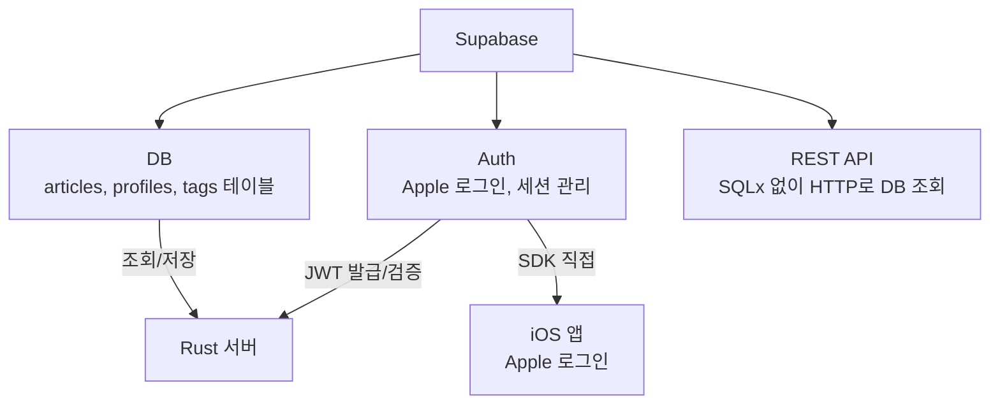

**MVP3 이후 구조:**
- 웹/iOS는 Supabase에 직접 붙지 않음
- Rust 서버만 Supabase와 통신
- iOS는 로그인(인증)만 Supabase SDK 직접 사용

### 마이그레이션이란

DB 테이블 구조를 바꿀 때 쓰는 변경 스크립트.
```
supabase/migrations/0001_create_articles.sql  ← 테이블 생성
supabase/migrations/0002_add_tags.sql         ← 컬럼 추가
```
iOS로 비유하면: CoreData 마이그레이션과 동일한 개념.

---

## 8. TTL 캐시 — 오래된 데이터를 자동으로 날리는 캐시

### 한 줄 요약

**"서버가 검색 결과를 5분 동안 기억해뒀다가, 같은 요청이 오면 바로 줌.
단, 사용자가 새로고침하거나 태그를 바꾸면 버리고 다시 가져옴."**

---

### TTL이란 (Time To Live)

캐시(Cache) = 한 번 가져온 데이터를 임시 저장소에 보관해두는 것.
TTL(Time To Live) = 그 데이터의 유통기한. 시간이 지나면 자동으로 버림.

```
5분 TTL 예시:
  14:00 — 데이터 저장 (유통기한: 14:05까지)
  14:03 — 요청 → 저장된 거 반환 (빠름)
  14:06 — 요청 → 만료됨 → 다시 가져옴
```

---

### 흐름으로 이해하기

#### 현재 Frank (캐시 없음)

```
앱 실행
  └→ 피드 요청
       └→ 서버
            └→ 외부 검색 API (Tavily/Exa) 실시간 호출
                 └→ 결과 반환 (2~5초)

앱 재시작
  └→ 피드 요청
       └→ 서버
            └→ 외부 검색 API 또 실시간 호출
                 └→ 결과 반환 (또 2~5초)  ← 매번 똑같이 느림
```

문제: 앱을 껐다 켜도, 5분 전에 봤던 것과 같은 기사인데도 매번 2~5초를 기다려야 함.

---

#### M3 이후 Frank (서버 TTL 캐시 도입)

```
앱 실행 (처음 or TTL 만료)
  └→ 피드 요청
       └→ 서버
            └→ 캐시 MISS (없거나 만료됨)
                 └→ 외부 검색 API 호출 (2~5초)
                      └→ 결과를 캐시에 저장 (5분 유통기한)
                           └→ 결과 반환

앱 재시작 (TTL 5분 이내)
  └→ 피드 요청
       └→ 서버
            └→ 캐시 HIT (저장된 거 있음)
                 └→ 즉시 반환 (수 ms)  ← 빨라짐

수동 새로고침 ("Cache-Control: no-cache" 헤더 포함)
  └→ 피드 요청 + "캐시 무시해줘" 신호
       └→ 서버
            └→ 캐시 있어도 무시
                 └→ 외부 검색 API 직접 호출
                      └→ 최신 결과 반환 + 캐시 갱신

태그 변경
  └→ POST /api/me/tags
       └→ 서버
            └→ 태그 저장
                 └→ 해당 사용자 캐시 즉시 삭제 (무효화)
                      └→ 다음 피드 요청은 MISS → 새로 가져옴
```

---

### 캐시 키 — 누구의 어떤 피드인지 구분하는 이름표

사용자마다, 태그마다 피드 내용이 다르기 때문에 저장할 때 이름표가 필요하다.

```
캐시 저장소 (서버 메모리)
├── "유저A:AI,경제"   → [기사1, 기사2, 기사3] (만료: 14:35)
├── "유저A:전체"      → [기사4, 기사5, 기사6] (만료: 14:33)
└── "유저B:AI"        → [기사7, 기사8, 기사9] (만료: 14:30)
```

유저A가 태그를 바꾸면 `"유저A:"` 로 시작하는 항목 전부 삭제 → 유저B는 영향 없음.

### Frank에서 TTL 캐시가 쓰이는 곳

현재 Frank에는 **두 종류의 캐시**가 있다.

#### 1. 웹 피드 탭 캐시 (클라이언트 TTL 캐시)

`web/src/lib/stores/feedStore.svelte.ts`의 `tagCache`

```
구조: Map<tagId | 'all', FeedItem[]>

동작:
  loadFeed() → 구독 태그 전체를 병렬 프리패치 → tagCache에 저장
  selectTag() → 캐시 히트면 즉시 표시 (서버 요청 없음)
              → 캐시 미스면 서버 요청 후 저장
  refresh()   → 현재 탭 캐시 무효화 + 재요청
```

이 캐시는 **세션 기반 TTL** — 페이지 새로고침 시 전부 날아감.
별도 만료 시간 없이 명시적 무효화(refresh / reset)로만 갱신.

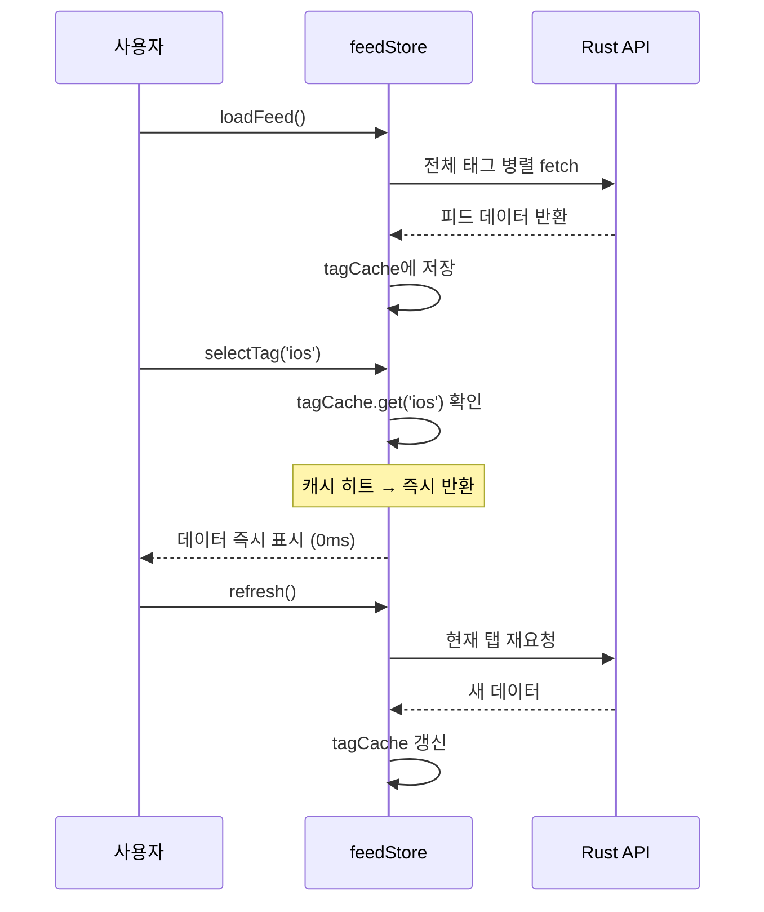

**왜 이렇게 했나:**
피드 탭 전환마다 API 호출하면 탭 클릭할 때마다 로딩 스피너가 뜬다.
프리패치로 캐시를 채워두면 탭 전환이 즉시(0ms) 반응.

#### 2. 웹 요약 캐시 (summaryCache)

`web/src/lib/stores/summaryCache.svelte.ts`

```
구조: Map<url, SummaryResult>

동작:
  기사 요약 완료 → summaryCache.set(url, result)
  다시 같은 기사 열기 → summaryCache.get(url) 히트 → AI 재호출 없음
  새로고침 → 캐시 초기화 (메모리 기반이라 휘발)
```

AI 요약 API는 비용이 발생하고 5~10초 걸린다.
같은 기사를 다시 열 때 캐시에서 바로 반환하면 비용과 대기 시간 모두 절감.

### TTL 캐시 vs 영구 캐시

| 종류 | 만료 조건 | Frank에서 사용 |
|------|---------|--------------|
| TTL 캐시 | 시간이 지나면 자동 만료 | 아직 미적용 (서버 레벨) |
| 세션 캐시 | 페이지 새로고침 시 만료 | feedStore.tagCache, summaryCache |
| 명시적 캐시 | 특정 이벤트(refresh/logout)에 무효화 | feedStore.tagCache |
| DB 캐시 | 만료 없음, 직접 삭제 | 즐겨찾기 summary (favorites 테이블) |

### Frank 서버 TTL 캐시 (MVP10 M3에서 구현 예정)

현재 Frank 서버(`server/src/`)에는 TTL 캐시가 없다.
`GET /me/feed`는 매 호출마다 외부 검색 API를 실시간 호출한다.

MVP10 M3에서 서버 인메모리 TTL 캐시를 도입한다.
구조는 위 "흐름으로 이해하기" 섹션 참고.

### stale-while-revalidate 패턴

Frank 웹 피드에서 구현된 UX 패턴.

```
stale = 낡은 데이터 (캐시)
revalidate = 새 데이터로 갱신
```

**동작:**
1. 캐시된 오래된 데이터를 **즉시 표시** (로딩 스피너 없음)
2. 동시에 백그라운드에서 새 데이터 요청 (`isRefreshing = true`)
3. 새 데이터 도착 → 화면 업데이트

```mermaid
sequenceDiagram
    participant U as 사용자
    participant Store as feedStore
    participant API as Rust API

    Note over Store: tagCache에 'ios' 탭 데이터 있음 (낡은 데이터)
    U->>Store: selectTag('ios')
    Store-->>U: 캐시 데이터 즉시 표시 (isRefreshing = false)
    Note over U: 사용자는 즉시 콘텐츠를 볼 수 있음

    U->>Store: refresh() 클릭
    Store-->>U: 기존 피드 유지 (isRefreshing = true, 상단 progress bar)
    Store->>API: 새 데이터 요청
    API-->>Store: 새 피드
    Store-->>U: 화면 업데이트 (isRefreshing = false)
```

iOS 비유: `UITableView`에서 기존 데이터 보여주면서 백그라운드에서 `URLSession` 재요청 → 도착하면 `reloadData()` 호출하는 패턴.

---

## 9. 환경변수 흐름 — 민감한 값을 안전하게 쓰는 방법

```mermaid
graph LR
    A[.env 파일\nAPI_KEY=xxx\nDB_URL=xxx] -->|앱 시작 시 1회 로딩| B[Config struct]
    B -->|주입| C[서버 핸들러]
    B -->|주입| D[DB 어댑터]
    B -->|주입| E[AI 어댑터]

    F[❌ 코드에 직접 하드코딩] -->|Git에 올라가면 노출!| G[보안 사고]
```

iOS 비유: `.xcconfig` 또는 `Info.plist`에 API 키 분리하는 것과 동일.

### Apple Client Secret 관리 흐름

Apple 로그인에는 두 개의 핵심 키가 있다.

```
.p8 파일 (RSA 개인키)
  → Apple Developer에서 1회 발급
  → 만료 없음 (분실 또는 revoke 시 재발급)
  → 절대 외부 노출 금지, Git 커밋 금지

APPLE_CLIENT_SECRET (JWT 토큰)
  → .p8로 서명한 JWT
  → 최대 6개월 만료
  → 만료 시 Apple 로그인 401 → 사용자 로그인 불가
```

```mermaid
graph LR
    A[.p8 파일\nRSA 개인키] -->|generate_apple_secret.js 실행| B[APPLE_CLIENT_SECRET\nJWT 토큰]
    B -->|서버 환경변수에 수동 설정| C[Rust 서버]
    C -->|Apple OAuth 교환 시 사용| D[Apple 서버]
```

**갱신 절차:**
```
기존 .p8 파일 유지 (재발급 불필요)
    ↓
generate_apple_secret.js 실행 (로컬에서 개발자가 직접)
    ↓
새 JWT 생성
    ↓
서버 환경변수(APPLE_CLIENT_SECRET) 업데이트
```

**APPLE_CLIENT_SECRET_EXPIRES_AT:**
비민감 날짜값 → `.env`보다 서버 환경변수에 직접 수동 관리가 적합.
현재 만료일: **2026-10-08**

iOS 비유: Keychain에 저장한 토큰이 만료되어 재발급받는 것과 동일한 흐름. 단, 여기서는 Apple이 토큰을 발급해주는 게 아니라 개발자가 `.p8`로 직접 서명해서 만든다.

---

## 10. 이 프로젝트 개발 사이클

```mermaid
graph LR
    A[/milestone\n큰 그림 설계] --> B[/workflow\n태스크 실행]
    B --> C[step-1~9\n단계별 구현]
    C --> D[MVP 완료]
    D --> E[/daily-retro\n회고]
    E --> F[history/ 아카이빙]
    F --> A
```

---

## 11. Claude Code 스킬 한눈에

| 스킬 | 언제 쓰나 | 한 줄 설명 |
|------|----------|-----------|
| `/init` | 세션 시작 | 현재 상태 파악 |
| `/milestone` | MVP 시작 전 | 큰 그림·로드맵 설계 |
| `/workflow` | 기능 구현 시작 | 9단계 태스크 실행 |
| `/step-{N}` | 중간 재개 | 특정 단계만 실행 |
| `/next` | 다음 단계 진행 | 자동으로 다음 step |
| `/status` | 진행 중 확인 | 현재 단계·진행률 |
| `/daily-retro` | 하루 끝 | 회고 문서 생성 |
| `/notes` | 메모 정리 | 쌓인 메모 분류+설명 |
| `/deep-analysis` | 코드 분석 필요 | 내 파일 심층 분석 |

---

## 12. 외부 서비스 계정 정리

| 서비스 | 연결 계정 | 역할 |
|--------|---------|------|
| Supabase | GitHub | DB + 인증 |
| Tavily | Google | 뉴스 검색 |
| Cloudflare | Google | 터널 + DNS |
| OpenRouter | — | AI 모델 연결 |

---

## 13. MVP4 이월 부채 (체크리스트)

- [ ] LLM 모델 MiniMax → Qwen 복귀 — commit 634f4f6 원복 (M1 선행 조건)
- [ ] iOS 요약 60s timeout — 클라이언트 타임아웃 + 재시도 버튼 (High)
- [ ] Apple Client Secret 갱신 알림 — 6개월 만료 2026-10-08경 (High)
- [ ] Supabase Manual Linking — 이메일+Apple 계정 병합, Beta 졸업 후 (Medium)
- [ ] alert → 인라인 에러 UX 개선, iOS 로그인 에러 표시 (Low)
