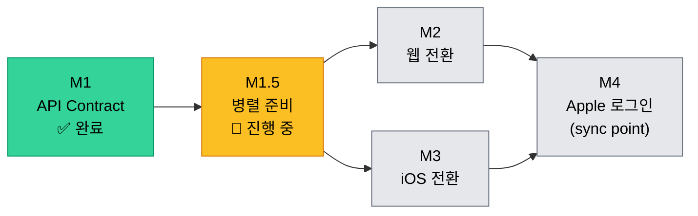
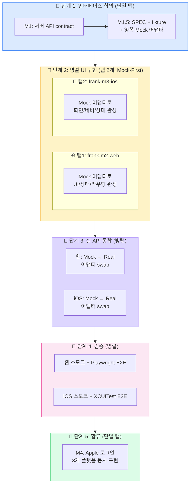
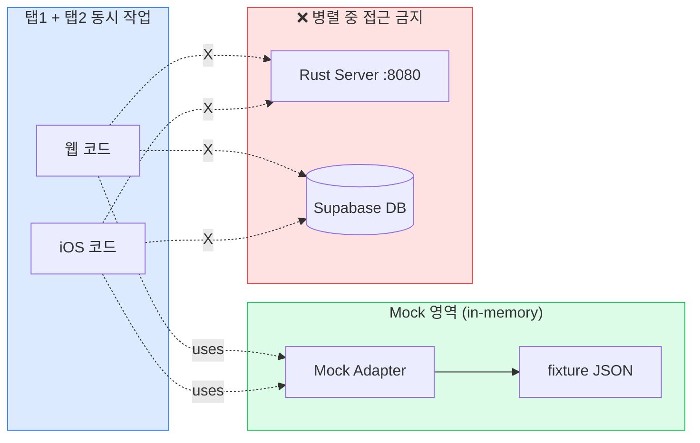

# MVP3: 웹-iOS API 통합

> 생성일: 260406
> 상태: 🚧 진행 중 (M1 완료 / M2~M4 대기)
> 목표: 웹과 iOS가 동일한 Rust API를 사용하여 동일한 경험 제공

## 배경

MVP1(웹)과 MVP2(iOS)가 각각 Supabase를 직접 호출하여 데이터를 가져오고 있음.
비즈니스 로직이 이중화되어 싱크가 안 맞고, 변경 시 양쪽 모두 수정 필요.

```
현재:  웹 → Supabase 직접 (태그, 기사, 프로필)
       iOS → Supabase 직접 (태그, 기사, 프로필)
       웹/iOS → Rust 서버 (수집, 요약만)

목표:  웹/iOS → Rust 서버 → Supabase (모든 데이터 요청)
       웹/iOS → Supabase Auth SDK (인증만)
```

## 확정 사항

| 항목 | 결정 |
|------|------|
| 인증 | Supabase Auth SDK 유지 (토큰 관리, Keychain/쿠키 위임) |
| 데이터 | Supabase 직접 호출 → Rust 서버 API로 통합 |
| 웹 세션 | localStorage → httpOnly 쿠키 전환 (@supabase/ssr) |
| iOS 토큰 | Keychain (Supabase SDK가 관리) |
| MVP2.5 부채 | MVP3 진행 중 흡수 해소 (별도 .5 버전 없음) |

## 마일스톤

| M# | 마일스톤 | 범위 | 상태 | 내용 |
|----|---------|------|------|------|
| M1 | API Contract | 서버 | ✅ 완료 (260407) | Rust 서버에 부족한 엔드포인트 추가 + 데이터 모델 통일 |
| **M1.5** | **병렬 개발 준비** | **웹+iOS** | **✅ 완료 (260407)** | **API SPEC 문서 + fixture + web 포트 추상화 + iOS Mock 어댑터** |
| M2 | 웹 전환 | 웹 | ⏳ 대기 (M1.5 완료 후 병렬 시작) | Mock으로 UI 완성 → 실 API 어댑터 swap → @supabase/ssr 쿠키 전환 |
| M3 | iOS 전환 | iOS | ⏳ 대기 (M1.5 완료 후 병렬 시작) | Mock으로 UI 완성 → 실 API 어댑터 swap → MVP2 부채 해소 |
| M4 | Apple 로그인 | 서버+웹+iOS | ⏳ 대기 | 3개 플랫폼 동시 구현 (참조: wip/apple-login-draft 2fbcedc) |

## M1: API Contract 상세

현재 Rust 서버 엔드포인트:

| 엔드포인트 | 상태 | 비고 |
|-----------|------|------|
| GET /health | ✅ 있음 | |
| GET /api/tags | ✅ 있음 | |
| GET /api/me/tags | ✅ 있음 | |
| POST /api/me/tags | ✅ 있음 | |
| GET /api/me/profile | ✅ 있음 | |
| GET /api/me/articles | ✅ 있음 | |
| POST /api/me/collect | ✅ 있음 | |
| POST /api/me/summarize | ✅ 있음 | |
| GET /api/me/articles/:id | ❌ 없음 | 기사 상세 (웹/iOS 필요) |
| PUT /api/me/profile | ❌ 없음 | 온보딩 완료 등 프로필 수정 |

데이터 모델 통일 필요:

| 필드 | 서버 | 웹 | iOS | 조치 |
|------|------|-----|------|------|
| title_ko | ✅ | ❌ | ✅ | 웹 타입에 추가 |
| content | ✅ | ❌ | ❌ | 클라이언트 불필요 (서버만 사용) |
| llm_model | ✅ | ❌ | ❌ | 클라이언트 불필요 |

## M2: 웹 전환 상세

1. @supabase/ssr 설치 + hooks.server.ts 쿠키 어댑터 설정
2. web/src/lib/utils/api.ts의 Supabase 직접 호출 → fetch(Rust API) 전환
3. web/src/lib/supabase.ts → 인증 전용으로 축소
4. SvelteKit API 프록시 라우트 제거 (/api/collect, /api/summarize → 직접 Rust 호출)

## M3: iOS 전환 상세

1. SupabaseArticleAdapter → APIArticleAdapter (URLSession, Rust API 호출)
2. SupabaseTagAdapter → APITagAdapter
3. Supabase Swift SDK 의존성 → Auth 전용으로 축소
4. MVP2 부채 흡수: FeedFeature LoadingPhase enum, UI 테스트 보강 등

## M4: Apple 로그인 상세

- 참조 커밋: wip/apple-login-draft 브랜치 2fbcedc
- iOS: ASAuthorizationController → idToken → Supabase Auth
- 웹: Supabase Auth OAuth (PKCE flow)
- 서버: 추가 작업 없음 (JWT 검증은 동일)

## 의존 그래프



M2/M3는 **서로 독립**하며 M1.5 완료 후 **두 worktree 탭에서 병렬 진행**.

## 병렬 작업 흐름 (시각화)



### 외부 의존 격리 원칙



→ Mock 영역만 거치므로 **두 탭이 외부 자원을 공유하지 않음 → 충돌 0**.

## 작업 방식: Mock-First → API 통합 → E2E

실무 패턴을 그대로 채용:

1. **인터페이스 합의** (M1 + M1.5) — API SPEC 문서 freeze
2. **Mock으로 UI 완성** (M2/M3 병렬) — 외부 의존 0, 충돌 0
3. **실 API 어댑터 swap** (M2/M3 후반) — 어댑터 교체만, UI 무변경
4. **클라이언트 스모크** + **E2E** (병렬 가능)

## 진행 방법

각 마일스톤마다 /workflow 실행:
- /step-1 요구사항 인터뷰 + 태스크 분해
- /step-3 서브태스크 분리
- /step-6 구현 (TDD)
- /step-8 테스트
- /step-9 커밋

### M2/M3 병렬 셋업 (M1.5 완료 후)

```bash
cd /Users/seungchan/Workspace/frank
git worktree add /Users/seungchan/Workspace/frank-m2-web -b feature/260408_m2_web
git worktree add /Users/seungchan/Workspace/frank-m3-ios -b feature/260408_m3_ios
# 탭1: cd /Users/seungchan/Workspace/frank-m2-web && claude
# 탭2: cd /Users/seungchan/Workspace/frank-m3-ios && claude
```

각 탭은 자기 영역(`web/` 또는 `ios/`)만 수정하며 `server/`는 read-only.

## 병렬 작업 운영 정책 (M2/M3 동시 진행)

### 격리 원칙
- 탭1(M2): `web/` 디렉토리만 수정. `server/`, `ios/` 절대 금지
- 탭2(M3): `ios/` 디렉토리만 수정. `server/`, `web/` 절대 금지
- 양쪽 모두 `progress/` 폴더에서는 자기 마일스톤 문서(M2 또는 M3)와 회고만 수정. **로드맵, 다른 마일스톤 문서, M1.5 문서는 read-only**
- M1.5에서 만든 인프라(`web/src/lib/api/`, `ios/.../Mock*Adapter.swift`)를 우회하지 말 것

### Server 변경이 필요해질 때
M2 또는 M3 진행 중 contract 부족분(엔드포인트 누락, CORS 등)이 발견되면:
1. 발견한 탭의 작업 **즉시 중지**
2. 사용자에게 보고
3. 사용자가 메인 탭에서 hotfix 브랜치로 server/ 수정 → main에 머지
4. 양쪽 worktree에서 `git pull --rebase origin main` 후 작업 재개

### 머지 순서 정책
- **선착순 머지**: 먼저 끝난 쪽이 PR을 만들고 main에 머지
- **후순위 rebase**: 후순위 탭은 머지 전에 `git fetch origin main && git rebase origin/main` 수행
- **충돌 위험**: 양쪽이 서로 다른 디렉토리(`web/` vs `ios/`)만 수정하므로 코드 충돌 거의 0. `progress/` 공통 문서만 주의
- **roadmap 갱신**: 각 탭은 본 로드맵을 수정하지 않음. 머지 시점에 메인 탭에서 일괄 갱신

### 머지 후 통합 검증 (메인 탭에서 사용자/메인 Claude 진행)
M2 + M3 둘 다 머지된 후, **M4 시작 전에** 메인 탭에서 다음 검증:

1. **양쪽 동시 빌드/테스트**
   ```bash
   cd /Users/seungchan/Workspace/frank
   git checkout main && git pull
   cd web && npm run lint && npm run check && npm run test
   cd ../ios/Frank && ~/.tuist/Versions/4.31.0/tuist generate --no-open && \
     xcodebuild test -workspace Frank.xcworkspace -scheme Frank \
     -destination 'platform=iOS Simulator,name=iPhone 17 Pro'
   ```

2. **실 Rust 서버 + 양쪽 클라이언트 동시 동작 확인**
   - Rust 서버 실행 (`cd server && cargo run`)
   - 웹 dev 서버 실행 (`VITE_USE_MOCK_API=false npm run dev`)
   - iOS 시뮬레이터 실행 (Mock 환경변수 OFF)
   - 동일 사용자로 양쪽에서 로그인 → 데이터 일관성 확인
   - 한쪽에서 데이터 변경 후 다른 쪽 새로고침 → 동기화 확인

3. **공통 문서 일괄 갱신**
   - 본 로드맵의 M2/M3 상태를 ✅ 완료로 변경
   - `progress/260408_MVP3_통합_검증_회고.md` 작성 (선택)

4. **worktree 정리**
   ```bash
   git worktree remove /Users/seungchan/Workspace/frank-m2-web
   git worktree remove /Users/seungchan/Workspace/frank-m3-ios
   git branch -d feature/260408_m2_web feature/260408_m3_ios
   ```

5. **M4 (Apple 로그인) 시작 가능 상태 확인**
   - `wip/apple-login-draft 2fbcedc` 브랜치 참조 가능 여부
   - 메인 탭에서 단일 작업으로 M4 진행
