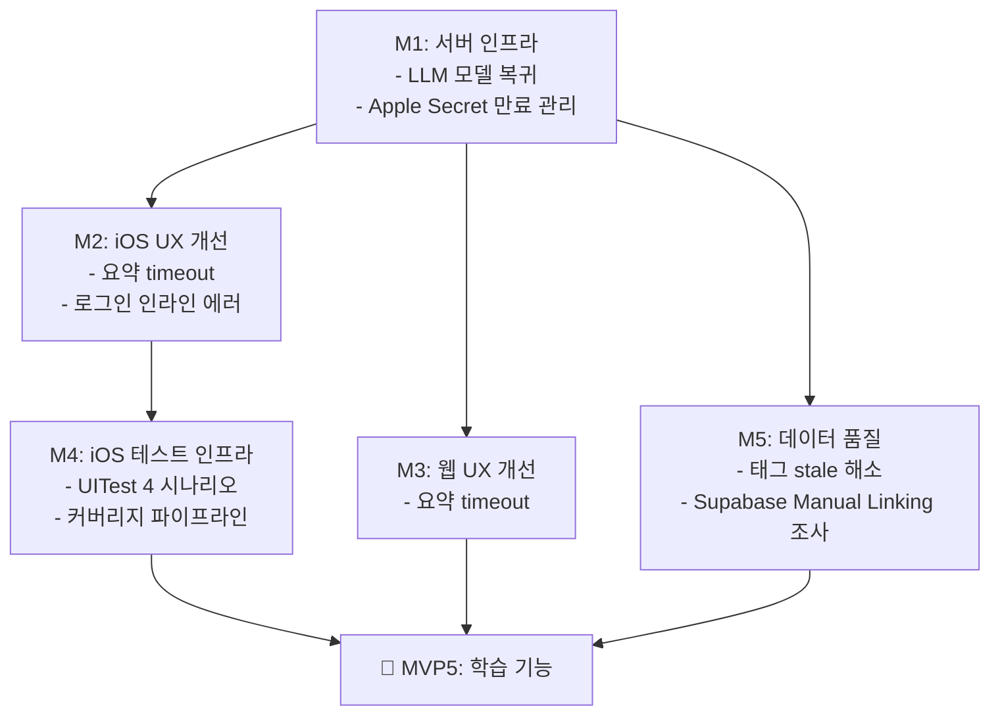

# 로드맵: Frank MVP4

> 생성일: 260408
> 최종 갱신: 260408
> 상태: 계획

---

## MVP4 한 줄 목표

MVP3까지 쌓인 기술 부채와 UX 결함을 해소하여 MVP5(학습 기능) 진입 전 안정적 기반을 확보한다.

---

## 타임라인

| 마일스톤 | 내용 | 예상 기간 | 의존성 | 상태 |
|---------|------|----------|--------|------|
| M1 | 서버 인프라 (LLM 복귀 + Apple Secret 만료 관리) | 반나절~1일 | 없음 | ✅ 완료 |
| M2 | iOS UX 개선 (요약 timeout + 로그인 인라인 에러) | 1~2일 | 없음 | ✅ 완료 |
| M3 | 웹 UX 개선 (요약 timeout) | 0.5~1일 | 없음 | 대기 |
| M4 | iOS 테스트 인프라 (UITest 4개 + 커버리지 파이프라인) | 2~3일 | M2 완료 후 | 대기 |
| M5 | 데이터 품질 (태그 stale 해소 + Supabase 조사) | 2~3일 | 없음 | 대기 |

> 진행 순서: M1 → M2 → M3 → M4 → M5 (순서 고정)
> M4는 M2 완료(LoginView 변경 안정화) 후 TC-01 시나리오 작성 가능.

**총 예상**: 6~8일 (M3 축소 반영)

---

## 의존성 그래프

---

## 마일스톤별 실행 명령

| 마일스톤 | 명령 |
|---------|------|
| M1 | `/workflow "MVP4 M1: 서버 인프라"` |
| M2 | `/workflow "MVP4 M2: iOS UX 개선"` |
| M3 | `/workflow "MVP4 M3: 웹 UX 개선"` |
| M4 | `/workflow "MVP4 M4: iOS 테스트 인프라"` |
| M5 | `/workflow "MVP4 M5: 데이터 품질"` |

---

## 변경 이력

| 날짜 | 변경 내용 | 사유 |
|------|----------|------|
| 260408 | MVP4 로드맵 초안 생성 | MVP3 완료 회고 기반 |
| 260408 | 5개 workflow 마일스톤으로 재편 | 9단계 workflow 적합성 기준 재조정 |
| 260408 | M1 완료 | LLM 복귀 + Apple Secret 만료 관리 구현 |
| 260408 | M3 범위 축소 | ErrorBanner/Skeleton 공통화 → MVP5로 이동 (새 화면 추가 시 같이) |
| 260408 | M2 완료 | 요약 30s 타임아웃 UX + 로그인 에러 인라인화 |
