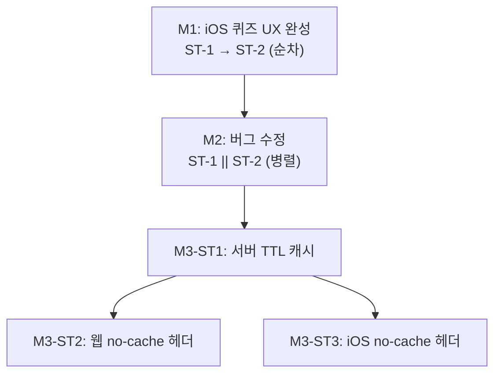

# 로드맵: Frank MVP10

> 생성일: 260414
> 최종 갱신: 260414 (마일스톤 순차 + 내부 병렬 전략으로 변경)
> 상태: 계획

---

## 목표 한 문장

실사용 테스트에서 발견한 버그 5개를 수정하고, 피드 응답 속도를 캐시로 개선한다.

---

## 진행 전략

- 마일스톤을 **순서대로 하나씩** 완료한다 (M1 → M2 → M3)
- 각 마일스톤 완료 후 **실제 테스트**를 진행한 뒤 다음으로 넘어간다
- 마일스톤 내부에서 **파일이 겹치지 않는 작업은 병렬로** 진행한다

---

## 타임라인

| 마일스톤 | 목표 | 기간 | 상태 |
|----------|------|------|------|
| M1 | iOS 퀴즈 UX 완성 — 다시 풀기 + 오답 보기 + 배지 수정 | 1~2일 | 완료 |
| M2 | 버그 수정 — 키워드 오염 + 에러 메시지 개선 | 1~2일 | 대기 |
| M3 | 피드 성능 — 서버 TTL 캐시 도입 | 2~3일 | 대기 |

총 예상: **1주 (5~7일)**

---

## 마일스톤별 실행 구조

### M1 — iOS 퀴즈 UX 완성

| 서브태스크 | 파일 | 방식 |
|-----------|------|------|
| ST-1: QuizView 버튼 추가 | `QuizView.swift`, `ArticleDetailView.swift` | 순차 |
| ST-2: FavoritesFeature 배지 수정 | `FavoritesFeature.swift`, `ArticleDetailView.swift` | 순차 (ArticleDetailView 겹침) |

→ M1 완료 후 iOS 실기기/시뮬레이터 테스트

---

### M2 — 버그 수정

| 서브태스크 | 레이어 | 파일 | 방식 |
|-----------|--------|------|------|
| ST-1: keyword_weights tag_id 컬럼 추가 | 서버 | `tags.rs`, `feed.rs`, `postgres_db.rs`, `ports.rs` | **병렬** |
| ST-2: 요약 에러 메시지 개선 | 웹 | `article/+page.svelte`, `summarize.rs` | **병렬** |

→ M2 완료 후 서버 + 웹 테스트

---

### M3 — 피드 성능 개선

| 서브태스크 | 레이어 | 파일 | 방식 |
|-----------|--------|------|------|
| ST-1: 서버 TTL 캐시 도입 | 서버 | `feed.rs`, `tags.rs`, `feed_cache.rs`, `ports.rs`, `mod.rs` | 먼저 |
| ST-2: 웹 no-cache 헤더 | 웹 | `feed/+page.svelte` | ST-1 후 **병렬** |
| ST-3: iOS no-cache 헤더 | iOS | `APIFeedAdapter.swift` | ST-1 후 **병렬** |

→ M3 완료 후 서버 + 웹 + iOS 통합 테스트

---

## 의존성 그래프

---

## 구현 원칙

- **TDD 유지**: 실패 테스트 → 구현 → 통과. 커버리지 90% 유지.
- **신규 기능 없음**: 기존 동작을 올바르게 만드는 것만.
- **마일스톤 완료 = 테스트 통과 + 실기기 확인**

---

## 변경 이력

| 날짜 | 변경 내용 | 사유 |
|------|----------|------|
| 260414 | 최초 작성 — MVP9 완료 후 실사용 버그 목록 기반 확정 | /milestone 플로우 |
| 260414 | 레이어별 → 마일스톤 순차 + 내부 병렬 전략으로 변경 | 마일스톤별 실제 테스트 진행 필요 |
