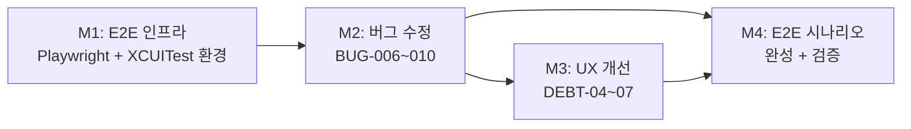

# 로드맵: Frank MVP14

> 기획일: 260429
> 최종 갱신: 260429
> 테마: 실사용 버그 수정 + UX 개선 + E2E 자동화 기반 구축
> 상태: 계획

## 목표

MVP13까지 기능 구현과 DB/API 정비를 마쳤다면, MVP14는 **실사용 체험을 정상화**하고 **E2E 자동화 기반**을 확립하는 사이클.

- BUG-006~010: 실사용 테스트에서 발견된 캐시·UI 상태·썸네일 버그 수정
- DEBT-04~07: 피드 좋아요·태그 스와이프·요약 하단·카드 구분 UX 마찰 제거
- DEBT-08: 웹(Playwright) + iOS(XCUITest) E2E 시나리오 자동화 기반 구축

## 타임라인

| 마일스톤 | 목표 | 기간 | 의존성 | 상태 |
|----------|------|------|--------|------|
| M1 | E2E 인프라 세팅 (Playwright + XCUITest 환경, /e2e 스킬 뼈대) | 3~5일 | 없음 | 대기 |
| M2 | 실사용 버그 수정 (BUG-006~010) | 1주 | M1 | 대기 |
| M2.5 | 부분 실패 TTL 수정 (조건부 — M2 완료 후 체크포인트 판단) | 1~2일 | M2 | 조건부 |
| M3 | UX 개선 (DEBT-04~07) | 1주 | M2(+M2.5) | 대기 |
| M4 | E2E 시나리오 완성 + 검증 | 1주 | M2, M3 | 대기 |

총 예상: 4~5주

## 마일스톤 상세 링크

- [M1 — E2E 인프라 세팅](M1_e2e_infra.md)
- [M2 — 실사용 버그 수정](M2_bug_fixes.md)
- [M3 — UX 개선](M3_ux_improvements.md)
- [M4 — E2E 시나리오 완성 + 검증](M4_e2e_scenarios.md)

## 의존성 그래프

- **M1 먼저**: 버그 수정·UX 개선 중 E2E 인프라로 바로 검증 가능
- **M2 → M3**: 버그가 있는 상태에서 UX 개선 QA 불가
- **M2+M3 → M4**: 수정된 동작을 기준으로 시나리오를 작성해야 올바른 시나리오가 됨

## 각 마일스톤 내 작업 순서 원칙

**서버/DB 먼저 → iOS + 웹 독립 병렬**

서버 수정이 확정되어야 클라이언트 구현 기준이 생긴다. 각 마일스톤 아이템 테이블에 "순서" 컬럼으로 명시.

## 아이템 라우팅 요약

| 유형 | 아이템 | 마일스톤 |
|------|--------|---------|
| chore | Playwright 환경 구성 + XCUITest 구조 정리 + /e2e 뼈대 | M1 |
| feature | BUG-006~009 수정 | M2 |
| research | BUG-010 동작 탐색 | M2 |
| feature | DEBT-04~07 UX 개선 | M3 |
| chore | E2E 시나리오 W-01~W-03, I-01~I-05 작성 + 검증 | M4 |

## KPI (MVP14 최종)

| 지표 | 측정 방법 | 목표 | 게이트 | 기준선 |
|---|---|---|---|---|
| 서버 테스트 통과 | cargo test | 전체 통과 | Hard | MVP14 시작: 328 |
| 웹 테스트 통과 | vitest | 전체 통과 | Hard | MVP14 시작: 265 |
| iOS 테스트 통과 | xcodebuild test | 전체 통과 | Hard | UITests 4개 (LoginFlow, Onboarding, CrossFeature + 신규) |
| BUG-006~010 해소 | progress/bugs.md 상태 | 전체 RESOLVED 또는 탐색 완료 | Hard | 현재 5건 OPEN (BUG-009 완료) |
| DEBT-04~07 해소 | progress/debts.md 상태 | 4건 RESOLVED | Hard | 현재 4건 OPEN |
| 웹 E2E 시나리오 3개 통과 | Playwright 실행 | 3개 통과 | Hard | — |
| iOS XCUITest 5개 통과 | xcodebuild test UITests | 5개 통과 | Hard | — |
| /e2e 스킬 파일 존재 | .claude/skills/e2e/SKILL.md | exists | Hard | — |
| MVP 회고 작성 | history/mvp14/retro.md 존재 | exists | Hard | — |
| 기술부채 증감 | progress/debts.md OPEN 카운트 | net 감소 (현재 5 → 0) | Soft | MVP13: 5건 OPEN |

## 변경 이력

| 날짜 | 변경 내용 | 사유 |
|------|----------|------|
| 260429 | 초안 작성 + critical-review 반영 | 실사용 테스트 기반 MVP14 기획 확정, 기준선 확정(서버 328/웹 265) |
| 260429 | M1~M3 → M1~M4 구조 재편 | E2E 인프라를 M1으로 선행, 버그수정 M2, UX개선 M3, 시나리오완성 M4로 분리. 인프라를 먼저 구축해 M2~M3 작업 중 E2E로 바로 검증 가능하도록 순서 조정 |
