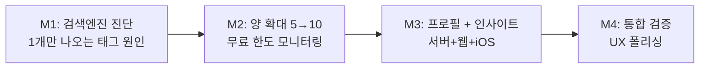

# 로드맵: Frank MVP15

> 기획일: 260501
> 최종 갱신: 260501
> 테마: 기사 양·다양성 확보 + iOS 개발자 시각 인사이트
> 상태: 계획

## 목표

피드 양과 시각을 강화해 "내 관점 트렌드 레이더" 정체성에 토대를 맞춘다.

- M1: 검색엔진 실측 진단 ("1개만 나오는 태그" 원인 파악)
- M2: 양 limit 확대 (5→10) + 무료 한도 안전장치 (서버)
- M3: 프로필 (직업 한 줄) + iOS 개발자 시각 인사이트 (서버 + 웹 + iOS)
- M4: 통합 검증 + UX 폴리싱 + 회고

## 타임라인

| 마일스톤 | 목표 | 기간 | 의존성 | 상태 |
|----------|------|------|--------|------|
| M1 | 검색엔진 진단 (research) | 1~2일 | 없음 | 대기 |
| M2 | 양 확대 + 무료 한도 모니터링 (서버) | 2~3일 | M1 | 대기 |
| M3 | 프로필 + 인사이트 (서버 + 웹 + iOS) | 1주 | M2 | 대기 |
| M4 | 통합 검증 + UX 폴리싱 (실사용 1주 포함, M3 후반과 일부 겹침) | 1~2주 | M3 | 대기 |

총 예상: 2~3주 (M3+M4 dogfooding 겹침으로 압축)

## 마일스톤 상세 링크

- [M1 — 검색엔진 진단](M1_search_diagnosis.md)
- [M2 — 양 확대 (서버)](M2_quantity_expansion.md)
- [M3 — 프로필 + 내 시각 인사이트](M3_profile_insight.md)
- [M4 — 통합 검증 + UX 폴리싱](M4_integration_polish.md)

## 의존성 그래프

- **M1 먼저**: 진단 결과가 M2 양 확대 폭(5→10 vs 5→15)과 Q4·Q5 결정에 영향
- **M2 → M3**: 서버 양 확대 후 클라이언트 작업 (메모리 `feedback_dev_order` 서버 먼저 원칙)
- **M3 → M4**: 핵심 기능 다 들어간 후 통합 검증

## 각 마일스톤 내 작업 순서 원칙

**서버/DB 먼저 → iOS + 웹 독립 병렬** (메모리 `feedback_dev_order`).

M3은 서버 인사이트 호출 함수 확정 → 웹/iOS 동시 진행.

## 아이템 라우팅 요약

| 유형 | 아이템 | 마일스톤 |
|------|--------|---------|
| research | 검색 엔진·쿼리 실측 진단 | M1 |
| feature | 서버 양 limit + 한도 모니터링 | M2 |
| feature | 서버 프로필 API + 인사이트 LLM 호출 | M3 |
| feature | 웹 설정 페이지 + 카드 UI | M3 |
| feature | iOS 설정 화면 + 카드 UI | M3 |
| chore | E2E 시나리오 추가 + 회고 | M4 |

## KPI (MVP15 최종)

| 지표 | 측정 방법 | 목표 | 게이트 | 기준선 |
|---|---|---|---|---|
| 서버 테스트 통과 | `cargo test` | 전체 통과 | Hard | MVP14 종료 시 카운트 |
| 웹 테스트 통과 | `vitest` | 전체 통과 | Hard | MVP14 종료 시 카운트 |
| iOS 테스트 통과 | `xcodebuild test` | 전체 통과 | Hard | MVP14 종료 시 카운트 |
| 양 limit 확대 적용 | `feed.rs` limit 값 검사 | 10 (또는 진단 후 결정값) | Hard | 현재 5 |
| 프로필 API 동작 | `cargo test profile` | GET/PATCH 통과 | Hard | — |
| 인사이트 응답 필드 존재 | 피드 응답에 `insight` 필드 | 직업 설정 시 존재 | Hard | — |
| 무료 한도 위반 발생 0건 | `progress/mvp15/cost_log.md` 검토 | $0 유지 | Hard | — |
| M1 진단 보고서 작성 | `progress/mvp15/M1_diagnosis_report.md` | exists | Hard | — |
| 웹 E2E 시나리오 1개 통과 | Playwright (프로필 설정 → 인사이트 표시) | 통과 | Hard | — |
| iOS XCUITest 시나리오 1개 통과 | xcodebuild test UITests | 통과 | Hard | — |
| MVP 회고 작성 | `history/mvp15/retro.md` 존재 | exists | Hard | — |
| 기술부채 증감 | `progress/debts.md` OPEN 카운트 | net 감소 또는 동일 | Soft | MVP14 종료 시 카운트 |
| 피드 ephemeral 보존 | `articles` 테이블 row count 변화 | 즐겨찾기 외 변화 없음 | Soft | — |

## 변경 이력

| 날짜 | 변경 내용 | 사유 |
|------|----------|------|
| 260501 | 초안 작성 | 시드 + 인터뷰 Q1~Q5 결정 반영 |
